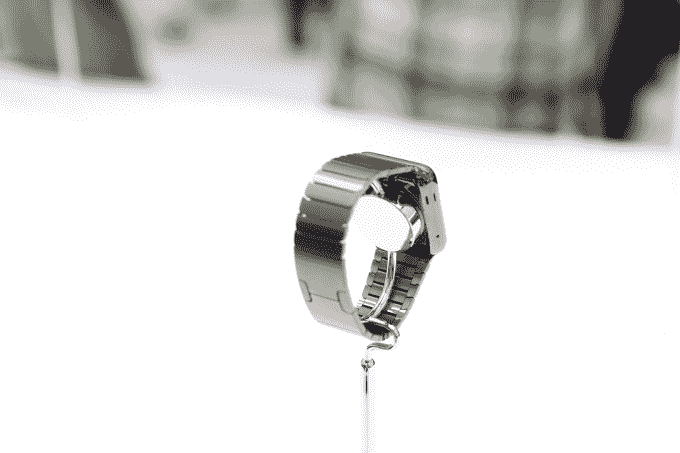
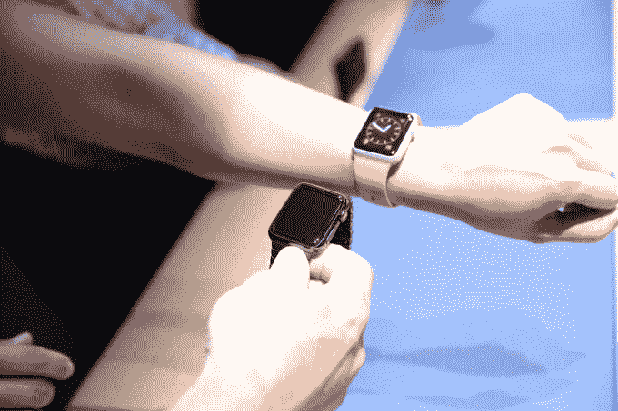
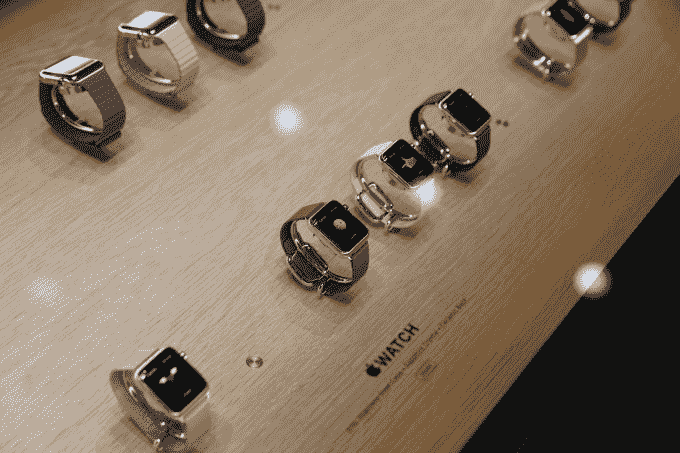

# 更正:瑞士现在有了一个不可思议的竞争对手 

> 原文：<https://web.archive.org/web/https://techcrunch.com/2014/09/09/correction-switzerland-just-gained-a-huge-competitor/>

# 更正:瑞士现在有了一个令人难以置信的竞争对手

因此，在苹果手表正式发布后的几个小时里，我们需要解决的是,[手表对瑞士意味着什么。](https://web.archive.org/web/20221007133241/https://beta.techcrunch.com/2014/09/07/if-switzerland-is-fucked-then-the-iwatch-is-too/)

当我第一次看到这款手表时，我真的认为 Jony Ive 关于瑞士钟表业是如何被摧毁的观点是正确的。然而，当我思考 Apple Watch 是什么(不是什么)时，我得出了一个更微妙的结论。

简而言之，苹果手表取代了普通手表。这并不意味着它会主动取代标签搬运工和 Rolexen。相反，它将填补目前我们大多数手腕上的空白。最近，这个空间已经成为 Fitbits 和鹅卵石之类的东西的家，但对大多数人来说，手表并不是一个必备的配件。现在是了。

苹果让手表再次变得很酷，新的手表购买者将会是苹果最大的客户，他们过去可能戴过手表，也可能没有戴过。它会卖几百万。这就是瑞士应该害怕的原因。因为他们现在将不得不与苹果竞争，但他们不能。因此，他们必须改进自己的产品，让机械表和石英表更加引人注目。我不会全天候戴苹果手表。我还是更喜欢我的欧米茄海马斯特和我的贝尔&罗斯。但当我在旅行或需要了解新信息时，我会戴上苹果手表。

这就是瑞士安全的原因。不管乐队看起来有多花哨，它仍然是一个令人讨厌的玩具。虽然我可以看到苹果正在蚕食一些低端市场，但它不会触及高端市场。消费者购买昂贵手表的原因与购买苹果手表的原因不同。这就是瑞士安全的原因。

那么苹果做对了什么呢？首先，他们的乐队系统非常棒。将表带从表壳上完全取下的按钮并不新鲜——积家过去就使用过——但你也可以通过按下链节上的一个小按钮来取下链节，这可能会让小型手表维修公司破产。乐队也很好地加工和相当英俊。

这种定制表带也为定制表带和带扣开辟了一个全新的辅助市场。我可以看到博柏利和路易威登在那里打上他们的商标，卖比手表本身还贵的表带。

我还认为苹果已经完全改变了定价公式。虽然许多人已经注意到，你可以花 349 美元买几块便宜的石英表，但这些便宜的手表仍然应该感到害怕。通过以大约 600 美元的实际价格出售一个功能强大的智能手表/iPhone 组合，你大大降低了对非常低端手表的需求。

最后，苹果甚至没有开一枪就淘汰了几乎所有的 Android Wear 设备。我想知道摩托罗拉之流要多久才能复制出几乎没人见过的功能。

我认为，受打击最大的将是世界化石、百货商店出售的时尚手表以及诸如此类的东西，它们更多地取决于买家的一时冲动，而不是他或她的银行存款。高端手表将继续安全地待在日内瓦稀薄的空气中，当苹果手表逼近它们并闯入它们的市场时，小公司将会争先恐后。

所以不，瑞士没有完蛋。但是很多人都是，我们才刚刚开始。