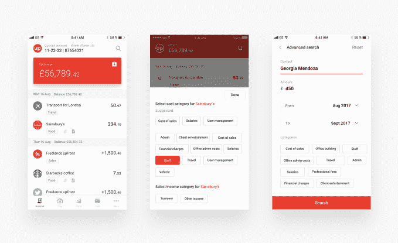

# 结合簿记的商业银行账户 Countingup 筹集了 230 万种子资金 

> 原文：<https://web.archive.org/web/https://techcrunch.com/2018/09/03/countingup-the-business-bank-account-that-combines-bookkeeping-raises-2-3m-seed/>

# 结合簿记的商业银行账户 Countingup 筹集了 230 万种子资金

英国金融科技公司 Countingup 已经筹集了 230 万英镑的种子资金。领投这一轮的是 Forward Partners，之前的 backer Frontline Ventures 和 JamJar Investments 也有参与。

Countingup 去年由蒂姆·富阿克里(Tim Fouracre)创建，他之前创建了云会计软件 Clear Books。counting up 希望通过重塑企业经常账户来简化个体交易者和其他小企业的生活。Fouracre 的愿景是，对于小企业来说，商业银行和会计软件应该合并，这样簿记和建档账户可以更加自动化。

“如果你在经营一家企业，那么记账就是一件苦差事，浪费你的时间，而且很无聊，”Countingup 创始人[去年告诉我。“你的银行用隐藏的费用让你吃惊，你可能已经对他们的客户服务失去了信心。Countingup 让创业和经营企业变得非常简单……我们正在通过将会计和银行业务整合到一个简单的智能手机应用程序中来实现这一点。](https://web.archive.org/web/20221209141737/https://techcrunch.com/2017/10/23/countingup/)

下载 iOS 或 Andriod 的 Countingup 后，你可以在智能手机上开一个活期账户，据称只需 5 分钟。该账户带有英国分类代码/账号和非接触式万事达卡。会计功能目前包括损益报告、簿记分类和将收据附加到交易的能力。

然而，将于今年晚些时候推出的大功能是发票，而“自动收据扫描”以及税务计算和申报等功能也在 2018 年的路线图中。

Fouracre 表示，Countingup 希望成为 100 万英国小企业的金融平台。它已经拥有 4000 名客户，我被告知它正以每月 1500 家企业的速度注册新用户。