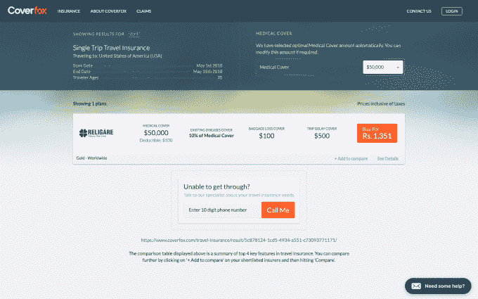

# 印度在线保险初创公司 Coverfox 获得 2200 万美元，由世界银行的 IFC 和 Transamerica TechCrunch 领投

> 原文：<https://web.archive.org/web/https://techcrunch.com/2018/04/18/coverfox-raises-22m/>

Coverfox 是少数几家旨在将印度保险数字化的公司之一，该公司通过 2200 万美元的 C 轮融资获得了新的资金，将用于推进该国更多的农村地区。

这项投资由世界银行的姐妹组织[国际金融公司](https://web.archive.org/web/20221209141104/https://www.ifc.org/wps/wcm/connect/corp_ext_content/ifc_external_corporate_site/home)和美国保险公司[泛美保险公司](https://web.archive.org/web/20221209141104/https://www.transamerica.com/)牵头，现有投资者 SAIF 合伙公司、Accel 和 Catamaran Ventures 参与，该基金来自 Infosys 联合创始人 Narayana Murthy。该公司证实，这轮融资实际上分两个阶段完成，这解释了为什么去年 6 月媒体围绕泛美投资的报道浮出水面。

总部位于孟买的 Coverfox 是一个聚合保险选项的数字平台。目前，它与 35 个合作伙伴合作，在印度提供约 150 多个套餐，涵盖健康、汽车、自行车、人寿和旅游保险。

今天的公告使成立于 2013 年的 Coverfox 从投资者那里筹集到了 3900 万美元。

许多 Coverfox 的支持者也资助了数字保险公司 Acko，该公司由 Coverfox 的联合创始人 Varun Dua 于去年创办。大约一年前，初创公司[宣布了一轮 3000 万美元的种子投资，当时一款产品还没有上市](https://web.archive.org/web/20221209141104/https://techcrunch.com/2017/05/24/acko-is-an-ambitious-digital-play-to-disrupt-indias-10b-insurance-industry/)，Acko 和 Dua 就成了头条新闻。

9 月份，Acko 获得了印度保险监管和发展局(IRDAI)的营业执照，并因其与亚马逊的关系再次成为头条新闻。[据说这家电子商务公司正在谈判投资](https://web.archive.org/web/20221209141104/https://tech.economictimes.indiatimes.com/news/internet/amazon-may-back-online-insurance-startup-acko/62322035)(尚未宣布任何交易),而[杜瓦本人表示](https://web.archive.org/web/20221209141104/https://www.moneycontrol.com/news/business/economy/acko-general-insurance-to-develop-products-for-amazon-in-talks-with-e-commerce-giant-for-investment-2490103.html)该公司正计划为这家电子商务巨头开发产品，也可能为其他类似规模的公司开发产品。

不过，据首席执行官 Premanshu Singh 说，迄今为止，Coverfox 还没有与 Acko 合作。

“我们根本不与 Acko 合作，至少在未来三到六个月内我们不打算合作，”他在接受 TechCrunch 采访时表示，并解释说该公司最初正在寻求更大的保险提供商。

他还否认了两家公司合并的可能性，尽管它们拥有共同的投资者基础。

“这两个实体非常不同，有独立的团队和不同的办公地点。我们想象不出会有什么战略性的事情发生，”辛格补充道。

Coverfox 自己表示，最近看到了“令人印象深刻的势头和规模”，辛格澄清说，过去一年的收入增长了四倍，但他拒绝透露具体数字。该公司计划加倍增长，并利用新的资金扩展到印度的二线和三线城市，该公司表示，这些城市的保险覆盖率比城市地区低 35%，而女性的保险覆盖率更低，比男性低 40%。

该公司还计划为其 Android 版 Coverdrive 应用程序投入更多资金，该应用程序旨在为以前几乎完全离线工作的保险销售人员提供数字优先的材料，以帮助他们利用 Coverfox 平台发展业务。

Coverdrive 是一个明智的补充，因为它有助于该公司在没有前期投资的情况下解决印度农村的长尾问题。相反，保险公司利用它的服务来推动自己的业务，从而同时增加 Coverfox 的销售额。

辛格说，Coverdrive 约占 Coverfox 销售额的四分之一。但这并不是该公司在二级和三级市场的唯一关注点，该公司将推出自己的员工，并专注于上市相关政策。

辛格指出，随着互联网银行逐渐侵蚀大多数保险品牌使用的银行保险模式，印度农村地区移动数据使用量的增长以及数字数据的增长，印度农村地区的扩张形势比前几年更好。

Coverfox 还没有考虑海外选择，尽管辛格解释说，已经有相当数量的入境请求。

“这肯定会发生，(但)我们还没有决定先去哪里，”他说。

同样，模型也没有确定。除了直接扩张，Coverfox 还可以通过合作或特许经营进入新市场。