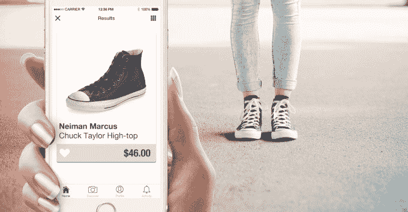

# Craves 的视觉购物应用程序只需拍照就能帮你找到喜欢的衣服 

> 原文：<https://web.archive.org/web/https://techcrunch.com/2015/07/14/craves-visual-shopping-app-helps-you-find-clothes-you-love-just-by-snapping-photos/>

虽然市场上有很多应用程序可以让你扫描条形码以比较价格，但今天发布的一款名为[的新时尚应用程序渴望让你只需拍下你想要的衣服的照片，它就可以在几秒钟内返回视觉上相似的结果——不需要扫描条形码。然后，当你找到你喜欢的东西时，你可以直接从应用程序本身购买该商品。](https://web.archive.org/web/20221208225259/http://craves.io/)

据曾在多伦多 Wave Accounting 负责移动团队的联合创始人斯科特·科尔米耶称，Craves 的想法是受他妻子纳丁(Nadine)用智能手机帮她买衣服的启发。

“她通常会抓拍照片或保存服装截图，以便日后追踪，”他说。“她会把它们都存到手机相册里，然后试着通过谷歌、Pinterest 等搜索它们。只要她有空。”

想到尝试使用技术来解决帮助像他妻子这样的女性找到在哪里购买她们喜欢的东西的问题会很有趣——特别是当在线购物经常导致缺货、链接中断和不可信的零售商时——科尔米耶想到了 Craves 的想法，它分析照片，以帮助消费者找到看起来像照片中的商品的东西。这些照片可以直接从 Craves 应用程序中拍摄，也可以从手机的相机胶卷中上传。

Craves 不仅仅是一个寻找时尚的工具，它还有一个社交组件，允许购物者关注朋友和有影响力的人，浏览热门商品、喜爱的结果，并接收销售通知。

然而，Craves 并不是传统意义上的创业公司。相反，科尔米耶解释说，它是在视觉搜索技术 [Slyce](https://web.archive.org/web/20221208225259/https://www.crunchbase.com/organization/slyce) 中孵化出来的，现在作为 Slyce 的子公司运营，就像该公司的其他消费者应用程序一样，包括猛扑和 SnipSnap。他说，在听说 Slyce 在视觉搜索方面所做的努力后，他最初联系了 Slyce 的创始人卡梅伦·切尔和艾丽卡·拉齐科特，他们决定建立一个 Craves 的原型，看看是否可行。

这款产品也是 Racicot 的联合创始人，他是 Craves '首席运营官，支持业务的 Slyce 方面，已经开发了不到一年，最近在大约 200 人的私人测试中进行了大约四个月，同时该团队努力提高其结果的相关性和质量，并策划了渴望功能的商家和品牌。

今天，Craves 重点展示各种商店的服装，包括百货商店和精品店，如 Yoox、Nasty Gal、Saks Fifth Avenue、Lord and Taylor、Neiman Marcus、ASOS、Mango、Singer22、Luisaviaroma、Forzieri、Silver Jeans、蔻驰等。

目前，当用户在应用程序中购物时，Craves 会收到会员收入。但在未来，该公司将考虑扩展到其他收入来源。

[gallery ids="1182470，1182475，1182474，1182473，1182472"]

该公司还在努力开发一种直接在 Craves 中进行的结账体验，而不是像现在一样将用户发送到零售商的移动网站，该团队将改善该应用程序的个性化功能以及商家阵容。

Craves 的到来正值谷歌购物受到可视化书签和搜索服务 Pinterest 的挑战，后者通常是消费者发现产品的更好工具。同样，科尔米耶认为，与传统的谷歌搜索相比，Craves 使用图像可以提供更好的购物体验。

“我们觉得用照片和截图搜索产品比试图找到正确的关键词组合插入谷歌要容易得多，”他说。"就像一幅画胜过千言万语一样."

与此同时，该应用还解决了困扰 Pinterest 的一个问题——通常 Pinterest 上的共享图片都是旧的、回收的链接，这些链接会将购物者引向死胡同——缺货库存、不良链接或未知的零售商。Craves 将他们与值得信赖的零售商和他们现在可以购买的产品联系起来。

Craves 今天向公众直播，并在 iTunes 上免费下载。