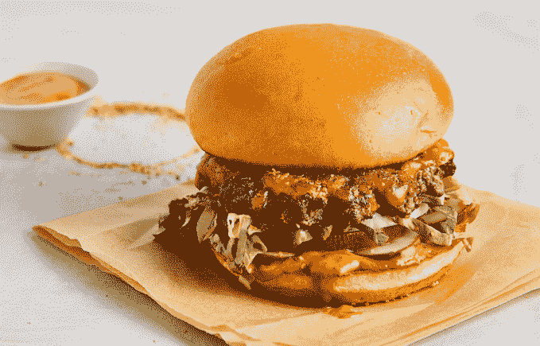
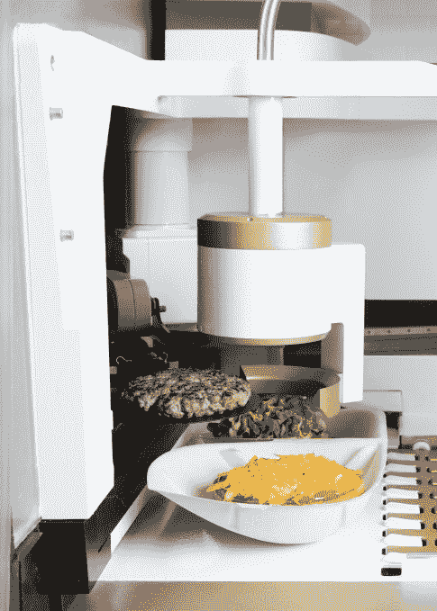
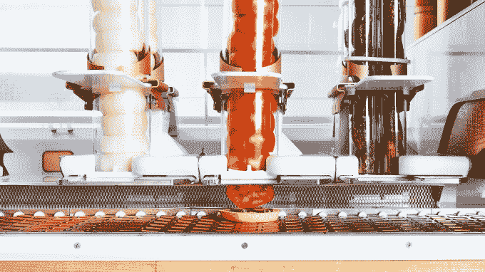
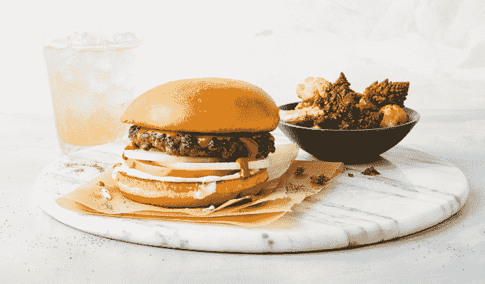

# 口味测试:汉堡机器人初创公司 Creator 开设第一家餐厅 

> 原文：<https://web.archive.org/web/https://techcrunch.com/2018/06/21/creator-hamburger-robot/>

Creator 的透明汉堡机器人不会把你的胸肉和牛排磨成美食肉饼，直到你点了它。这只是这家前身为 Momentum Machines 的初创公司希望以仅 6 美元的价格提供世界上最新鲜的芝士汉堡的一种方式。6 月 27 日，经过 8 年的发展，[创造者](https://web.archive.org/web/20230131172255/http://creator.rest/)在 9 月向公众开放之前，展示了它的第一家机器人餐厅。我们先睹为快…呃…尝一尝。

当我问一家一次开一家餐馆的初创公司如何成为一家 100 亿美元的公司时，Creator 联合创始人兼首席执行官亚历克斯·瓦尔达科斯塔斯(Alex Vardakostas)直视着我说:“市场比这大得多。”

以下是 Creator 的汉堡烹饪机器人在旧金山福尔松街 680 号的工作方式。一旦你通过平板电脑上的人工礼宾点了汉堡，压缩空气管就会把当天烤好的小面包推进右边的电梯。它被振动刀锯成两半，然后被放到传送带上烘烤并涂上黄油。按毫升计量的酱料和按克计量的香料被自动喷到面包上。整个泡菜、西红柿、洋葱和一块块美味的奶酪在被放在上面前一秒钟就被切掉了。

与此同时，机器人研磨无激素，牧场饲养的胸肉和牛排。但是，不是把它们全部捣碎，而是把肉垂直悬挂，轻轻压在一起。它们形成一个松散但可自动烤熟的馅饼，然后在整个包装滑出机器之前，整个过程大约需要五分钟，然后扑通一声落在小圆面包上。这个想法是，当你咬汉堡时，你的牙齿与垂直的线对齐，所以不需要用力咀嚼，它几乎在你的嘴里融化。

如果你想成为第一个尝试它的人， [Creator 将于太平洋时间今天上午 10 点](https://web.archive.org/web/20230131172255/http://eatatcreator.eventbrite.com/)开始出售早期门票。否则，在公开发布之前，它将在周三和周四的午餐时间开放。最终，一个应用程序将让人们定制所有成分的确切比例，解锁近乎无限的排列。

目前，这家初创公司的初始预设汉堡选项包括经典风格的 Creator vs. The World with a mole 千岛酱，由 Top Chef 的厨师 Tu 设计的牡蛎 aioli Tumami 汉堡，由 Bar Tartine 的厨师 Nick Balla 设计的烟熏烤焦洋葱酱和葵花籽 tahini Dad 汉堡。

每一种的味道都相当不错。这种味道从所有新鲜切好的和磨碎的原料中散发出来，这些原料缺乏切片前的防腐剂。尽管非常嫩，但当你咀嚼时，肉饼会粘在一起。之后，我不再有那种通常伴随着狼吞虎咽奶酪汉堡的油腻感、肠道炸弹感和食物昏迷感。

Vardakostas 说:“这种汉堡你在高档餐馆花 12-18 美元就能买到，而且是 6 美元。这可能不是我这辈子吃过的最好的汉堡，但以这个价格来说肯定是最好的。其中很大一部分来自机器人厨师节省的劳动力和厨房空间。我们花在食材上的钱比其他任何汉堡店都多

这位首席执行官不愿透露 Creator 筹集了多少资金，但表示它得到了谷歌的 GV、频繁的食品初创公司投资者 Khosla Ventures 和专注于硬件的 Root Ventures 的支持。然而，TechCrunch 获得的 SEC 文件显示，初创公司[在 2017 年](https://web.archive.org/web/20230131172255/https://www.sec.gov/Archives/edgar/data/1573131/000157313117000004/xslFormDX01/primary_doc.xml)筹集了至少 1830 万美元，并在 2013 年寻求[再筹集 600 万美元](https://web.archive.org/web/20230131172255/https://www.sec.gov/Archives/edgar/data/1573131/000157313113000003/xslFormDX01/primary_doc.xml)。

可以理解为什么。“麦当劳是一家价值 1400 亿美元的公司。比通用和特斯拉加起来还大。麦当劳有 4 万家餐厅。食品是三大市场之一。“但是我们有很多优势。就面积而言，普通餐馆要大 50%。”然后他向他的比大多数快餐店的后面小得多的大机器人示意，并微笑着说，“那是我们的厨房。你把它卷进去，插上电源。”

## 从翻馅饼到研究物理

Creator 联合创始人兼首席执行官 Alex Vardakostas

你想要的创始人是一个超级英雄出身的故事。他们生命中的一些形成时刻，使他们不顾一切地解决问题。Vardakostas 有一个非常令人信服的故事。“我父母开了一家汉堡店，”他透露道。“我的工作是每天做几百个同样的汉堡。你意识到有太多的机会没有被利用，因为你没有合适的工具，而且这是一项艰苦的工作。”

在南加州的餐馆里长大，机器人和工程甚至不在他的考虑范围内。然后，“我 15 岁的时候，爸爸第一次带我去书店。我开始阅读有关物理学的书籍，并意识到这可能是一种可能性。”他继续在加州大学圣巴巴拉分校学习物理，开始在车库工作，最后开车去硅谷著名的硅谷技术工厂加工第一个机器人原型的零件。

就在那时，他遇到了他的联合创始人首席运营官·史蒂夫·弗雷恩。“史蒂夫告诉我他来自斯坦福，我非常害怕，”瓦尔达科斯塔斯回忆道。但两人有着良好的工作关系，并有从学院中招募崭露头角的机械工程师的诀窍。Momentum Machines 始于 2009 年，2010 年成为全职车库项目，2012 年注册并加入 Lemnos Labs，2014 年开始取得重大进展。

与此同时，其他企业家也试图在食品机器人领域寻找商机。有一家现已倒闭的 Y Combinator 初创公司 [Bistrobot](https://web.archive.org/web/20230131172255/https://www.facebook.com/techcrunch/videos/10154100955972952/) 随意地在白面包上喷洒液体花生酱和果仁酱，并称之为三明治。最近，Miso Robotics 名为 Flippy 的汉堡翻转臂成为头条新闻，尽管它所做的只是在传统的煎锅上翻转和烹饪肉饼。Vardakostas 嘲笑道，“我们有一只手臂可以拉出汉堡，但这可能是由 350 个传感器、50 个致动器和 20 台计算机运行的完整 Creator 机器人的 5%的复杂性”。

## 打破汉堡行为

首席执行官在厨房的经历让创造者与人的因素保持联系。他告诉我，他认为在没有员工的餐馆里用电脑点餐的想法听起来“反乌托邦”事实上，他想让他的餐饮服务员工获得新职业。Vardakostas 叹了口气说，“人们把餐馆工作看作是慈善事业，但伙计，我们只是需要一个机会。”谈到谷歌让员工尝试兼职项目的旧政策，他解释道，“科技公司有 10%的时间，但没有人会为餐厅员工这样做。”

“我们在 2012 年真正感到兴奋的事情是，我们刚刚开始执行重新发明在这样的商店工作的工作，机器负责肮脏和危险的工作，”他的联合创始人 Frehn 解释道。“我们正在研究员工教育计划。百分之五的时间他们只是为了阅读而得到报酬。我们已经在这么做了。有出书预算。我们每小时付 16 美元。当修理机器的机会出现时，我们会为维修或维护人员提供一条获得更多报酬的途径。”

法式炸薯条是创造者无法逃避的一个传统。Vardakostas 说，它们基本上是你能吃的最不健康的东西，指出它们“比油炸圈饼更糟糕，因为有更多的表面暴露在冰箱里。”但是厨师告诉他，没有它们，有些人根本不会吃汉堡。创造者的妥协是，默认情况下，汉堡与丰盛的迷你法洛或季节性蔬菜沙拉搭配，但你仍然可以选择油炸食品。

Creator 的命运不会仅仅由汉堡机器人和与它一起工作的人来决定。这家初创公司必须向快餐食客证明，它也可以一样快捷、便宜，但味道要好得多，而且他们在餐厅的 bougie 陶瓷谷仓装饰中很受欢迎。同时，它必须让更富裕的食客相信，自助餐厅式的点餐柜台和低价并不意味着低质量。哦，这个名字对汉堡店来说有点太夸张了。

目前，Creator 不会授权其机器人或特许其餐厅，尽管这些可能会有利可图。“我不希望有人把冷冻牛肉放在那里或收取更多的费用，”Vardakostas 说。相反，我们的目标是有条不紊地扩张，或许利用它娇小的足迹进入机场航站楼或公交车站。“我们想离开旧金山，”弗雷恩自信地总结道。“我们的商业模式非常简单。我们拿出人们喜欢的真正好的汉堡，以半价出售。”