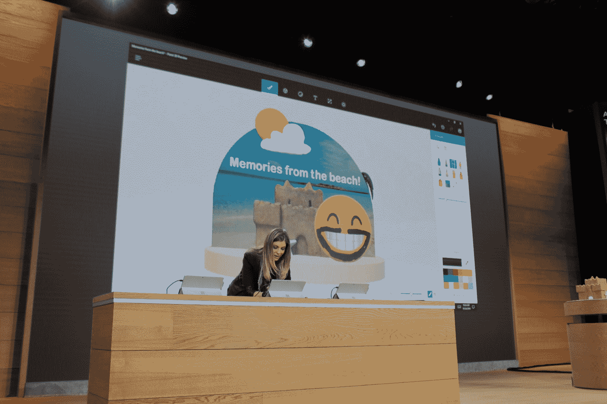
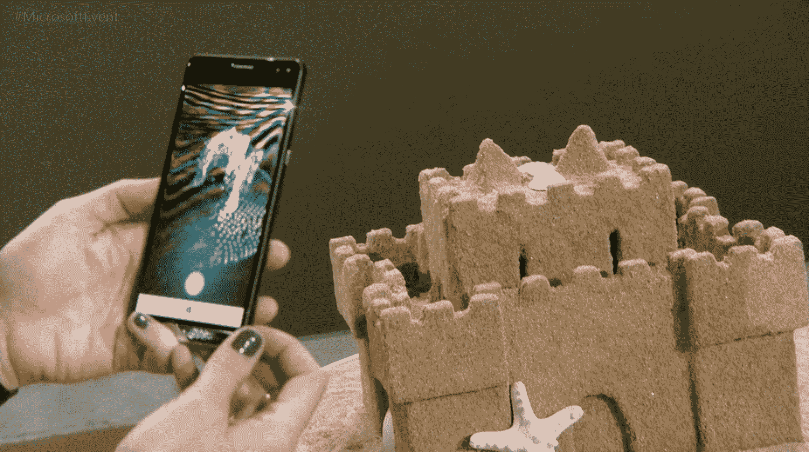
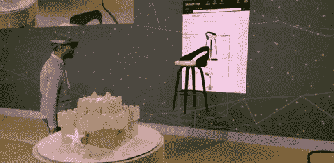
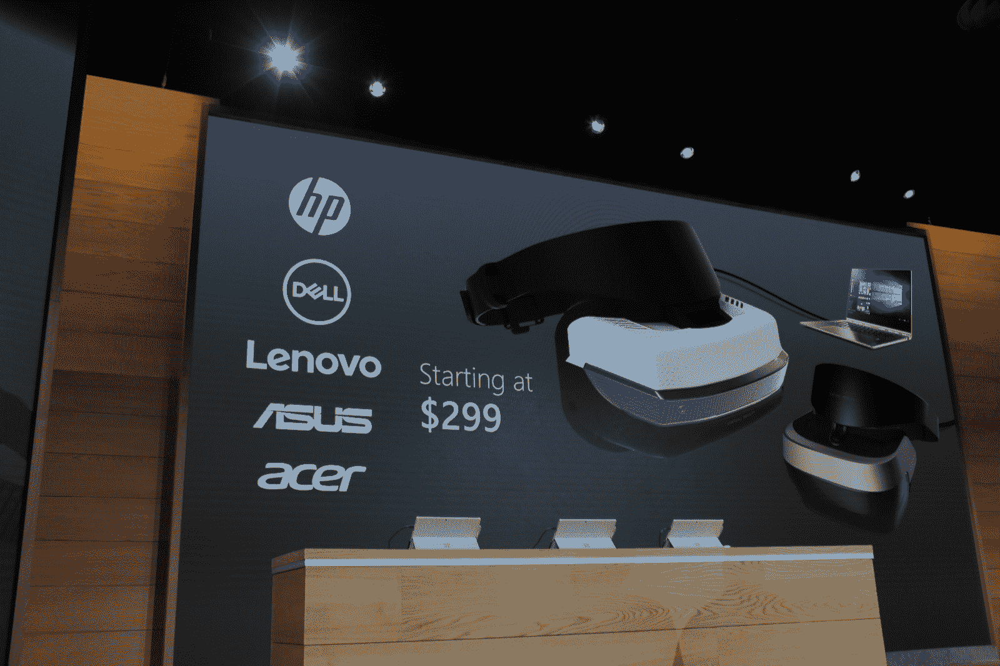
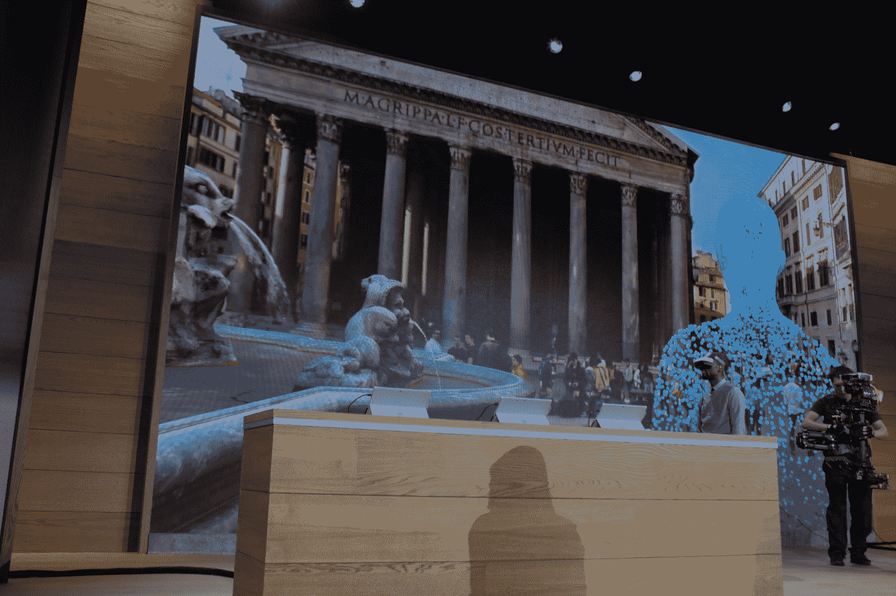
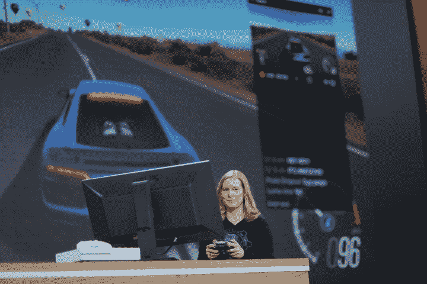
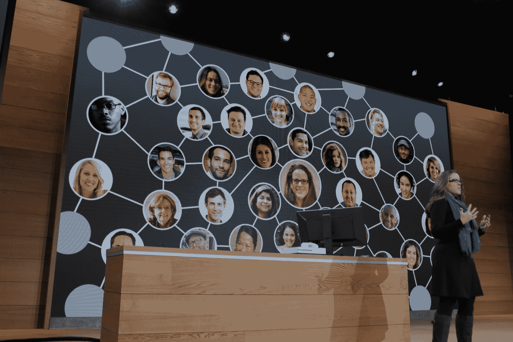

# 微软聚焦 3D 的 Windows 10 Creators 更新将于明年春天发布

> 原文：<https://web.archive.org/web/https://techcrunch.com/2016/10/26/creators-update/>

正如广告所说，今天早上都是关于 Windows 10 的。该公司通过公布其操作系统的艺术重点更新开始了清晨的会议。作为免费升级，Windows Creators Update 将于明年春天推出，它将围绕该公司积极推进增强和虚拟现实的努力，推出一系列专注于 3D 的工具。

发布会自然伴随着一些相当大胆的宣言，比如“3D 是每个人的”，“人类的进步总是以我们的创造力为标志。”这次更新似乎主要是围绕几周前泄露的新版本 Microsoft Paint 进行的，将这款应用程序一贯简单的基本工具与额外的功能相结合，这些功能为根据该公司的产品(如 HoloLens 和《我的世界》)构建的对象增加了深度。

简单地命名为 [Paint 3D](https://web.archive.org/web/20230314014654/https://techcrunch.com/2016/10/26/this-is-microsofts-paint-3d-for-the-windows-10-creators-update/) 只需按下一个按钮就可以将简单的钢笔草图变成 3D。正如人们对绘画的期望，效果是简单的。但它也非常令人印象深刻(至少在演示中)，将一朵云的涂鸦变成了一朵云的 3D 涂鸦。与此同时，贴纸工具可以让用户将二维图像贴在三维图像上。由于与 3D 建模软件公司的合作，用户还可以从 SketchUp 中提取对象。一旦完成一张图片，就可以分享给社区或通过社交网站。

在活动中还展示了 Windows Capture 3D experience，这是一款用于移动设备的 3D 扫描应用程序，用户可以通过在物体周围走动来拍摄三维物体，就像在舞台上展示的假沙堡一样。在演示中，该应用程序部署在 Windows phone 设备上——惠普精英 X3——尽管该公司很快补充说，它正在寻求在“任何手机”上推出该功能，因为，嗯，该公司的移动播放已被证明……并非无处不在。

该公司很快指出，像 Paint 这样的应用程序只是该公司全力推进 3D 的开始，将这一功能引入其最受欢迎的程序。排在首位的是 PowerPoint。用户可以将 3D 图像放入该公司的幻灯片应用程序中，以创建图像或更好地定位对象，这种方式你不一定能使用 2D 对象。

自然，HoloLens 也是这部剧的重要组成部分。该公司演示了如何将 Paint 中创建的图像导入 Edge 浏览器，并在设备上以 3D 形式查看。这款耳机还可以用于更普通但关键的功能，比如室内装饰，这样用户就可以看到房间里的椅子是什么样子——类似于我们在 Oculus 和 Vive 等 VR 耳机上看到的第三方演示。

这个演示也是在一个普通的、未命名的虚拟现实耳机上推出的，还包括一个度假旅游演示。作为首次推出的一部分，该公司将与许多硬件制造商合作，包括惠普、戴尔、联想、华硕和宏碁，这些制造商将试图以 299 美元起的耳机来削弱 Oculus 和 HTC 等公司。

自然，游戏也将是该公司游戏的一大部分，游戏直播将直接内置于 Creators Update，以及评论和玩家互动，这无疑是几个月前[公司选择 Beam](https://web.archive.org/web/20230314014654/https://techcrunch.com/2016/08/11/microsoft-acquires-beam-interactive-game-livestreaming-service/) 的一个重要原因。用户还可以通过活动创建自己的定制锦标赛，定义游戏模式，设置时间，并通过 XBox Live 邀请朋友。

新的 Windows 10 Creators 更新的一大部分是共享内容。新的“我的朋友”功能在底部工具栏中突出显示了一些亲密的联系人，可以拖放内容，通过 Skype、Mail 和 Xbox 直接与人分享。

“世界上最大的合作软件项目”的早期版本将于本周向 Windows 内部人士发布。

