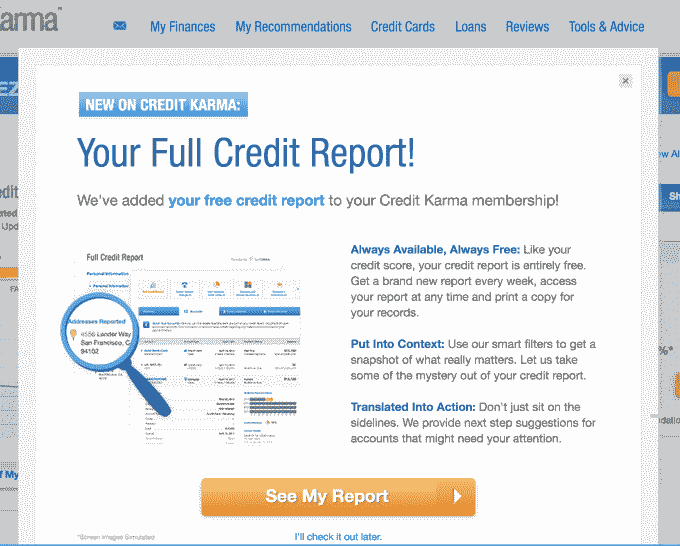
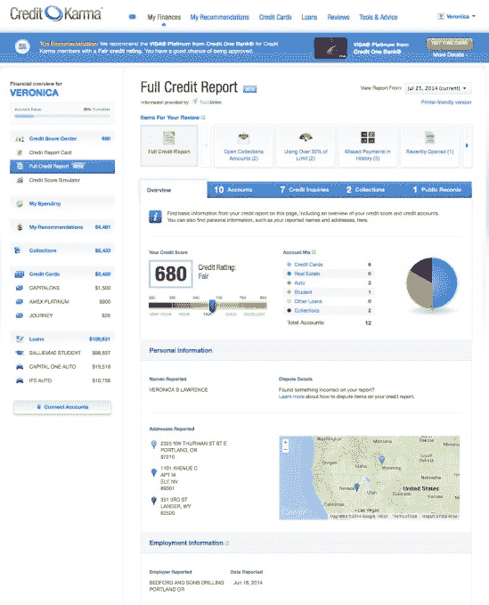

# Credit Karma 推出免费的每周信用报告(是的，真的)

> 原文：<https://web.archive.org/web/https://techcrunch.com/2014/07/30/credit-karma-rolls-out-free-weekly-credit-reports-yes-really/>

在线信用监测初创公司 [Credit Karma](https://web.archive.org/web/20221226012331/https://www.creditkarma.com/) 正在推出免费的信用报告。不，这不是骗局。

多年来，消费者一直被提供“免费”信用报告的网站所困扰，这些网站有很多附加条件[。注册免费报告后，这些误导网站会在试用期结束后开始按月向不知情的用户收费。这就是为什么使用 Credit Karma 令人耳目一新，这是一种提供免费信用监测和免费信用评分的服务，实际上是*免费*，而不是*免费** 。](https://web.archive.org/web/20221226012331/http://www.consumer.ftc.gov/articles/0155-free-credit-reports)

最近几个月，我有点痴迷于 Credit Karma iOS 应用程序，因为我有一个申请新抵押贷款的近期目标。我一直在努力清理我信用报告上的旧的负面项目，登录应用程序看到分数随着这些变化而增加，这有点激动。

[Credit Karma](https://web.archive.org/web/20221226012331/http://www.crunchbase.com/organization/credit-karma) 通过与 TransUnion 和 VantageScore(三家信用机构的评分系统)的合作，一段时间以来一直每周向像我这样的用户提供更新的信用评分。

此外，该服务提醒用户注意他们信用报告的变化，如余额减少或增加、信用额度变化、硬信用查询、新帐户和其他项目。它还为您提供了一张“信用报告卡”，可以对您的信用历史和行为的各个方面进行评级，包括您的未结信用卡使用率、按时付款的百分比、未结信用卡额度的平均年龄等。更重要的是，它解释了每一项是如何运作的，以及为什么它很重要，这对揭开消费者信贷的神秘面纱大有帮助。

基于你自己的信用历史和档案，信用因果报应通过向你推荐相关服务，如信用卡、贷款产品或债务合并行业来产生收入。多亏了这款应用，我最终与一家名为 Lexington Law 的服务签订了合同，该应用正忙于代表我给各种信贷机构写信，要求他们删除早就应该删除的负面项目。(是的，我知道我可以自己做，但是我没有时间。)

Credit Karma 指出，25%的消费者在他们的报告中有可能影响他们得分的错误，33%的人从未检查过他们的报告。与此同时，消费者的平均信用分数是 633，但拥有“良好”信用的门槛是 720。

不幸的是，Credit Karma 直到现在还没有获得消费者的完整信用报告，而是向你提供更多关于你财务状况的总结。所以你仍然需要通过正常的程序来申请你的[一年一次的免费报告，](https://web.archive.org/web/20221226012331/http://www.consumer.ftc.gov/articles/0155-free-credit-reports)或者付钱给一家公司来帮你拿。随着今天的推出，这种情况发生了变化，因为消费者的信用报告在任何时候都可以在 Credit Karma 中免费获得。如果您愿意，也可以每周刷新一次。

像往常一样，Credit Karma 不只是提供信息，而是解释它的意思，并建议您应该采取的行动。

这些新报告的交易又是与 TransUnion 达成的，所以从技术上讲，这是消费者可以获得的三种信用报告之一。当 TransUnion 检索您的信用报告时，他们会代表您请求您的信用信息，这被称为“软查询”这些类型的查询不会显示给债权人，所以它们不会像“硬查询”那样影响你的信用。

此举应该有助于 Credit Karma 更好地与传统的信用监测机构以及更直接的竞争对手竞争，如评分提供商和财务顾问 ReadyForZero 以及 T2 的 Credit Sesame，后者也提供免费的信用评分和摘要，但今天 T4 对访问信用报告收费 9 美元。

下面是一个虚拟报告，您可以看到它的样子:

