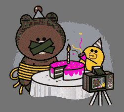
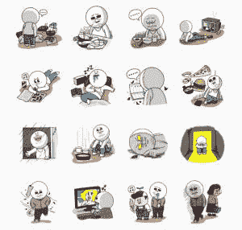
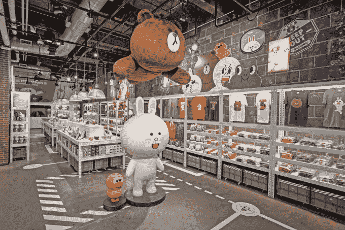

# 线贴的秘密语言

> 原文：<https://web.archive.org/web/https://techcrunch.com/2015/07/10/creepy-cute-line/>

纵观历史，每一种交流方式都有自己的简写方式。

北方文艺复兴时期的绘画富含象征意义[；即使是最平凡的细节，比如花瓶，也是一个丰富的寓言。](https://web.archive.org/web/20230331081339/http://robinurton.com/history/Renaissance/northrenaiss.htm)

维多利亚时代的人[折叠他们名片的角](https://web.archive.org/web/20230331081339/http://www.daysofelegance.com/callingcards.html)，表达从祝贺到哀悼的各种情感。

无线电报员开发了一套编码俚语系统来保护他们的手免受可怕的“莫尔斯手指”的伤害。

现在 [Line](https://web.archive.org/web/20230331081339/http://line.me/en/) ，一个在全球拥有 2.05 亿月活跃用户的消息应用，有这样的贴纸:

我住在台湾，大约三年前，许多 WhatsApp 用户转而使用微信和 Line，这在很大程度上要归功于贴纸和表情符号。起初我认为贴纸毫无意义——当你可以在几秒钟内输入回复时，为什么要浪费时间去翻阅一个可爱的图片库呢？

然后我看到上面那个扭曲的派对贴纸，意识到我错了。就像文艺复兴时期绘画中的符号一样，线条贴纸表达了广泛、复杂且经常令人困惑的一系列想法和情感——其中一些真的是一团糟，非常糟糕。

## 贴纸生意

Line 正在花费大量资金将其消息应用程序转变为一个“生活方式平台”，其中充满了诸如[杂货递送](https://web.archive.org/web/20230331081339/https://techcrunch.com/2015/02/01/line-groceries-southeast-asia/)和[流媒体音乐](https://web.archive.org/web/20230331081339/https://techcrunch.com/2015/06/10/line-music-japan/)等功能。类似于微信、 [KakaoTalk](https://web.archive.org/web/20230331081339/http://www.kakao.com/talk) 以及最近的 [Facebook Messenger](https://web.archive.org/web/20230331081339/https://www.messenger.com/) 等其他消息应用所采取的策略，提供广泛的服务旨在让用户保持参与，即使在免费短信和语音通话的新鲜感消退之后。

然而，Line messaging 应用的主要收入来源仍然是贴纸包和游戏。它的创造者市场，让第三方设计师上传和出售贴纸，[在开业的第一年就赚了 7500 万美元。](https://web.archive.org/web/20230331081339/https://techcrunch.com/2015/05/18/line-creators-market-freshman-year/)

根据该公司上个月发布的四周年纪念数据，其用户每天发送多达 24 亿个贴纸和表情符号。几乎一半，即 48%的人表示快乐，但其余的人反映的情绪从悲伤(10%)到愤怒(6%)和惊讶(5%)不等。

美国和其他西方国家的许多人犯了和我一样的错误，认为消息应用程序贴纸很可爱。在最近一篇关于该系列首次公开募股计划的文章中，彭博称他们为“泰迪熊偶像”

然而，这家总部位于东京的公司的许多贴纸利用了 [kimo-kawaii](https://web.archive.org/web/20230331081339/http://www.tofugu.com/2013/06/18/kimokawaii/) ，这是一种将 kawaii 或可爱与黑暗情绪相结合的趋势(“kimo”意味着恶心或令人不快)。也许这方面最好的例子是一个系列，在这个系列中，Line 的主要角色之一 Moon 在寻找新工作时陷入了低谷。随着他的银行存款减少到零，Moon 让他的公寓陷入肮脏，通过看似乎是软核色情的东西来消磨时间，并试图与一只蟑螂交朋友。

虽然 kimo-kawaii 经常被描述为最近的趋势，但它在日本流行文化中有着深厚的根基。一个名为[阴郁熊](https://web.archive.org/web/20230331081339/http://www.chax.cc/main.html?en)的角色被设计成对 Hello Kitty 的血腥回应，但像 [Gudetama](https://web.archive.org/web/20230331081339/http://www.sanrio.com/characters-gudetama/) 这样的新三丽鸥角色，一个长期抑郁的蛋，也融入了 kimo-kawaii。

对于 Line 的吸引力在日本、台湾、泰国和印度尼西亚等核心市场之外的表现如何，仍存在疑问，这些市场占其用户的一半以上，尤其是在它准备进行首次公开募股的时候。

然而，无论其商业战略表现如何，Line 的贴纸都是科技公司如何影响和强化文化趋势的一个例子，因为为销售产品而创造的角色开始了他们自己的生活。

## 在可爱的表面下抓挠

像其他封装 kimo-kawaii 的设计一样，线条人物也有因其可爱而变得可口的优势。大多数——一只棕色的泰迪熊、一只白兔、一只绿色的青蛙、一只黄色的小鸡——就像一个蜡笔盒，里面装满了卡通人物的通用原型。这使得它们具有很强的通用性。

在一个贴纸包里，他们可能在吸血或互相强迫喂食蛋糕，但是在 [Line Friends 商店](https://web.archive.org/web/20230331081339/http://store.linefriends.com/)里，他们看起来和凯蒂猫一样无害，该商店已经在该公司的主要市场设立，出售填充动物、文具、餐具和其他物品。

Line 的数据记录了哪些贴纸最常被使用，但没有记录收件人对它们的反应。这是一个挑战，但也给了设计师更多的自由。该公司在创建新包装时没有考虑具体的人口统计数据。不过，Line 在东京的贴纸计划团队经理渡边智友(Naotomo Watanabe)表示，当 Line 首次推出时，其用户大多是高中女生。

随着该应用寻求扩大吸引力，它开始将其市场测试扩大到其他群体。《月亮的求职故事》于早春上映，标志着日本财政年度的开始，许多专业人士都在寻找新的工作机会。

Line 现在提供 140，000 套贴纸和 6，830 个表情符号，它正忙着想办法在那些它的信息应用还没有占据主导地位的国家，将它的角色转化为金钱。例如，它[最近推出了表情键盘](https://web.archive.org/web/20230331081339/https://techcrunch.com/2015/06/17/you-wont-use-our-messaging-app-so-heres-a-funky-keyboard/)，目标是亚洲以外的用户。键盘上有 3000 个贴纸和表情符号，如果成功的话，可能会吸引人们使用其他的 Line 应用程序，包括[艾利斯](https://web.archive.org/web/20230331081339/https://itunes.apple.com/us/app/aillis-formerly-line-camera/id516561342?mt=8)(以前叫做 Line camera)，它的照片编辑应用程序，像 [Line Rangers](https://web.archive.org/web/20230331081339/https://itunes.apple.com/app/id767265270) 这样的游戏，甚至是像 [Line 杀毒软件](https://web.archive.org/web/20230331081339/https://play.google.com/store/apps/details?id=jp.naver.lineantivirus.android)和 [Line Tools](https://web.archive.org/web/20230331081339/https://itunes.apple.com/app/line-tools/id580412648) 这样的实用程序。

## 移动消息的通用语言

在文本对话中，贴纸是对连接的[出价，比礼物或表情符号更省力。它们让表达你无法(也可能不应该)用语言表达的感觉变得容易。](//web.archive.org/web/20230331081339/https://www.sandiego.edu/wellness/resource-guides/healthy-relationships/bids-for-connection.php%E2%80%9D)

其他贴有 kimo-kawaii 精髓的信息应用包括脸书的[邪恶牡蛎](https://web.archive.org/web/20230331081339/http://www.buzzfeed.com/floperry/sinister-oysters)和 [HamCat](https://web.archive.org/web/20230331081339/https://www.facebook.com/HamCatYum) 包。

然而，Line 的贴纸脱颖而出，因为它们展示了一群故事情节相对复杂的人物——或者至少足以为名为《Line Town》的[卡通系列](https://web.archive.org/web/20230331081339/https://techcrunch.com/2013/04/07/line-offline/)和[漫画系列](https://web.archive.org/web/20230331081339/http://campaign.naver.com/linesticker/en)提供素材。可以肯定的是，Line 的一些贴纸包以一种简单明了的方式很可爱，比如《布朗和康尼的甜蜜约会》(Brown and Cony's Lovey Dovey Date)，其中的两个主角，一只熊和一只白兔，正在进行浪漫的郊游，在沙滩上嬉戏，并在彼此的屁股上贴上绷带。

虽然 Line 的许多贴纸都很可爱，很天真，但有些贴纸却像最疯狂的“任和史汀普”或“比维斯和大头”漫画一样夸张暴力。有一张贴纸显示莎莉正在吃人，一边吃着鸡腿，一边直接从瓶子里狂饮葡萄酒。然而，Line 可以显示的情况是有限的，并且因地区而异。例如，在有大量穆斯林人口的国家，Line 不出售显示醉酒人物的贴纸。

渡边说，故事情节和人物之间的关系是偶然出现的。

“最初我们并没有考虑为 Line 创造角色。我们在思考制作有效贴纸的最佳解决方案。渡边通过翻译告诉 TechCrunch:“我们首先想到了月亮，我们认为这是将表情带入我们的贴纸的最简单的方式。“然后我们想创造出更有个性的贴纸，所以我们想出了女性和男性角色，比如康尼和布朗。”

随着 Line 生产新的贴纸包，关系和个性开始发展。例如，一只坚忍的熊布朗和一只性格浪漫的白兔康尼之间的关系时好时坏。渡边说，黄色小鸡莎莉是“有点悲伤的角色”，也是其他角色经常虐待的目标，他们喜欢像打棒球一样打她，或者把她当作家具。

乍看之下，蛋糕派对贴纸似乎是随机的，但莎莉终于占了上风。这是 Line 对 Judith 斩首 Holofernes 的回应，这是文艺复兴和巴洛克时期绘画中的一个流行主题，是对移动时代的愤怒和报复的一种令人毛骨悚然的可爱思考。

渡边说:“台词‘烧保险丝’最初是用来表达愤怒的。在日本，这套贴纸代表了一种隐藏但挥之不去的愤怒，你无法真正表现出来，一种消极攻击的愤怒。那可能是莎莉的想象。莎莉正在想象用她消极攻击的方式做事。莎莉总是被打败，在很多情况下她总是受害者，所以我认为在这个特定的标签上，她是赢家。"