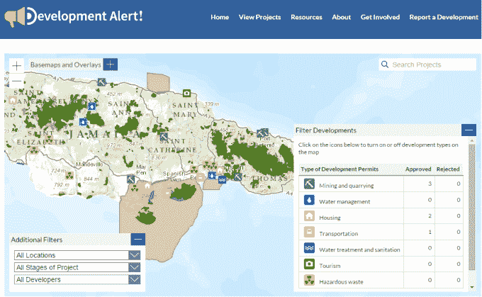

# 跨越数字鸿沟保护环境

> 原文：<https://web.archive.org/web/https://techcrunch.com/2014/12/19/crossing-the-digital-divide-to-protect-the-environment/>

斯蒂芬妮·拉蒂撰稿人

Stephanie Ratté是森林治理倡议的项目协调员和研究分析师，她领导并协调 GFI 和 Access 倡议团队的沟通和外联工作。

卡罗尔·埃克塞尔撰稿人

卡罗尔·埃克塞尔(Carole Excell)是世界资源研究所(World Resources Institute)访问倡议的项目主任，致力于全球范围内的信息访问、公众参与和司法问题。

劳伦·威廉姆斯撰稿人

Lauren Williams 是森林治理倡议的成员，领导刚果盆地地区的工作，包括制定战略和向开展研究和宣传以加强自然资源治理的民间社会伙伴提供技术支持。

**编者按:** *Stephanie Ratté是森林治理倡议的项目协调员和研究分析师；Carole Excell 是世界资源研究所获取倡议的项目主任，Lauren Williams 是森林治理倡议的成员，领导刚果盆地的参与。*

越来越多的数字工具正在涌现，以更好地管理世界自然资源。[发展预警！](https://web.archive.org/web/20230308130620/http://www.developmentalert.org/jamaica)新[基础设施](https://web.archive.org/web/20230308130620/http://www.developmentalert.org/jamaica)项目与牙买加环境敏感区域重叠的地图。全球森林观察利用卫星和众包数据近乎实时地追踪世界各地的森林砍伐情况。沙捞越地理门户网站收集马来西亚沙捞越州的地理、森林砍伐、基础设施、土地使用和其他数据，以增加该地区环境和政策问题的透明度。并且 [EIA 资源和响应中心](https://web.archive.org/web/20230308130620/http://www.ercindia.org/)监控印度的环境影响评估(EIA)过程，并作为 EIA 报告的独立资源和数据库。

然而，与此同时，许多主要的自然资源使用者——如土著社区和民间社会团体——往往难以利用这些技术。全世界大约有 13 亿人用不上电，超过 30 亿人生活在农村地区，他们的网络连接可能很差。我们如何确保数字工具惠及最需要它们的社区？

[上个月在哥伦比亚的波哥大举行了第五届全球接入倡议会议](https://web.archive.org/web/20230308130620/http://www.wri.org/events/2014/10/fifth-global-gathering-access-initiative)，聚集了 90 多个公民社会和社区领袖来讨论这个问题。出现了一些机遇和挑战，揭示了如何更好地将技术与当地社区和民间社会组织结合起来。

**参与式工具开发**

影响人们使用数字工具能力的制约因素可以是个人的(如知识、文化程度、技能、资金和时间)和/或系统的(如电力和互联网接入)。让社区和民间社会组织参与开发阶段有助于确保这些限制因素得到考虑和解决。

以 [Sapelli 移动数据收集平台](https://web.archive.org/web/20230308130620/http://www.ucl.ac.uk/excites/software/sapelli)为例，这是一个低成本的移动工具，旨在帮助社区绘制地图和报告森林活动。由伦敦大学学院的[极端公民科学](https://web.archive.org/web/20230308130620/http://www.ucl.ac.uk/excites) (ExCiteS)小组开发，供不识字和文盲社区使用，该平台没有文本，完全依靠图标。

研究人员与社区成员共同设计图标——可能包括树木、建筑、食物以及伐木和耕作等活动——以使它们与环境相适应。到目前为止，社区已经使用这个平台在刚果共和国和刚果民主共和国监控偷猎并获取伐木活动的证据。

**增加容量**

在线地图平台越来越多地用于环境保护。然而，许多全球聚会的与会者强调了在记录土地和自然资源方面与社区合作的重要性，这既是为了加强制图的准确性，也是为了确保社区对信息的所有权。正如玛雅领袖联盟的克里斯蒂娜·科克和朱利安·乔协会强调的，“如果没有参与性，地图绘制会孤立社区。”

在伯利兹南部，托莱多玛雅文化委员会和托莱多阿尔卡德斯协会与土著玛雅社区密切合作，在玛雅地图集中记录他们的土地。41 个社区参与了绘制土地、边界、植被、河流、土地使用等地图的工作，并在地理地图上绘制了地图。

1997 年*的玛雅地图集*不仅作为玛雅土地的文献，还包含了历史、故事、照片和来自村长和社区成员的艺术品。通过将地理地图与来自村民的文化细节结合起来，该地图集是维护玛雅生活和遗产的一种强有力的方式。

**跨越数字鸿沟**

互联网接入问题——包括社区是否以及如何上网——对数字工具的使用有着巨大的影响。例如，在非洲，[20%的人口](https://web.archive.org/web/20230308130620/http://www.itu.int/en/ITU-D/Statistics/Documents/facts/ICTFactsFigures2014-e.pdf)预计将在今年年底上网，但只有十分之一的家庭联网(这种互联网使用的差异来自于手机)。在发展中国家，接入互联网的女性比男性少 25%。考虑全球数字鸿沟的所有方面以确保目标用户可以获得工具变得越来越重要。

新的计划可以调整他们的工具以适应社区的限制，或者他们可以通过支持基础设施的发展来努力克服限制。例如，[数字民主](https://web.archive.org/web/20230308130620/http://www.digital-democracy.org/)开发了[远程访问](https://web.archive.org/web/20230308130620/http://tech.transparency-initiative.org/emily-jacobi-documenting-oil-spills-transparency-in-hard-to-reach-places/)，帮助偏远地区的土著社区记录和绘制环境退化图。该组织目前正在亚马逊和墨西哥为这些用户开发一个[移动报告平台](https://web.archive.org/web/20230308130620/http://www.digital-democracy.org/ourwork/ra/)。

**整合治理**

来自数字工具的丰富的环境和空间信息是一个起点，但往往不足以带来变化。[诊断治理优势和劣势的工具](https://web.archive.org/web/20230308130620/http://www.wri.org/publication/assessing-forest-governance)可以帮助确定法律改革、监控政策实施情况或了解政府机构解决环境问题的能力需求。例如，即将发布的[环境民主指数](https://web.archive.org/web/20230308130620/http://www.wri.org/our-work/project/access-initiative-tai/commissions#project-tabs)评估了全球 70 个国家的知情权、参与权和公平权。将这类信息放在公民手边可以支持数据驱动的运动，以加强他们的权利，包括获取信息和参与森林资源决策的能力。

**建立实践社区**

全球会议得出的最重要的教训之一是建立实践社区的重要性。汇集不同的倡导者和研究人员团体可以帮助开发人员获得对他们工作的反馈，接触更多的受众，并分享对技术如何改善社会和环境成果的见解。

