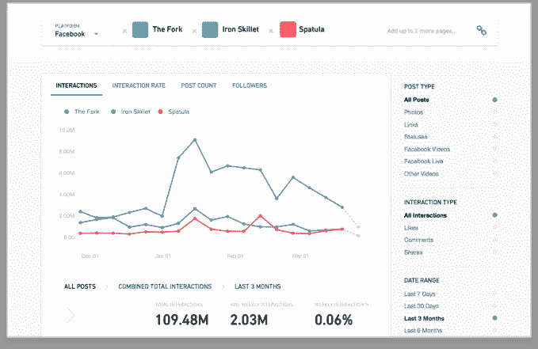

# 脸书的 CrowdTangle 允许出版商比较社交应用的性能

> 原文：<https://web.archive.org/web/https://techcrunch.com/2017/03/29/crowdtangle-intelligence/>

# 脸书的 CrowdTangle 允许出版商比较社交应用的性能

背负着沉重的假新闻罪恶感，脸书在去年收购并免费提供的 CrowdTangle 工具中为出版商推出了新的社交渠道基准。

[crowd angle Intelligence](https://web.archive.org/web/20230307212051/http://www.crowdtangle.com/blog/intelligence)让新闻媒体可以在任何一个社交应用程序中的多达五个社交账户上比较他们不同账户的表现，包括脸书、Instagram、Twitter 和 Reddit。然后，发布者可以看到哪些账户在不同的日期范围和内容类型下获得了最多的喜欢、评论、分享、新关注者或帖子。例如，BuzzFeed 可以查看其脸书账户，如 BuzzFeed News、Tasty and Nifty，在一个月内拥有最多粉丝。

该工具旨在“帮助出版商了解整体趋势，并更容易地分析哪些内容有效，哪些内容无效。”得益于图表和图形，CrowdTangle Intelligence 简化了高水平报告的撰写和趋势发现，从而为他们的出版策略提供信息。

如果脸书能够提高出版商在其社交网络上分享内容的质量，它将从更好的参与中获益。在其他社交渠道上帮助他们只会让这个工具更有价值。与此同时，脸书正在尽一切努力弥补它在选举期间放任假新闻传播的方式，以及它如何吸收了大量过去直接流向新闻出版商的广告支出。这就是脸书启动其大型新闻项目的原因。

尽管直接应对假新闻及其对新闻业的明显影响是复杂的，但脸书所能做的最好的事情就是尝试以其他方式向出版商和读者伸出援手。