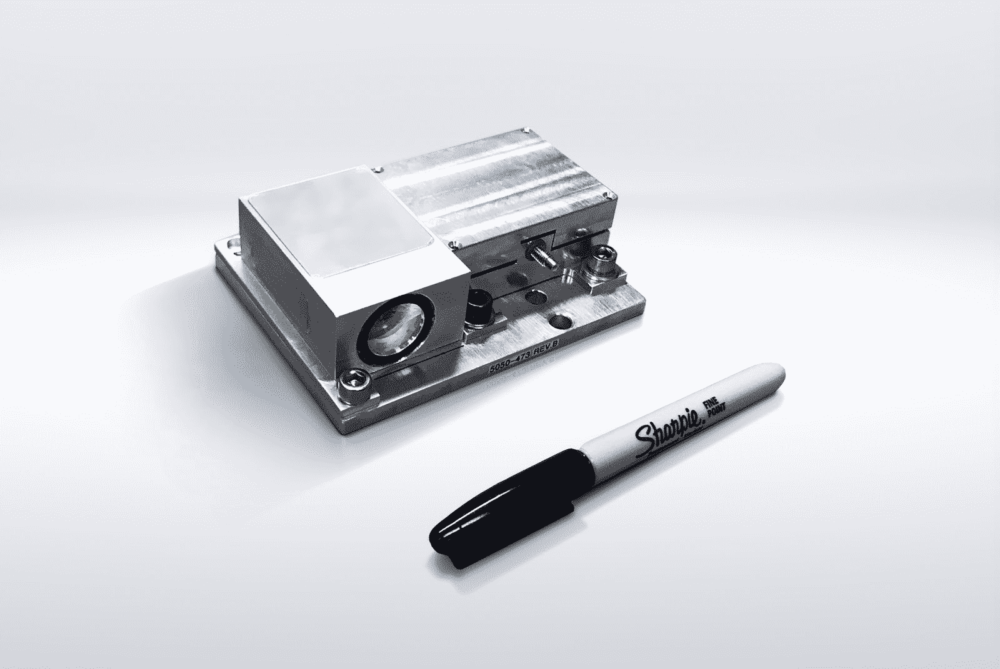

# 通用汽车的 Cruise 收购 Strobe，以降低自动驾驶的激光雷达成本

> 原文：<https://web.archive.org/web/https://techcrunch.com/2017/10/09/cruise-acquires-strobe-to-help-dramatically-reduce-lidar-costs/>

# Cruise 收购 Strobe 有助于大幅降低激光雷达成本

通用汽车去年收购的自动驾驶汽车初创公司 Cruise 已经收购了一家自己的初创公司——Strobe，这是一家激光雷达传感器制造商，它将整个激光雷达阵列减少到只有一个芯片，Cruise 表示，这将有助于帮助它将每辆车的激光雷达成本降低近 100%。

成本问题是一个大问题:激光雷达仍然是自动驾驶汽车堆栈中最昂贵的组件之一，它不仅在成本方面是一个瓶颈，而且在制造复杂性和性能以及在各种天气下的可靠性方面也是一个瓶颈，正如 Cruise 首席执行官 Kyle Vogt 在宣布这一消息的[媒体帖子](https://web.archive.org/web/20230304193322/https://medium.com/kylevogt/how-were-solving-the-lidar-problem-8b4363ff30db)中指出的那样。

Vogt 表示，降低自动驾驶汽车的成本将是在一系列不同地区部署自动驾驶汽车的关键，包括在主要城市的郊区和郊区，目前的经济状况使其难以部署类似自动乘车服务的东西。

Strobe 的激光雷达组件

Vogt 说，Strobe 的技术可以精确测量距离和速度，结合雷达，可以为无人驾驶汽车的决策提供至关重要的信息。Strobe 将把他们的团队和创始人带到 Cruise，Cruise 将与其新工程师和通用汽车公司的资源合作，与通用汽车公司的休斯研究实验室 skunkworks 团队一起开发激光雷达技术。

在自动驾驶汽车技术中采用的激光雷达方面，威力登目前是行业领导者，但许多人都在努力提高激光雷达部件的成本、外形和可靠性。另一家初创公司 Luminar 最近披露了自己的运营规模，它还宣布正在与丰田研究所以及其他精选合作伙伴合作，将其能力添加到道路上的自动测试车辆中。