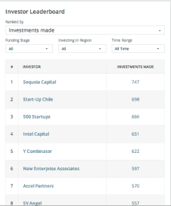

# CrunchBase 扩大了其全球影响力，增加了孵化器、风险投资合作伙伴和新的排行榜功能 

> 原文：<https://web.archive.org/web/https://techcrunch.com/2014/09/10/crunchbase-grows-its-global-reach-adding-incubators-vc-partners-and-a-new-leaderboard-feature/>

# CrunchBase 扩大了其全球影响力，增加了孵化器、风险投资合伙人和新的排行榜功能

每个人都知道 CrunchBase 是投资者和创业社区可能需要的所有信息的主要网站。但是现在这个以如此少的投入给你如此多的东西的网站增加了更多的功能，并且公布了几个月的劳动成果。

CrunchBase 团队接触了数千家风险投资公司，以确保用户能够获得创业社区和投资者最准确的商业图表。

CrunchBase 总裁马特·考夫曼(Matt Kaufman)表示:“我们需要一个所有人都可以访问的关于创业活动和初创公司的通用数据库。

CrunchBase 风险项目揭示了这一努力的成果，该项目目前包括 1000 多家风险企业、孵化器和加速器。这是美国 60%的活跃投资公司，但不仅仅是风险投资者，数据还包括企业投资者和孵化下一波早期前景的孵化器的信息——像[威瑞森风险投资](https://web.archive.org/web/20221007031503/http://www.crunchbase.com/organization/verizon-ventures)和 [Telstra 风险投资](https://web.archive.org/web/20221007031503/http://www.crunchbase.com/organization/telstra-ventures)这样的公司，以及领先的孵化器，如 [DreamIT 风险投资](https://web.archive.org/web/20221007031503/http://www.crunchbase.com/organization/dreamit-ventures)和[创新工厂](https://web.archive.org/web/20221007031503/http://www.crunchbase.com/organization/innovation-works)。

这些公司总共通过 21，000 轮融资投资了 14，000 家公司，总投资额为 1，700 亿美元。

CrunchBase 排行榜

随着创业 bug 在全球范围内流行，CrunchBase 出现了。已经有超过 30%的风险项目成员在美国以外，CrunchBase 团队正致力于扩大全球覆盖面。

随着新信息和新贡献者的涌入，CrunchBase 也带来了新的特性和功能，比如该网站新的 leader board 特性。

这一功能消除了对季度仪式的需求，在季度仪式上，分析私人投资数据的服务机构争相加载所有数据，将其输入系统，并撰写报告比较投资者的表现。

投资者和企业家(以及记者)可以获得近乎实时的每日更新，了解谁的投资组合表现最好，谁的投资最多，而不是每月报告。

[CrunchBase 投资者排行榜](https://web.archive.org/web/20221007031503/http://www.crunchbase.com/investor-leaderboard)，根据融资阶段、地理位置和时间框架对顶级投资者进行排名。