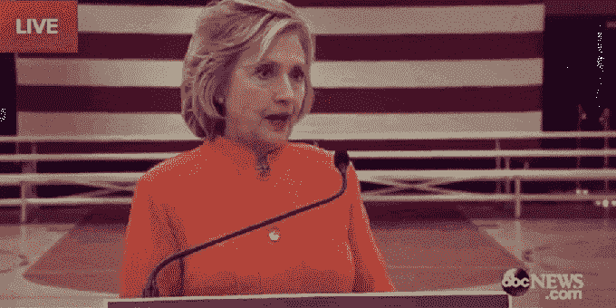

# CrunchWeek: YouTube Green、Earningspalooza 和# jack lash 

> 原文：<https://web.archive.org/web/https://techcrunch.com/2015/10/23/crunchweek-youtube-green-earningspalooza-and-jacklash/>

# CrunchWeek: YouTube Green、Earningspalooza 和#Jacklash

马特:
嘿，我们来谈谈 CrunchWeek 的收入吧。

**梅根:**

德鲁:
梅根，你能在节目上这么说吗？

——————–

欢迎来到另一集 CrunchWeek，这是 TechCrunch 的每周综述节目，我们在这里谈论科技领域最重要的事情。

本周，我们将讨论 [YouTube Red](https://web.archive.org/web/20221207212820/https://beta.techcrunch.com/2015/10/21/youtube-red/) 、 [Alphabet](https://web.archive.org/web/20221207212820/https://beta.techcrunch.com/2015/10/22/alphabet-q32015-earnings/) 和[亚马逊收益](https://web.archive.org/web/20221207212820/https://beta.techcrunch.com/2015/10/23/amazon-shares-pop-9-5-percent-following-surprisingly-good-earnings/)以及 Twitter Flight、Twitter Twitter Twitter、杰克·多西 Twitter、杰克杰克·多西多尔西、杰克。是 [#Jacklash](https://web.archive.org/web/20221207212820/https://beta.techcrunch.com/2015/10/23/does-wall-street-like-what-its-hearing-from-twitter-again/) (参考下面视频)。

[https://web.archive.org/web/20221207212820if_/https://www.youtube.com/embed/LEX1PFWZ1Xc?feature=oembed](https://web.archive.org/web/20221207212820if_/https://www.youtube.com/embed/LEX1PFWZ1Xc?feature=oembed)

视频

还有，德鲁忘了穿外套。他真可耻！

正如我们的常驻收益霸主阿历克斯所说:今天是周五，是紧缩周，是时候放下工作，谈点正事了。点击播放，我们会在 7 天后回来看你。