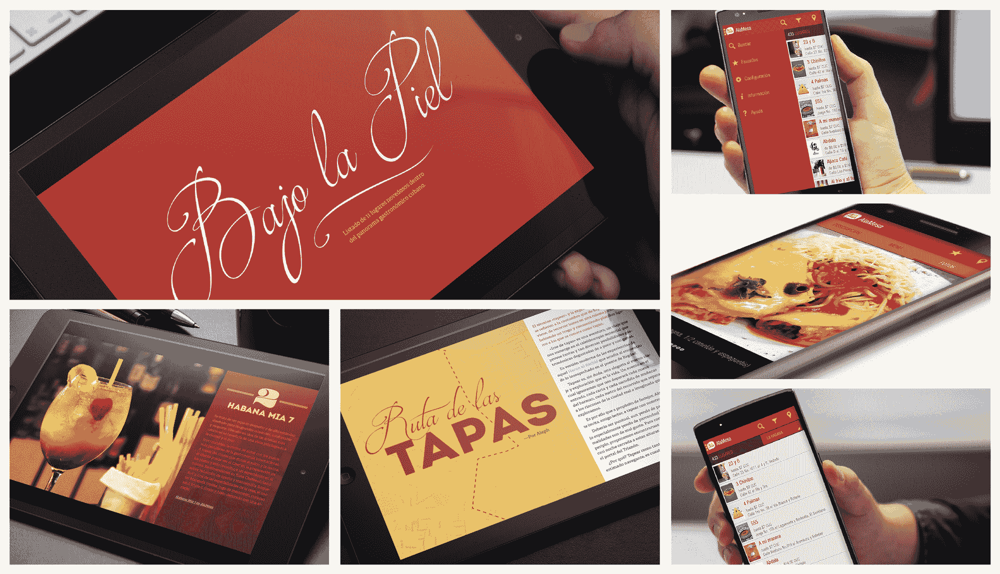

# 古巴的创业悖论

> 原文：<https://web.archive.org/web/https://techcrunch.com/2015/10/06/cubas-startup-paradox/>

Adam Popescu 是一位洛杉矶作家，他的作品已经在英国广播公司、国家公共广播电台、快速公司、洛杉矶时报、Mashable 和花花公子等出版物上发表过。

More posts by this contributor

你到处都能看到它们。一群群年轻人和老年人，男人和女人，低头看着他们的智能手机，手指快速开火，嘴角噙着微笑，享受着互联网连接的快乐。

这些街道上正在发生一些奇怪的事情。随着老爷车的游行队伍驶过褪色的殖民建筑和野蛮的苏联办公楼，几十个人挤在人行道上，希望得到一个信号，很明显我们离美国很远。

为什么这些人都堵在人行道上，而不在家登录？

这里是古巴，而在古巴，你在家是无法登录的。你基本上根本无法登录。个人电脑是非法的，Wi-Fi 只在少数几个被称为网络点的热点地区可用——外加一些酒店的大厅。要想上车，你需要一张 tarjeta，一种类似公交车的通行证，用于上网。每小时大约 5 美元，这是一个昂贵的旅程，迫使大多数人离线工作——然后，在疯狂的数据冲刺中，当他们访问拥挤的带宽时，上传，发送和下载。

在拥有 200 万人口的哈瓦那有 5 个数码站，全岛有 155 个。7 月之前，一个也没有。古巴人只有作为医生、教授或科学家受雇于国家，才能使用网络。唯一的其他选择:在受到严格监管的国营计算机实验室每周拨号一小时，或者盗版连接，在一个以严格的共产主义控制而闻名的国家，这是一个危险的游戏。

互联网如此稀缺，许多人为了上网，接受了拥有崇高头衔和月薪低至 12 美元的工作。可怜的工资换来同样可怜的 56K 门户网站。但即使是以这种蜗牛般的速度，它也已经成为启动创业公司和接受账外工作的工具。

在一个只有 5%互联网普及率的国家，你可以在任何时候上网。这使得古巴成为世界上联系最少的地方之一，也是科技企业家最具挑战性的工作地点之一。然而，这也是最充满机遇的领域之一。

尽管障碍重重，一个年轻的创意阶层正在成功成长。在花了一周时间会见了十几个当地玩家后，我了解到在古巴上网的最好方式是离线工作。

## 问题和解决方案

古巴的 1100 万人受过良好的教育。识字率达到惊人的 100 %,严格的州立大学每年培养数千名 T2 STEM 毕业生。然而，他们毕业时，这个国家缺乏使用这些工具的基础设施或薪酬激励。

没有真正的资本，缺乏商业和营销经验，渴望真正的互联网接入，几乎不可能建立一个技术企业。当人们上网时，他们不能购物或接受付款。信用卡被禁止，很少有人有银行账户。

这就是为什么当网飞二月份来到这个岛的时候，[没有人订阅](https://web.archive.org/web/20230320043137/http://www.npr.org/2015/02/14/386323314/netflix-streams-its-way-to-cuba-slowly)。不仅太贵，古巴人也没有办法支付。这就是优步永远不会在这里工作的原因——但是它的一个本地版本，YoTeLlevo，给这个想法注入了古巴元素，给司机发电子邮件，提前安排费用(所有的乘车都是现金支付)。

另一方面，Airbnb 是一个意外的成功，部分原因是许多古巴人已经把他们的房子出租给客人。这项服务使用迈阿密的一家公司来递送汇款，汇款可以直接寄到主人家里(然而，在这个非常官僚的国家，文书工作是一场噩梦——就像生活设施一样，[或者缺少生活设施](https://web.archive.org/web/20230320043137/http://www.businessinsider.com/what-its-like-to-stay-in-an-airbnb-in-havana-cuba-2015-6#we-booked-a-7-day-stay-at-dianas-luxury-apartment-in-the-heart-of-havana-for-a-grand-total-of-840-the-listing-was-accurate-for-the-most-part-but-it-would-have-been-nice-to-know-that-there-was-a-serious-issue-with-the-water--we-didnt-have-any-most-days-1))。

> 这里是古巴，而在古巴，你在家是无法登录的。你基本上根本无法登录。

所有这些因素都使市场对风险投资缺乏吸引力，这一现实在美国新闻媒体的许多“rara”报道中经常被掩盖。在多年的孤立之后，恢复外交关系是一个巨大的进步。但卡斯特罗政权并不急于欢迎外国科技巨头。严格的控制让他们继续掌权，扩大网络访问意味着放弃这种控制。国有的唯一电信提供商 ETECSA 保持着主要的垄断地位，像 Albet 和 Desoft 这样的软件公司也是如此，他们不会轻易放弃市场份额。

这是一个关于两个古巴的故事:一个是为党内精英和游客打造的虚假的第一世界，一个是为当地人打造的简朴现实。古巴在 2013 年开通了一条光纤电缆，并且有传言称[将在全国范围内扩展 Wi-Fi 点](https://web.archive.org/web/20230320043137/http://www.laht.com/article.asp?ArticleId=2373111&CategoryId=14510&utm_source=SS+Copy+of+May+1+Blast&utm_campaign=August+29+Blast&utm_medium=email)——但这何时发生仍有待观察。[漫游已经到了](https://web.archive.org/web/20230320043137/http://www.latinospost.com/articles/73482/20150921/verizon-becomes-first-u-s-wireless-provider-to-offer-calls-and-text-messaging-in-cuba.htm)，但那只对外国人开放。酒店播放从 CNN 到《赤裸与恐惧》的所有节目，但古巴人只能收听国营节目。所有其他媒体都是非法的。嗯，官方的说法是。

## 青年运动

几十年的隔离为微型企业的繁荣创造了一个完美的风暴。只是不像你想的那样。

技术领域的支柱是一个反映毒品分销网络的每周数据转储。花几块钱，这是古巴人消费媒体的一种方式，甚至可以分享应用程序更新和广告。每周都有 1tb 的新内容——所有这些都是非法的。

它被称为 El Paquete Semanal，是网络的离线版本——就像集网飞、Spotify 和应用商店于一体——通过硬盘分发，硬盘上装满了音乐、电影和电视，从电视剧到《权力的游戏》(Game of Thrones)，甚至像韩国肥皂剧一样深奥的内容。当你看它的结构和范围时，你会发现它很像一个卡特尔。从它的结构到用户上瘾的方式。

“Paquete 的功能就像互联网一样，”El Paquete 的创始人之一埃利奥·赫克托·洛佩兹(Elio Hector Lopez)在老哈瓦那希尔顿酒店的大厅里告诉我。“为了分发，我们有送货人，在每个省有四个分管理员。他们从我们这里购买内容，然后转售。这是一个人们找到自己想要的东西的地方。”

每周都有一名邮递员将包裹投递给订户。金钱转手，大约每人 2 美元，24 小时后，用户下载商品后，跑步者回来领取 USB。批发商会以更低的价格买到这种包装，并在全国各地的货摊和露天市场出售。没有办法追踪 El Paquete 的影响范围有多广——没有电子邮件捕获或指标——但 Lopez 估计它影响了岛上 95%的地区。这是共产主义带来的野兽，一种已经成为古巴首选毒品的线下服务。

埃利奥·洛佩兹

27 岁的洛佩兹曾是经济学专业的学生，2006 年帮助创办了这家公司。那时候，它甚至没有名字。那时，洛佩兹在一家银行工作，这给他提供了互联网接入和下载音乐的机会。他开始为朋友制作混音带；一年后，和其他人一起在网上挖矿。

网络扩大了，想法也生根了。与大多数古巴人不同，洛佩兹曾作为一个剧团的演员前往欧洲和南美洲，这种接触让他知道人们想要什么，以及什么类型的内容在国外很受欢迎。

洛佩兹说，有四个人在从事该项目的核心工作，他的团队使用四个免费的电视卫星和 200 名员工来采购媒体并分发媒体，他半开玩笑地说，这是一项艰巨的任务，正在杀死他。“这是一种奴役，”他双眼深陷，布满血丝。“想象一下，一周又一周，我们必须获取信息，编辑信息——因为我们删除了广告，而所有东西都有广告——这是一项永不停止的工作。我们没有休息日。”

尽管如此，洛佩兹显然陶醉于罗宾汉光环，这个光环的昵称是“运输者”。他也在赚钱，尽管没有一些媒体宣称的那么多。真正获利的是批发商，他们将数据分割并播种到全岛。每周，洛佩兹和他的团队以 20 美元一个的价格将他们的硬盘卖给六个这样的高级推销商。大多数古巴人每月挣同样多的钱，这并不是一件坏事。但这可能不会持久。

> 这些 20 多岁的年轻人头发蓬乱，胡须蓬乱，手里拿着 iPhones，看起来他们可能在索马而不是哈瓦那工作。

当这个国家真正在网络和信用卡方面开放时，这种业务可能会崩溃，因为这是一种利用缺乏访问权的黑市交易。

当被问及是否担心时，洛佩兹耸了耸肩，像大多数企业家一样，他告诉我这是通向更大成就的大门:对他来说，就是开一家广告公司。El Paquete 对在当地夫妻店的节目中插入广告收费，并对使用该服务接触大众的核心创业公司收费。

这些应用包括 [AlaMesa](https://web.archive.org/web/20230320043137/http://play.google.com/store/apps/details?id=com.alamesacuba.app) ，一款流行的 Yelp-meets-猫途鹰-OpenTable Android 应用，提供餐馆列表、位置和价格； [Vistar](https://web.archive.org/web/20230320043137/http://vistarmagazine.com/) ，以 pdf 格式出版的双语艺术文化杂志；还有 [Revolico](https://web.archive.org/web/20230320043137/http://www.revolico.com/) ，一个外观和感觉都类似 Craigslist 的市场。所有人都有网站，但由于上网如此困难，大多数人通过 El Paquete 在网下有更大的影响力。

阿拉米萨

从技术上讲，所有这些业务都是非法的。广告是非法的，这里的媒体绝对不是自由的。这些企业都在破坏这一事实。尽管如此，El Paquete 的内容仍然很严格:没有色情，也没有持不同政见者。没什么可拽老虎尾巴的——至少不要太用力。

虽然古巴有 50 万名合法企业家(根据布鲁金斯学会的数据，为 T6)，但上述公司都没有官方执照。然而，政府容忍他们(Vistar 的创始人 Robin Pedraja 和 Gabriel Lara 说，在陷入官僚主义的繁文缛节之前，他们曾几次试图获得许可证。洛佩兹有卖硬盘的执照，但仅此而已)。

一些人认为埃尔帕奎特是由国家秘密控制的，但是洛佩兹说这不是真的。卡斯特罗兄弟很可能会睁一只眼闭一只眼，以避免镇压可能导致的火药桶。

> 没有真正的资本，缺乏商业和营销经验，渴望真正的互联网接入，几乎不可能建立一个技术企业。

“古巴从来没有过这样的杂志，”Pedraja 告诉我。审查是这里的常态——在新闻自由方面，古巴在 180 个国家中排名第 169 位。没有涵盖音乐和时尚的出版物——只有党派言论。“这就是我们成功的原因。”

靠近火焰操作产生了意想不到的结果。它不但没有抑制创造，反而推动了创造。

“我们可以说是国家和用户之间的向导，”28 岁的平面设计师、AlaMesa 的联合创始人 Yondainer Gutiérrez 补充道。古铁雷斯正在准备一个应用程序更新，并引入了一个增强现实功能，允许用户在走进餐厅之前虚拟体验餐厅。“这是一个商机。”

很难预测车会对这场发生在他第二故乡街头的战争说些什么。今天的自由战士已经用卡拉什尼科夫冲锋枪和燃烧瓶换来了智能手机和拇指驱动器。但他们仍在战斗。

“我离开是因为 Revolico 遭到封锁，我害怕会发生什么，”海勒姆·森特勒斯(Hiram Centelles)在他的第二故乡西班牙科尔多瓦(Córdoba)通过电话告诉我。“这就像一场猫捉老鼠的游戏。”

2008 年，Revolico 的联合创始人在政府屏蔽了他的网站后逃离。Centelles 一直在使用盗版 VPN 来愚弄当局并保持网站活跃。但由于 Revolico 既是广告载体，又是跨境市场，他的服务成为了攻击目标。

现在，他有一个六人团队在海外运营，他在古巴和佛罗里达州的客户每月支付大约 15 美元的额外广告费用，通过 El Paquete 每周达到数百万。但是接受他的同胞的付款仍然是一个挑战。很难让谷歌和最近冻结了他的账户和资金的 PayPal 等美国公司相信，他在经营一项合法的业务——而不是帮助一个支持恐怖主义的国家，古巴仍然很难摆脱这一称号。

“谷歌封锁了我们的账户，因为我们的网站是由不同的域名提供服务的，但这是我们必须做的，以避开古巴政府，”他解释说。

Centelles 今年早些时候回到了古巴，这次旅行恰逢 Google Ideas 首次访问古巴。他设法和谷歌人开了一次会，“我们问他们的第一件事是:‘你能解除我们 AdSense 账户的封锁吗？’“他们做到了。但现在，PayPal 是一个主要问题。许多中的一个。

“我们远离古巴，”他悲叹道，“远离我们的客户。这很难——我们在两岸都有战斗。”

## 后续步骤

对于这些新贵企业家来说，在网上联系、发展和交易是一场持久战。

“商业环境非常艰难，”戴维斯·史密斯(Davis Smith)指出，他是一名美国人，在创立户外装备初创公司 Cotopaxi 之前，曾在拉丁美洲的网络公司生活和工作了 15 年。

> 如果旅行限制进一步放宽，古巴会留住科技人才吗？

几周前，史密斯带领皮划艇队从哈瓦那出发，前往佛罗里达群岛，将划桨所得捐赠给新兴企业家。这是他第二次来到古巴，虽然他的分析发人深省，但史密斯很快指出，即使在古巴，变化也是可以到来的。“五年前，没有人有手机。今天每个人都有一个。”

他说，要吸引美国资本，需要提高互联网普及率(超过 40%)和政府稳定性。这需要时间。但是，受旅游业反弹的鼓舞，史密斯预测，“我们在古巴看到的第一批投资者将是房地产投资者——试图建造酒店和购买房产的人。”

出于对一个对美国人关闭了 50 多年的地方的好奇，这似乎是一个肯定的赌注。

经济禁运仍然有效——只有国会能够改变——但是在九月 T2，商务部和财政部放松了商业限制。美国公司现在可以销售农产品和建筑材料，这可能会增加房地产投资的可信度。美国公司现在可以雇佣古巴人来为古巴市场开发应用程序和软件。这是当地人的一大胜利，也是一个新兴的外包经济。但是，如果旅行限制进一步放松，古巴会留住它的科技人才吗？

阿拉米萨的古铁雷斯表示，像他这样的创业核心致力于改变古巴的长期文化。这些 20 多岁的年轻人头发蓬乱，胡须蓬乱，手里拿着 iPhones，看起来他们可能在索马而不是哈瓦那工作。但是像古铁雷斯这样的企业家仍然坚信他们的未来在这里，而不在美国。

“这是我的国家，”古铁雷斯补充道。“我想留在古巴。但是，我想帮助它成长。我想成为重要事情的一部分。”