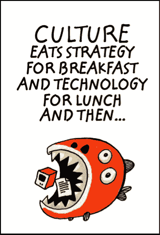
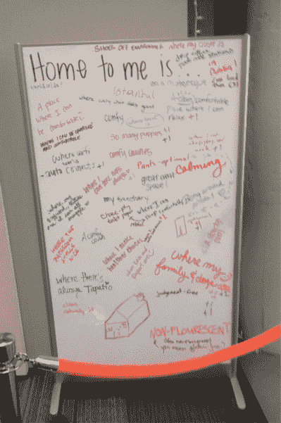
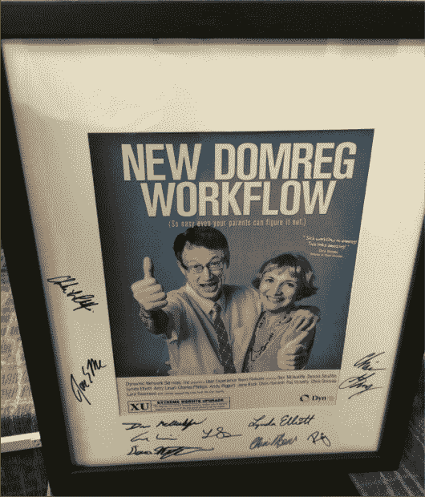

# 早餐的文化饮食策略

> 原文：<https://web.archive.org/web/https://techcrunch.com/2014/04/12/culture-eats-strategy-for-breakfast/>

More posts by this contributor

 **编者按:** *比尔·奥莱特(Bill Aulet)是[麻省理工学院创业马丁信托中心](https://web.archive.org/web/20230322231522/https://entrepreneurship.mit.edu/)的常务董事，也是[麻省理工学院斯隆管理学院](https://web.archive.org/web/20230322231522/http://sloan.mit.edu/)的高级讲师。他是最近出版的新书《自律的企业家精神:成功创业的 24 个步骤》的作者。*

我以前觉得企业文化不重要。关于愿景、使命和价值观的讨论是为那些不会制造产品或销售产品的人准备的！我们有工作要做，而这个工商管理硕士妨碍了我们！

然后我的第一家公司倒闭了。

剑桥决策动力公司没有失败，因为我们没有伟大的技术或伟大的产品或客户。作为一个可持续的、可扩展的组织，它失败了，因为我们没有有意义的目的来创建团队团结以度过艰难的时期。现在，该公司舒适地处于一种我喜欢称之为“深度隐身模式”的永久状态。

相比之下，我最近和我的一些学生参观了快速增长的公司 Eventbrite。Eventbrite 使活动策划人能够在线管理门票销售和 RSVPs，其用户已经售出了超过 20 亿美元的门票。

我们进门时，空气中弥漫着明显的活力和兴奋。几十辆整齐停放的自行车横跨在微笑的接待员旁边的一排。带我们参观的员工自豪地展示了他们的会议室，这些会议室以他们帮助客户完成的大型活动命名，包括“Promunism”，这是一个以共产主义为主题的高中舞会。那个房间有一个显眼的红色旋转式电话，用于在策划这样一个大型活动时可能出现的紧急情况，这是一个清晰可见的标志，以积极的方式将公司与客户联系起来。

一分钟后，我们走过一块白板，上面写着“家对我来说是……”，上面写满了热情的员工建议。

旧金山的 Eventbrite 办公室(摄影:Bill Aulet)。

作为纽约人，我天生对幸福和凝聚力的世界持怀疑态度。但是，当我们的主持人，营销副总裁，前麻省理工学院学生，一位数员工 Tamara Mendelsohn，带着自豪和活力大步走进房间，讨论 Eventbrite 如何从几名员工发展到数百名员工，并成为北加州其他人的成功典范时，这一切都变得有意义了。

有很多关于一级市场研究和营销技巧的技术建议，以推动市场牵引力，但迄今为止最有趣的部分是关于公司的创始人和领导人如何有意识地“设计公司文化”她解释说，起初，主要重点是在招聘过程中测试谦逊程度，他们有一个清单来执行他们的“没有混蛋”规则。但是他们很快意识到他们需要做得更多。

随着公司的发展，他们希望在整个公司保持同样的 GSD(完成工作)态度，不要让他们的公司变成“另一家公司”这很棘手，但因为创始人和员工深深地致力于这种态度，他们开发了以下解决方案:“你不能在这里抱怨，”塔玛拉解释说。“如果你发现有问题，你必须解决它。我们说这是一个提出解决方案的绝佳机会，这也是我们许多最佳项目的来源。任何事情都可以改变。我们不是任何人的受害者。我们拥有文化。”

如此强大的文化造就了如此成功的公司，这绝非偶然。如果售票软件不出问题，活动策划人就已经有足够多的事情要担心了——它需要正常工作。当我们在我们中心的活动中使用该工具时，我们不仅发现了一个很好的功能集，还发现了一个超级响应的技术支持团队，当我们搞砸或不理解某些功能时，他们会为我们提供帮助。当 Tamara 向我们解释 Eventbrite 的文化时，我明白了为什么他们的支持团队如此专注。

正如我们在课堂上所说的(感谢彼得·德鲁克，他有我们修改过的原文)，“文化早餐吃战略，午餐吃技术，晚餐吃产品，不久之后还会吃其他一切。”为什么？因为公司文化，一个由 Edgar Schein 首创的概念，是一个组织价值观的可操作化。文化引导着员工在技术业务决策和如何与他人互动方面的决策。良好的文化能让多元化的员工群体在行动上产生内在的一致性。

有些人可能认为文化不能被“设计”，它只是发生了。不管你愿不愿意，文化都会发生，这是事实。它是公司的 DNA，很大程度上是由创始人创造的——与其说是他们的言语，不如说是他们的行动。因此，不试图创造企业文化，或者更糟糕的是，不建立公司价值观的决定，实际上是你选择哪种文化将会盛行——而不是变得更好。

我应该对此感到惊讶吗？不，因为在 20 世纪 80 年代和 90 年代初的十多年里，我在 IBM 工作，当时它是世界上最受尊敬、最赚钱、发展最快的公司。从培训的第一天起(培训通常持续两年)，该公司就清楚地表明了他们的三个[核心价值观](https://web.archive.org/web/20230322231522/http://www-03.ibm.com/ibm/history/ibm100/us/en/icons/bizbeliefs/)的重要性:尊重个人、一流的客户服务以及在所有任务中追求卓越。正是这种对这些核心价值观的强烈坚持——通过培训、每月交流、绩效评估系统、榜样以及最终我们做出的每一个决定——让我们变得伟大。

在我后来的几年里，我看到了管理层对这些价值观的承诺和坚持的明显削弱。领导者开始在这些方面走捷径，以实现短期目标，因为他们对自己的职位越来越没有信心，并认为实现短期结果更重要。正是这种对这些价值观的模糊性极大地导致了 IBM 的垮台，也导致了 Lou Gerstner 成为首席执行官。

随着他努力扭转业务，他对这个问题有了更深刻的理解，他在任期结束时表达了自己的观点:“我在 IBM 的时候发现，文化不只是游戏的一个方面，它就是游戏。归根结底，一个组织只不过是其员工创造价值的集体能力。”

虽然 IBM 是一家大公司，但这种模式同样适用于我现在经营的初创公司——尤其是那些想要扩大规模的初创公司。我的同事 Paul English 在 Kayak 建立了独特的文化，这是该公司成功的基础。创始人创建了一个系统，在这个系统中，从招聘过程到运营，他们的公司文化都是卓越和高效的。要做出决定的会议不能超过三个人，因为那样的话人们会浪费时间。这创造了一种行动和问责的文化，同时交换了共识。

这种文化并不适用于所有人和所有公司，但他们在 Kayak 并没有为此道歉，并一直坚持下去。从保罗的行为，到会议室的大小，再到激励制度，这些实践每天都在强化这一点。这些努力的结果是，该公司每名员工的收入为 125 万美元，是行业平均水平的两倍多。2013 年 6 月， [Kayak 被 Priceline.com](https://web.archive.org/web/20230322231522/http://www.forbes.com/sites/greatspeculations/2013/06/03/with-kayak-in-the-bag-pricelines-u-s-business-looks-stronger/)的[以 18 亿美元](https://web.archive.org/web/20230322231522/http://priceline.com/)收购。

另一个例子是一家名为 [Dyn](https://web.archive.org/web/20230322231522/http://dyn.com/about/) 的公司，总部位于新罕布什尔州的曼切斯特。这家公司从事着为用户创造、管理和改善互联网管道的重要但平淡无奇的工作。该公司的创始人深信他们需要有一个强大的文化。与为客户创造价值的目标保持一致，他们专注于创造一个卓越的环境，允许人们诚实地面对自己的错误，促使他们改正错误，然后庆祝并永垂不朽地实现解决方案的技术努力。

这种文化又一次被房地产、接待游客的方式、公司领导的行为以及他们的高能见度电影海报带入了生活。下面是一张电影海报的例子。在这种情况下，客户注册新域名的工作流程出现了问题，因此员工们开发了一个解决方案，使其变得如此简单“甚至你的父母也能弄清楚”然后，该公司投资制作了下面的海报，并让团队在海报上签名。它现在被永久地悬挂在他们的总部。对我来说，Dyn 从 2011 年的 53 名员工发展到今天的 300 名员工并不奇怪，它被认为是一个非常规地点的巨大成功故事。

Dyn 公共区域的墙上挂着海报(摄影:Cory Von Wallenstein)。

每家公司，尤其是初创公司，都会经历一些随机事件，这些事件会有帮助，也会有伤害。提前完全预见这些事件是不可能的。这不是问题。问题是你的组织将如何应对一系列不可避免的未知和随机事件。

一个强大的产品计划是伟大的，但它也需要强大的文化，以积极的方式处理潜在的不利情况。用[纳西姆·尼古拉斯·塔勒布](https://web.archive.org/web/20230322231522/http://en.wikipedia.org/wiki/Nassim_Nicholas_Taleb)在他的书中描述的概念来说，像 Eventbrite 这样的积极文化将原本脆弱的人类系统变得抗脆弱(即，它随着随机事件变得更强)。快速成长的初创公司的不可预测的世界，以及必须做出的日常决策，往往会使企业变得更强大，而不是更弱或更混乱。

所以把我算在彻底皈依者之列。当我现在与企业家交谈时，在我被这个想法冲昏头脑之前，我想了解他们的愿景、使命和价值观。创意既便宜又美味。文化甚至在早餐前的晨跑前就吃它们。

上图由[马里乌索](https://web.archive.org/web/20230322231522/https://twitter.com/MariusUrsache)