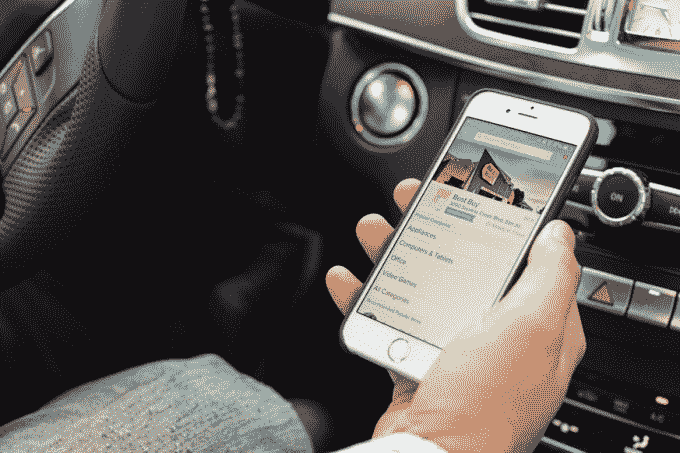

# 路边店为百思买购物者提供当天本地提货选项 

> 原文：<https://web.archive.org/web/https://techcrunch.com/2015/02/18/curbside-brings-a-same-day-local-pickup-option-to-best-buy-shoppers/>

不是所有的电子商务都涉及送货上门。移动购物应用[路边购物](https://web.archive.org/web/20221005123804/https://shopcurbside.com/)，让用户用手机购物，然后[不用下车就能在当地零售商](https://web.archive.org/web/20221005123804/https://beta.techcrunch.com/2014/10/06/backed-by-9-5-million-curbside-launches-a-mobile-shopping-app-for-same-day-pickup-not-delivery/)处取货，自去年首次亮相以来一直在快速增长，现在每周处理数千份订单。今天，该公司宣布将在圣何塞、旧金山和湾区其他地方的几个百思买门店进行推广。

虽然包括亚马逊在内的许多公司[一直专注于加快本地送货速度](https://web.archive.org/web/20221005123804/https://beta.techcrunch.com/2015/02/17/amazon-prime-now-one-hour-delivery-goes-live-across-manhattan/)，甚至为主要在城市市场的特定客户提供当天送货选项，但其他公司[，如沃尔玛](https://web.archive.org/web/20221005123804/https://beta.techcrunch.com/2015/02/12/walmart-expands-its-online-grocery-shopping-with-store-pickup-option-to-two-more-markets/)，在电子商务方面一直在尝试更多的混合模式。以沃尔玛为例，该公司已经在美国的[商店](https://web.archive.org/web/20221005123804/http://www.thecitywire.com/node/34907#.VNy3MFPF83Y)和[的](https://web.archive.org/web/20221005123804/http://www.bizjournals.com/phoenix/news/2015/02/10/walmart-tests-out-online-grocery-orders-in-phoenix.html)[商店](https://web.archive.org/web/20221005123804/https://beta.techcrunch.com/2014/01/28/walmart-to-go-denver-grocery-test/)测试了当地取货选项，顾客可以在线购物，然后停车，他们的商品被送到他们面前。

类似地，去年秋天，Curbside [开始向其他零售商提供相同类型的服务，首先是大旧金山湾区的 10 家目标商店，以及圣何塞的 Westfield Oakridge 购物中心，那里已经有几家零售商加入。现在，该公司已经签署了一项协议，将在当地的百思买商店提供这项服务，包括两家在圣何塞(桑塔纳街和圣何塞南)，一家在旧金山(Geary Blvd)，另一家在尚待确定的湾区位置。](https://web.archive.org/web/20221005123804/https://beta.techcrunch.com/2015/02/12/walmart-expands-its-online-grocery-shopping-with-store-pickup-option-to-two-more-markets/)

虽然这些扩张显然仍代表着地区零售商的试点测试，但早期数据表明，这项服务正在引起消费者的共鸣。超过 55%在路边购物的人会重复购买，该公司现在每天处理数百份订单。此外，创始人兼首席执行官 Jaron Waldman 表示，即使在假日购物季结束后，增长仍保持稳定并有所攀升。

该公司发现，最初，这项服务对年轻父母很有吸引力，他们喜欢不用让孩子下车就能拿起家用物品和婴儿用品，如尿布的便利。但随着时间的推移，产品组合已经扩大，沃尔德曼说，消费者也将路边用于其他东西，例如服装和化妆品。

百思买已经提供了自己的店内提货选项，购物者可能会选择购买更多高端商品——他们已经在网上研究过并准备现在购买的东西。顺便去商店立即取货是一种即时满足的形式，这是传统电子商务无法提供的。它还节省了送货费和许多当天购物服务的相关费用。

如果对 Target、Best Buy 和 mall operators 等零售商的测试进展顺利，该公司计划将其服务扩展到湾区的更多地方，然后扩展到其他市场。沃尔德曼还指出，他们正在计划进一步的电子商务整合，路边成为零售商在自己的结账页面上的一个履行选项，除了通过其移动应用程序成为消费者的目的地。首席执行官说，目前正在与路边的零售商和其他潜在合作伙伴讨论这些扩张。

这家公司得到了 800 万美元的首轮融资的支持，它也有别于当今许多依赖承包商来完成手头任务相关劳动力需求的初创公司，比如在镇上跑快递。Curbside 表示，其大部分员工每周工作超过 30 小时，按小时计酬并享受福利。然而，在未来，零售商可能会选择自己在路边工作。

如今，路边摊已经发展到 65 名零售员工和 25 名总部员工。现在，应用程序中提供了百思买的位置。