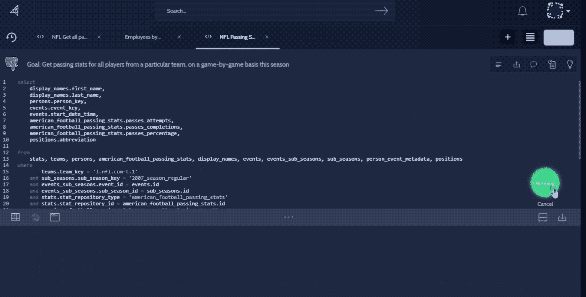

# Cursor 寻求用 2M 的新资金 TechCrunch 为任何内部数据库建立一个搜索工具

> 原文：<https://web.archive.org/web/https://techcrunch.com/2018/05/30/cursor-looks-to-build-a-search-tool-for-any-internal-database-with-2m-in-new-funding/>

随着公司变得越来越大，有可能谁有权访问和拥有什么信息将变得越来越分散——最后一个知道如何做某事的人，比如知道代码库的人，离开公司的风险开始成为一个真正的生存威胁。

显然，解决这个问题的一个方法是确保人们互相交流。但由于一旦公司拥有数千名员工，情况通常不会如此，亚当·温斯坦和他的联合创始人帕特里克·法雷尔和杰森·麦克格创办了一家名为 [Cursor](https://web.archive.org/web/20221025222035/https://www.cursor.com/) 的公司，旨在帮助内部解决这个问题。Cursor 是一种内部信息搜索工具，无论是 SQL 查询、数据库元数据，还是 Tableau 等现有平台。整个目标是尽可能地将员工之间的沟通差距减少到零，并确保不只是一个人知道如何完成不断被淹没的请求。

“硅谷有一种戴上玫瑰色眼镜的方式，”温斯坦说。“我发现，即使在解析函数的领导层，每个人都有这个问题。总的来说，软件泛滥，以至于软件背后的数据和知识变得支离破碎。如果你使用 Mixpanel 和 Google Analytics，它们都有一定程度的数据保护，跨越它们的能力越来越成为一个问题。随着业务的增长，在总体水平上获取价值变得越来越困难。有一个挑战，我们没有人可以跟踪它。如果每个团队中有人是知识型员工，他们甚至会休假，这就是一种风险。”

这家初创公司今天表示，它已经从 Toba Capital 获得了 200 万美元的融资，Ride Ventures 和几家天使投资者参与了融资，并推出了光标数据搜索和分析中心。

Cursor 在内部或多或少表现得像一个搜索引擎。用户可以搜索信息，这将显示从 Tableau 工作表到实际 SQL 段的任何内容。然后，用户可以对来自这些搜索的信息进行评论，这些信息都标有元数据，以帮助员工更容易地找到这些信息。这个想法是，如果生产团队中的某个人需要什么东西(比如一段代码)，他们应该有某种直观的方法来找到它，而不是必须启动一个有几十个人的电子邮件链。

这大部分源于温斯坦在 2014 年收购 Bright 加入 LinkedIn [时的想法。温斯坦与数据分析团队一起工作，但像任何优秀的工程师一样，他试图通过提高这些流程的效率来“让自己摆脱工作”。](https://web.archive.org/web/20221025222035/https://techcrunch.com/2014/02/06/linkedin-snatches-up-data-savvy-job-search-startup-bright-com-for-120m-in-its-largest-acquisition-to-date/)

“如果我做得对，总会有办法让你周围的事情发生得更快更便宜，”温斯坦说。“我是我们(在中国)仅有的处理诉讼、处理 M&A、降低成本以及所有这些事情的人之一。我是限制性试剂。我成了人类知识经理，我想，必须有一个解决方案来管理这一切，这就是 Cursor 背后的想法。”

一些内部搜索工具已经变得非常流行，尤其是在编程方面。虽然这不是一个精确的比较，但 Sourcegraph 在使代码易于搜索和找出谁在使用它方面[做着类似的工作](https://web.archive.org/web/20221025222035/https://techcrunch.com/2017/10/06/sourcegraph-raises-20m-bring-more-live-collaboration-to-programming/)。这一切都说明了一种趋势，即试图让所有这些信息更容易搜索，并减少电子邮件或 Slack 的开销，这肯定是大型公司将开始注意到的事情。