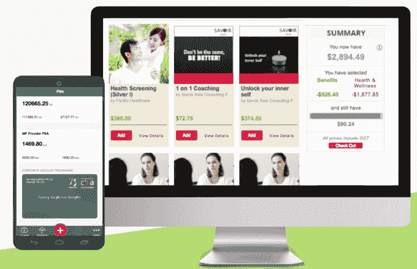
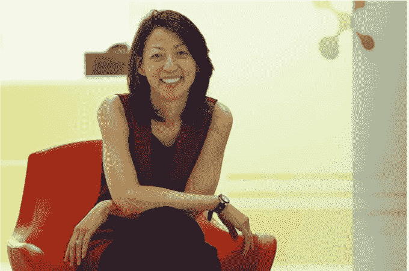

# 新加坡 CXA 筹集 2500 万美元发展其专注于健康的保险经纪公司 

> 原文：<https://web.archive.org/web/https://techcrunch.com/2017/02/08/cxa-25-million-series-b/>

[CXA](https://web.archive.org/web/20230129232726/http://www.cxagroup.com/) ，一家总部位于新加坡的创业保险经纪公司——如果有这样的事情存在的话——已经筹集了 2500 万美元来扩大其在亚洲提供专注于健康的保单的服务。

这是一次 B 轮投资，由 B Capital、[脸书联合创始人爱德华多·萨维林](https://web.archive.org/web/20230129232726/https://techcrunch.com/2016/05/19/facebook-co-founder-eduardo-saverins-new-fund-closes-initial-140m-for-deals-in-asia/)的 BCG 支持基金和新加坡经济发展局的投资部门 EDBI 领投。CXA 公开表示，这笔交易对它的估价超过 1 亿美元。根据 Crunchbase 的数据，迄今为止，它已经从投资者那里筹集了总计 3300 万美元。

CXA 的目标是通过关注健康来打破企业保险领域。这听起来可能像典型的公司噱头，但 CXA 可以支持这种说法。它不是简单地向公司出售保险费来覆盖他们的劳动力，而是内置了一个健康组件，使员工能够获得他们可以随意挑选的服务。

因此，员工不必使用指定的公司健身房或受到严格的医疗保健选项的限制，如果有的话，他们可以根据自己的意愿灵活地使用他们的分配。除了简单地帮助他们保持健康，让他们更加欣赏自己的雇主和工作，从 CXA 购买保险的公司还有切实的好处。更健康的劳动力也意味着未来更低的保费，以及潜在的生产力提升和士气提高。

这种模式特别引人注目的一点是，医疗保健的成本没有被保险购买者吸收。CXA 的平台为企业带来免费的医疗服务提供商。除了标准的保险经纪业务，CXA 还通过健康服务提供商出售给员工的交易佣金赚钱。此外，它通过自动化通常需要手动文书工作的流程来削减成本。

通过与 CXA 首席执行官兼创始人[罗莎琳·周古](https://web.archive.org/web/20230129232726/https://www.linkedin.com/in/rosaline-chow-koo-212334/)的交谈，目前最大的挑战似乎是公司的年轻。这在一定程度上解释了为什么 CXA 对其 1 亿美元的估值直言不讳，以帮助它赢得潜在新客户和潜在雇员的时间和尊重——这两个人都可能从保险行业的大公司跳槽，自然会寻求保证。

"为什么要离开一家大公司，除非他们知道我们会永远留在这里？"辜在接受采访时解释道。“我想向所有人展示，我们资金充足，受到高度重视。”

小鱼综合症一直是一个问题。辜有着令人难以置信的背景，他是在洛杉矶一个贫困社区长大的移民，三年前创立了 CXA。她注入了启动项目所需的 1000 万美元，其中一半来自储蓄，其余的是贷款，她说这笔贷款还没有还清。

作为一名长期的保险高管，她在公司的最后一段时间是美世的高级创新合作伙伴，Koo 看到了将数据增长融入保险业务的机会，特别是在她观察到成本飙升的亚洲。

“慢性病比西方早 10 年来到(亚洲)。雇主们表示，他们无法承受双倍的医疗保险费用，他们一直在试图了解如何让员工更健康，”她说。

解决方案似乎显而易见，但大公司仍在争先恐后地重新安排自己以利用优势。CXA 从一开始就做到了这一点，但辜认为她的领先优势很微弱，因为其他人将不可避免地赶上来。

“这是时间问题，”她说。“因为我们更了解这个行业，我们能接触到客户和保险，所以我们必须不断创新，否则他们会赶上来。我们可能有两年的领先优势，我们可以在市场上制造这么多混乱。”

> CXA 首席执行官兼创始人罗莎琳·周古

由于这种商业模式，古永锵透露，该公司已经盈利，但它不想停滞不前，被抓住。该公司计划利用这笔新融资，将业务重点从新加坡和香港扩大到亚洲更多地区。古永锵透露，CXA 已经与一家未透露姓名的英国合作伙伴签署了经纪业务许可和收入分成协议，该协议将把业务扩展到中国、印度、印尼、日本、马来西亚、菲律宾、韩国、台湾和泰国。但从长远来看，她承认，获得自己的牌照可能是谨慎的，可能是通过收购一家经纪公司。

除了地理扩张之外，辜还希望扩大 CXA 的服务，让保险公司和银行能够向现有用户(即其客户的员工)交叉销售新套餐。也就是说，该公司希望释放用户的潜力，让他们获得更多他们可能不知道或不了解的银行、金融和保险服务。拥有 500 名 CXA 客户的初步试点进展顺利，足以保证很快进行更全面的推广。该公司还正在转向 Saas 平台，这将有助于其客户获得更多信息。

所有这些破坏已经引起了涟漪。古永锵承认，已经多次接触 CXA，寻求收购。

“我们太小了，够不着，”她评论道。“我们需要比现在大 5 到 10 倍。”

Koo 说，与其卖给保险公司，像谷歌这样的科技公司可能是更好的母公司。但目前，她仍专注于扩大公司规模，因此退出还很遥远。

截至目前，CXA 拥有 45 家《财富 100 强》客户，在新加坡和香港的办事处拥有近 200 名员工。一家上海办事处将于下个月开业。