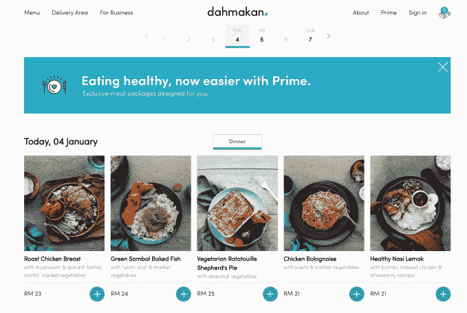
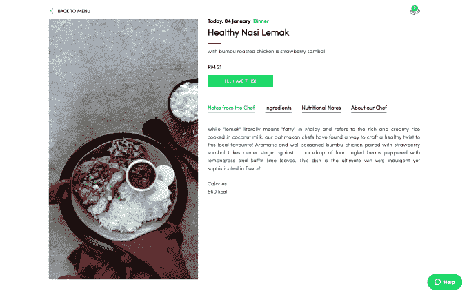

# 马来西亚 Dahmakan chows 的端到端食品配送服务 TechCrunch 降价 260 万美元

> 原文：<https://web.archive.org/web/https://techcrunch.com/2018/01/04/dahmakan-chows-down-2-6m-more/>

马来西亚食品配送初创公司 Dahmakan 去年从 Y Combinator 毕业，已经筹集了 260 万美元，开始探索在东南亚扩展业务的潜力。

这家初创公司与 FoodPanda 和 Deliveroo 等公司不同，它采用“端到端”的食物方式，也就是说，它自己烹饪所有的菜肴，并将其配送给客户。(这也被称为“全栈”，但也许“食物栈”更合适。)最重要的是，它认为它的食物是健康的，而不是垃圾/各种各样的——这对那些(我们)在新的一年充满健康活力的人来说是正确的。

对于这家总部位于吉隆坡的初创公司来说，去年是重要的一年。[它在 2 月份](https://web.archive.org/web/20221205132100/https://beta.techcrunch.com/2017/02/19/malaysias-dah-makan-raises-1-3m/)筹集了 130 万美元，然后成为[YC 2017 年夏季项目](https://web.archive.org/web/20221205132100/https://beta.techcrunch.com/2017/08/22/yc-demo-day-s17-day-2/)的一部分，成为第一家进入高评级创业加速器的马来西亚创业公司。这一次，新一轮融资由 Y Combinator、德州大西洋资本(Texas Atlantic Capital)、瑞士家族办公室 Atami Capital 和私募股权基金 APAX Partners 的一位前创始人牵头，未披露身份的现有支持者参与了融资

Dahmakan 联合创始人杰西卡·李(Jessica Li)是 2015 年创立该公司的三位前食品熊猫之一，她告诉 TechCrunch，新资金(A 轮融资前)将用于开发技术和探索在东南亚扩展业务的机会，到 2025 年，该地区的在线支出预计将翻两番。

印度尼西亚和泰国是目前正在考虑的两个市场扩张点。

> Dahmakan 上提供的一些晚餐选择

在技术方面，Dahmakan 投资于物流和人工智能技术，创建了 Dahmakan 智能操作员系统(DIOS)，这家初创公司声称这是一个管理其车队和客户需求的自学系统。与其他公司不同，如与食品商店合作经营的 FoodPanda，Dahmakan 在固定的用餐时间送货，因此它能够对送货时间进行更多的控制。

食物不是在任何时间点单，而是在预定的时间窗口送到顾客手中，这就保证了食物不会迟到，或者顾客可以退款。

除了零点菜单，Dahmakan 还提供“Prime”套餐，为批量购买 10 份、20 份或 50 份餐的客户提供折扣，同时还有更灵活的商务餐饮选择。

在内部控制所有过程似乎比食品配送公司的碰运气方法更有利可图，后者需要巨大的规模才能实现盈利。Dahmakan 声称单位盈利，并表示自推出以来，每月销售额持续增长 20%。

FoodPanda、Uber Eats 和 Deliveroo 是该地区显而易见的竞争对手，但新加坡的 [Grain 可能是最接近 Dahmakan 端到端方法的](https://web.archive.org/web/20221205132100/https://beta.techcrunch.com/2016/01/20/grain-series-a/)。

> 椰浆饭是马来西亚的一道经典菜肴