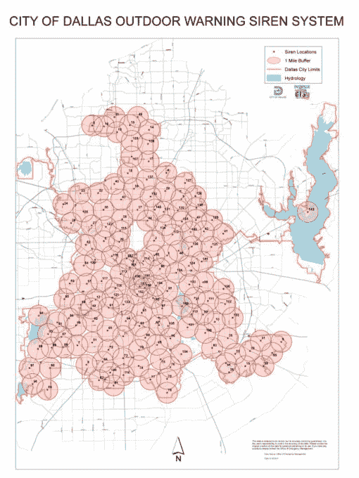

# 无线电信号黑客让达拉斯的警笛变得疯狂 

> 原文：<https://web.archive.org/web/http://techcrunch.com/2017/04/12/dallas-emergency-system-100000-dollar-upgrade-radio-hack/>

# 一个无线电信号黑客让达拉斯的警笛变得疯狂

上周五，当达拉斯的户外警报器发出狼来了的警报时，Twitter 侦探得出结论，黑客通过一个脆弱的计算机网络劫持了警报器。事实证明，警报器根本不是电脑化的——它们是通过一个有十年历史的无线电系统来控制的，这个城市刚刚投票花费 10 万美元来升级 T1。

本周，达拉斯市官员[披露了上周五混乱](https://web.archive.org/web/20230129224931/https://www.dallasnews.com/news/news/2017/04/10/hacker-broadcast-signal-triggered-dallas-emergency-sirens-friday-night)的一些细节。“这是一个无线电系统，而不是电脑问题，”达拉斯城市经理 T.C. Broadnax 解释说。该市的户外警报系统于 2007 年首次安装，由一家名为联邦信号公司(Federal Signal Corp .)的公司制造的 156 个警报器提供动力。市政府官员拒绝提供应急系统如何工作的细节，只是指出“这是一个音调型系统”，这表明它可能会被复制触发警报所需的音调代码的外部无线电设备破坏。整个事情听起来有点像大规模的[电话窃听](https://web.archive.org/web/20230129224931/https://www.wired.com/1993/04/phreaks/)，这很酷，但鉴于美国主要城市可能存在许多类似的不安全系统，这可能比酷更可怕。

周五晚些时候触发后，无线电系统被禁用，以便该市可以采取一些基本的预防措施。当该系统在周末恢复运行时，它使用了加密技术来保护其音调语言，这一措施本可以避免整个磨难。

对于那些仍然认为黑客攻击总是像《机器人先生》中的场景的人来说，达拉斯事件只是又一个警示故事。如今，人们对公共基础设施安全感到紧张是有充分理由的:当联邦政府努力保护全国范围内的关键基础设施时，异构的城市和州级技术提供了一个不断蔓延的攻击面。记住这一点，值得记住的是，并不是所有的安全事件都涉及在计算机屏幕上滚动的矩阵风格的代码行。显然，一个好的老式无线电黑客仍然可以肆虐。