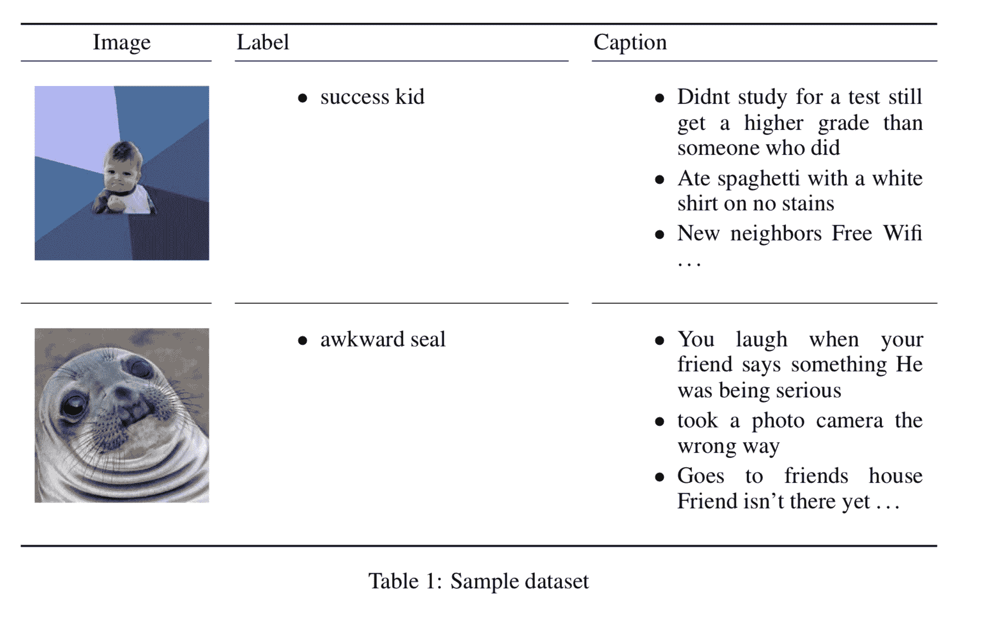
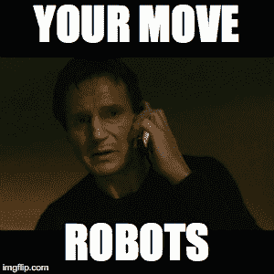

# Dank 学习系统自动生成模因 

> 原文：<https://web.archive.org/web/https://techcrunch.com/2018/06/15/dank-learning-system-autogenerates-memes/>

# Dank 学习系统自动生成模因

我们都知道，在不久的将来，人类将走到一个十字路口。鉴于目前全球 99%的人口都在从事创造模因和/或湿模因的工作，当计算机在这方面比人类做得更好时会发生什么？研究人员可能刚刚发现。

斯坦福大学的两位研究人员 Abel L. Peirson V 和 E. Meltem Tolunay 利用机器学习创建了一个系统，可以自动生成包括上面可见的迷因。他们发现，他们的系统“产生的原始迷因总体上无法与真实迷因区分开来。”

你可以在这里阅读[报道。](https://web.archive.org/web/20221025222310/https://arxiv.org/pdf/1806.04510.pdf)

该系统使用预训练的 Inception-v3 网络，该网络使用[长短期记忆](https://web.archive.org/web/20221025222310/https://en.wikipedia.org/wiki/Long_short-term_memory)模型来产生适用于特定图片的字幕。人类然后评估迷因的幽默，奖励系统真正的 LOLs。

研究人员用“400，000 个图像、标签和标题三元组以及 2600 个独特的图像-标签对”来训练网络，其中包括真实人类产生的有趣的模因。然后，该系统以类似的方式再造迷因。

有用吗？是的，它会，但我怀疑它会在短时间内取代人类迷因工作者。人类似乎是安全的……目前如此。

> 我们承认，在我们的项目和其他语言建模任务中，最大的挑战之一是捕捉幽默，这因人和文化而异。事实上，这本身就构成了一个研究领域，相应地，关于这个问题的新的研究思路应该在未来纳入迷因生成项目。一个例子是在数据集上进行训练，该数据集包括图像的上下之间的文本中的断点。这些都是人工选择的，对模因的幽默效果很重要。如果模型可以学习断点，这将是一个巨大的进步，可以完全自动化迷因的生成。未来工作的另一个途径是探索对图像起作用的视觉注意机制，并研究它们在模因生成任务中的作用。

然而，可悲的是，我们仍然不能相信我们的机器人模因统治者不令人讨厌。

研究人员写道:“最后，我们注意到数据集中存在对脏话、种族主义和性别歧视的偏见，因此未来工作的另一种可能性是解决这种偏见。”

