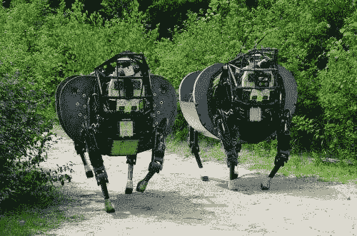

# DARPA 奖励 6500 万美元开发完美的微型双向脑机接口

> 原文：<https://web.archive.org/web/https://techcrunch.com/2017/07/10/darpa-nesd-grants-paradromics/>

# DARPA 奖励 6500 万美元用于开发完美的微型双向脑机接口

有了 6500 万美元的新资金，DARPA 寻求开发神经植入物，使人类大脑有可能直接与计算机接口对话。作为其神经工程系统设计( [NESD](https://web.archive.org/web/20230405051109/https://www.darpa.mil/program/neural-engineering-system-design) )计划的一部分，该机构将资助五个学术研究小组和一家位于圣何塞的小公司来推进其目标。

为了体验 DARPA 感兴趣的东西，布朗团队将致力于创建一个界面，将一个巨大的“神经颗粒”网络编织在一起，可以作为大脑皮层顶部或内部的植入物。这些传感器将能够进行实时电子通信，目的是了解大脑如何处理和解码口语——这是一个如此复杂和自动化的大脑过程，以至于研究人员仍然无法理解它的某些方面。

在六名接受者中，四人对视觉感兴趣，其余两人检查听觉和言语。[麻省理工科技评论](https://web.archive.org/web/20230405051109/https://www.technologyreview.com/s/608219/us-to-fund-advanced-brain-computer-interfaces/)报道称，Paradromics 是唯一一家被列入融资新闻的公司，将获得约 1800 万美元。与布朗团队类似，Paradromics 将利用这笔资金开发一种能够解码和解释语音的假肢。

获奖者有一个远大的目标清单。最重要的是 DARPA 希望开发“高分辨率”神经植入物，一次性记录多达一百万个神经元的信号。最重要的是，它要求设备能够双向通信——接收信号并将其传输回来。它希望这种能力在一个不超过两枚堆叠在一起的镍币的包装中。

“通过增加高级神经接口的能力，以并行处理 100 多万个神经元，NESD 的目标是实现与大脑的双向交流，这将有助于加深我们对该器官底层生物学、复杂性和功能的理解，”NESD 项目创始人菲利普·阿尔韦达在声明中说。

NESD 奖获得者的完整名单:

在为期四年的项目过程中，研究小组将与美国食品和药物管理局就在人脑中安装 DARPA 的梦想植入物的长期安全影响进行协调。

一旦被破解，这项最常被称为脑机接口(BCI)的技术将打开一个充满可能性的世界。从创伤性脑损伤的康复到只用思维输入 WhatsApp 信息，脑机接口有可能彻底改变现代技术的方方面面。但是，即使资金流入，开发这种技术的挑战仍然数不胜数:硬件如何做到足够小且无创，可以在日常生活中佩戴？考虑到创建与人脑直接连接的隐私噩梦，我们将如何保护它们？

打造一个可行的脑机接口是一项挑战，它将一些最棘手的软件问题与最棘手的硬件问题交织在一起。虽然 DARPA 肯定不是唯一一个对建造双向大脑植入的桥梁感兴趣的财大气粗的实体，但凭借其国防预算和学术联系，它绝对是我们赌的仿生马。

国防高级研究项目署