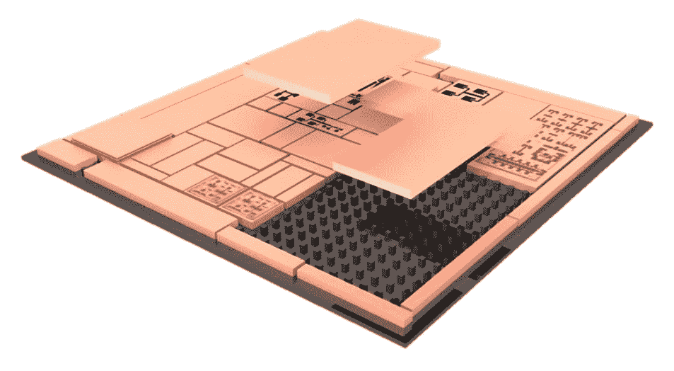
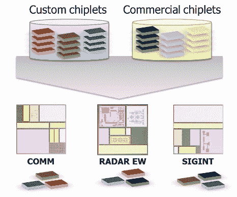

# DARPA 项目旨在用“小芯片”制造模块化计算机

> 原文：<https://web.archive.org/web/https://techcrunch.com/2017/08/26/darpa-project-aims-to-make-modular-computers-out-of-chiplets/>

国防部的研究部门已经正式开始努力[创建一个模块化计算框架](https://web.archive.org/web/20230126231719/https://www.darpa.mil/news-events/2017-08-25)，从一组混合的“小芯片”中抽取一些部分。该机构表示，生产这种奇怪的东西需要一个村庄——事实上，“一个充满创新者的巨大村庄。”国防高级研究计划局总是有办法处理文字。

该计划于去年首次宣布，被称为通用异构集成和知识产权重用策略，他们简称为芯片。它一直在接触大学、军工承包商，当然还有半导体和芯片企业，以探索这种可能性，本周是“提案日”，该机构和感兴趣的各方分享细节和期望。

 基本上，这个想法是在合理的范围内，将某些功能减少到标准的小芯片尺寸和形状因子，并创建一个系统，通过该系统可以将这些小芯片组织成更大的电路板。需要一个为卫星或侦察无人机提供大量图像处理和存储的主板吗？把这些碎片放在一起。想要更专注于低延迟信号处理和集成来自多个传感器的输入？忘记图像的东西，捕捉一些其他部分。

在本周的活动中展示的幻灯片有更多的细节，尽管这个项目仍处于早期阶段，它仍然是相当推测性的。

 目前还不清楚这些小芯片的大小或形式——这要由那个巨大村庄的创造者、创新者来决定。这可能是宏观层面的交换，比如插入额外的 RAM 或 PCI 卡。或者，它可以在制造阶段进行烘焙，但仍然比现有的定制芯片系统更加灵活。

然而，理想情况下，最终的电子设备将比当前的解决方案更小，功能更多，制造和更换成本更低——这在某些情况下并不难，因为一些军事系统可以追溯到几十年前。

DARPA 热衷于强调，它不希望任何东西从零开始重新制作，而只是重组东西以创建一个更灵活的基础设施。在许多情况下，全能 PC 的旧模式不再是最好的。然而，这可能意味着建立新的接口或标准。

DARPA 的比尔·沙佩尔在公告中总结道:“通过从商业领域带来最好的设计能力、可重构电路结构和加速器，我们应该能够通过添加更小的专用芯片来创建防御系统。”

项目经理丹·格林(Dan Green)对芯片有更有见地的看法:

“现在，我们正在超越漂亮的图片和纯粹的文字，我们正在卷起袖子做艰苦的工作，改变我们思考、设计和建造微电子系统的方式。”