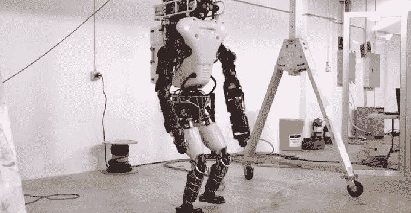

# DARPA 令人难以置信的人形机器人现在可以用自己的双脚行走，不需要任何支撑

> 原文：<https://web.archive.org/web/http://techcrunch.com/2015/01/20/darpas-incredible-humanoid-robot-can-now-walk-on-its-own-two-feet-no-support-required/>

# DARPA 令人难以置信的人形机器人现在可以用自己的双脚行走，不需要任何支撑

记得阿特拉斯吗？DARPA 与波士顿动力公司(现归谷歌所有)合作建造的巨型步行机器人？

上次我们看到它时，它有两个主要缺陷，使它变得不那么令人生畏:它非常吵，需要一根又大又粗的支撑电缆来保持它的供电和直立。

这两个问题都已得到解决。

DARPA 今天发布了一段视频，展示了最新版本的 ATLAS，真是太棒了。DARPA 表示，大约 75%的机器人已经被重新设计，只有膝盖以下的部分保持不变。

上一代 ATLAS 通过难看的电缆系绳获得电力(因此极大地限制了它的范围)，而现在机器人背着自己的电源。在它的自带电池耗尽之前，它可以工作大约一个小时。

虽然上面视频中的 ATLAS 仍然由一根支撑绳支撑着，但这只是为了操作者的安全——而不是为了“哦，上帝，邪恶的机器人正在逃跑！”感觉。进来时大约有 350 磅重的金属和尖角，还刚刚学会走路，这可不是你想一头撞下来的东西。

与此同时，新款 ATLAS 比前几代产品安静得多。就在一年前，在 ATLAS 旁边工作意味着戴耳塞——现在，由于新的压力泵设计，噪音比震耳欲聋更令人讨厌。

除此之外，一系列小的调整使 ATLAS 更接近约翰·康纳噩梦中的东西:手臂已经重新定位以增加它们的范围，手臂和腿部的新致动器使它比以往任何时候都更强大，无线紧急停止允许操作者在出现问题时立即拔掉电源插头(当然，直到机器人变得有知觉，拔掉自己的开关，穿墙获得自由)。)

哦，多亏了新发现的手腕旋转能力，ATLAS 可以打开门把手——所以如果你想在机器人大战中幸存下来，需要藏在扫帚柜里，那可能是时候想出一个新的了。

**作为参考，下面是 ATLAS 在 2013 年底的位置:**

现在它可以做所有的事情……但是没有电线。