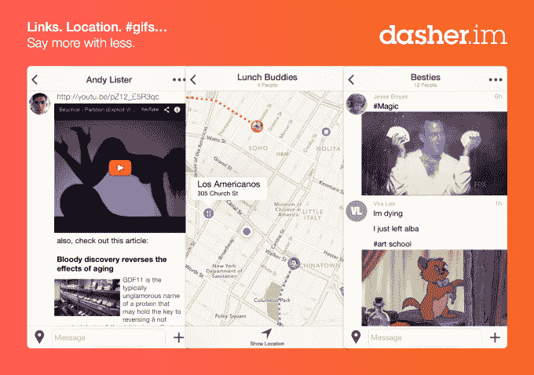

# Dasher 将消息应用提升了一个档次，支持丰富内容、位置共享、gif 等

> 原文：<https://web.archive.org/web/https://techcrunch.com/2014/07/08/dasher-takes-messaging-apps-up-a-notch-with-support-for-rich-content-location-sharing-gifs-and-more/>

你需要另一个消息应用程序吗？做 gif 的那个？当然，为什么不呢？！你的 iPhone 的“聊天应用”文件夹的第 10 页还有空间，对吗？太好了！介绍争夺消息应用宝座的最新竞争者: [Dasher](https://web.archive.org/web/20230405064514/https://dasher.im/splash) ，这是一款新的社交应用，由来自 [Lerer Ventures](https://web.archive.org/web/20230405064514/http://www.crunchbase.com/organization/lerer-ventures) 、 [Venrock](https://web.archive.org/web/20230405064514/http://www.crunchbase.com/organization/venrock) 和其他天使投资人的 125 万美元种子资金支持。

Dasher 成立于去年年底，由杰西·博耶斯创建，他曾是 Gilt Groupe 的移动工程主管；安迪·李斯特，前 Foursquare iOS 和 HowAboutWe iOS 负责人；和德克·麦考密克，前 Jetsetter 网站负责人。

博耶斯说，这个想法最初是他在 Gilt 时产生的，当时他开始研究公司使用的新消息服务，回来后对当前的选择感到失望。

“每个人都在努力打造更好的手机短信——以略有不同的方式发送相同类型的内容，但都是一样的东西，”他感叹道。“你在发送文本，你在发送图像。博耶斯说:“也许一个应用程序试图通过提供更好的群体体验或发送贴纸来实现差异化，但你很快就会达到一个较低的上限。”。

最初的想法是创建一个更好的用于企业的消息平台，但是团队很快发现他们越是使用他们所构建的东西，他们就越是喜欢它。所以他们决定让 Dasher 成为一款面向消费者的应用。

至于是什么让 Dasher 与众不同，它专注于支持除文本和照片之外的其他类型的内容。

博耶斯解释说，这款应用允许“丰富的嵌入式内容”，包括粘贴链接时的文章片段，分享视频 URL 时的嵌入式 YouTube 和 Vimeo 播放器，以及 Twitter 或维基百科等其他网站的丰富链接等。

哦，对了——gif。GIF 功能很有趣——你只需输入一个标签，Dasher 就会自动在你的信息中包含一个 GIF，这要归功于与在线 GIF 资源 Giphy 的集成。

用户还可以编辑和删除消息，这使他们能够更好地控制消息传递体验，并且他们可以通过“在路上”功能与朋友分享他们的位置。通过这个，Dasher 将在接下来的一个小时内跟踪你的位置(或者直到你停止它)，提醒朋友你在你的路线上的当前进度。(请注意，苹果即将发布的移动操作系统升级版 iOS 8 已经内置了类似的位置共享功能。在那里，你也可以在其他时间间隔分享你的位置，比如“直到一天结束”，或者“无限期地”)

虽然 Dasher 的功能使其成为比几个竞争对手更强大的移动通讯应用，但它并不是第一个提出提供更丰富通信的人。[由李嘉诚旗下的地平线风险投资公司(Horizons Ventures)、阿什顿·库彻和其他人](https://web.archive.org/web/20230405064514/https://techcrunch.com/2013/06/25/android-first-mobile-messenger-invi-raises-3-million-for-its-sms-replacement-app/)支持的消息应用 Invi 也专注于“富媒体消息”，而 [iOS 应用 Emu 包括内置助手、嵌入式内容和位置共享](https://web.archive.org/web/20230405064514/https://techcrunch.com/2014/04/02/emu-a-smarter-messaging-app-with-a-built-in-assistant-exits-beta/)。尽管它们各有特色，但都还没有成为热门。

那么，像现在来到这个拥挤场景的许多其他人一样，Dasher 的目标不仅是如何从人群中脱颖而出，而且是如何让用户尝试一下。在今天的 Dasher 案例中，邀请朋友的唯一机制是一个 SMS 邀请过程(谢天谢地，这不是自动垃圾邮件)。但目前还没有内置的脸书交友工具，也没有从其他地方导入社交图的工具。

[slideshow ids="1026465，1026466，1026467，1026468，1026469 "

但是 Dasher，像另一款名为 Hipe 的消息应用程序一样，也计划转向网络来吸引新用户。很快，Dasher 用户将能够向朋友发送链接，他们可以在线查看这些链接，即使他们不是 Dasher 应用程序的用户。网络功能将在几周内上线，而 Dasher 的 Android 版本将于今年夏天推出。

与此同时，感兴趣的 iOS 用户可以在 iTunes 上免费下载 Dasher 应用程序[。](https://web.archive.org/web/20230405064514/https://itunes.apple.com/us/app/dasher-messenger/id878734406?mt=8)

[vimeo 100129277 w=500 h=281]