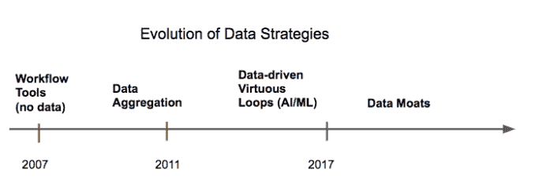

# 数据不是新的石油

> 原文：<https://web.archive.org/web/http://techcrunch.com/2018/03/27/data-is-not-the-new-oil/>

乔斯林·戈德费恩撰稿人

 More posts by this contributor

构建软件比以往任何时候都容易，这使得构建可防御的软件业务比以往任何时候都难。所以难怪投资者和企业家都看好数据形成新竞争优势的潜力。一些人甚至将数据誉为“新石油”。我们专门投资于利用数据和人工智能解决商业问题的初创公司，因此我们当然看到了吸引力——但石油类比是有缺陷的。

在对大数据的热情中，人们很容易忽略一个事实，即所有数据并非生来平等。创业公司和大公司都吹嘘他们积累的数据量，从万亿字节的数据到超过国会图书馆所有信息量的数据。数量本身并不能构成“数据护城河”

首先，原始数据远不如用来解决问题的数据有价值。我们在公开市场上看到了这一点:作为数据聚合者和商人的公司，如[尼尔森](https://web.archive.org/web/20230330232920/http://www.nielsen.com/us/en.html)和 [Acxiom](https://web.archive.org/web/20230330232920/https://www.acxiom.com/) ，其估值倍数远低于那些通过数据结合算法和人工智能制造产品的公司，如网飞或脸书。当前这一代人工智能创业公司认识到了这种差异，并应用机器学习模型从他们收集的数据中提取价值。

即使将数据用于支持基于 ML 的解决方案，数据集的大小也只是故事的一部分。数据集的价值，数据护城河的力量，来源于上下文。有些应用程序要求模型在为客户提供任何价值之前被训练到很高的精确度，而其他应用程序则需要很少的数据或根本不需要数据。一些数据集是真正专有的，而另一些是容易复制的。一些数据的价值会随着时间的推移而衰减，而另一些数据集却经久不衰。应用程序确定数据的值。

## **定义“数据偏好”**

机器学习应用程序可能需要大量不同的数据来为最终用户提供有价值的功能。

*地图阈值*

在云时代，最小可行产品(或 MVP)的概念已经深入人心——软件特性的集合，其价值刚刚够寻找初始客户。在智能时代，我们看到数据和模型的模拟出现:证明采用所需的最低水平的准确智能。我们称之为最低算法性能(MAP)。

大多数应用程序不需要 100%的准确性来创造价值。例如，医生的生产力工具最初可能会简化电子健康记录系统的数据输入，但随着时间的推移，可以通过学习医生在系统中输入的内容来自动输入数据。在这种情况下，MAP 为零，因为应用程序从第一天起就具有仅基于软件特性的价值。智力可以以后再加。然而，人工智能是产品核心的解决方案(例如，从 ct 扫描中识别中风的工具)，可能需要等同于现状(基于人的)解决方案的准确性。在这种情况下，地图将与人类放射科医生的表现相匹配，在商业发射可行之前，可能需要大量的数据。

*性能阈值*

不是每个问题都能以接近 100%的准确率解决。鉴于目前的技术水平，有些问题过于复杂，无法完全建模；在这种情况下，大量的数据将不会是一个银弹。添加数据可能会逐渐提高模型的性能，但很快就会遭遇边际收益递减。

在另一个极端，一些问题可以用非常小的训练集以接近 100%的准确率解决，因为建模的问题相对简单，几乎没有要跟踪的维度，结果也几乎没有变化。

简而言之，有效解决问题所需的数据量变化很大。我们将达到可行的准确度水平所需的训练数据量称为性能阈值。

人工智能支持的合同处理是低性能门槛应用的一个很好的例子。有数以千计的合同类型，但大多数都有共同的关键领域:参与方、交换的价值项目、时间框架等。抵押申请或租赁协议等特定文档类型已高度标准化，以符合法规要求。在多家初创公司中，我们已经看到自动处理文档的算法只需要几百个样本就可以训练到可接受的准确度。

创业者需要穿针引线。如果性能阈值很高，您将遇到一个引导问题，即获取足够的数据来创建一个产品，以推动客户使用和更多的数据收集。太低了，你还没有建立起一个数据护城河！

*稳定阈值*

机器学习模型对取自它们所代表的真实世界环境的例子进行训练。如果条件随着时间推移逐渐或突然改变，而模型没有随之改变，模型将*衰退*。换句话说，模型的预测将不再可靠。

比如 [Constructor.io](https://web.archive.org/web/20230330232920/https://constructor.io/) 就是一家利用机器学习对电商网站搜索结果进行排名的创业公司。该系统观察客户对搜索结果的点击，并使用该数据来预测未来搜索结果的最佳顺序。但是电子商务产品目录是不断变化的。一个对所有点击进行同等加权的模型，或者只对一段时间的数据集进行训练的模型，有高估旧产品的风险，而牺牲了新推出的和当前流行的产品。

保持模型稳定需要以与环境变化相同的速度吸收新的训练数据。我们称这个数据采集速率为稳定性阈值。

易腐数据并不能构成一个很好的数据壕沟。另一方面，当稳定性阈值较低时，对大量新数据的持续访问可能会成为难以逾越的障碍。

## **识别具有长期防御能力的机会**

地图、性能阈值和稳定性阈值都是识别强大数据壕沟的核心要素。

先行者可能有一个进入新类别的低地图，但一旦他们创建了一个类别并领导它，未来进入者的最低标准是等于或超过先行者。

需要较少数据来达到性能阈值和较少数据来维持该性能(稳定性阈值)的域不太容易防御。新进入者可以很容易地积累足够的数据，并匹配或超越你的解决方案。另一方面，解决低性能阈值(不需要太多数据)和低稳定性阈值(数据快速衰减)问题的公司仍然可以通过比竞争对手更快地获取新数据来建立护城河。

## **强大数据护城河的更多元素**

人工智能投资者热衷于谈论“公共数据”与“专有数据”来对数据集进行分类，但数据护城河的优势有更多维度，包括:

*   易接近
*   时间—数据收集和在模型中使用的速度有多快？能否立即访问数据，还是需要花费大量时间来获取和处理数据？
*   成本—获取这些数据需要多少钱？数据的用户需要为许可权付费还是付钱给人类来标记数据？
*   唯一性-类似的数据是否可以被其他人广泛使用，然后他们可以构建一个模型并获得相同的结果？这种所谓的专有数据可能更好地被称为“商品数据”，例如:工作列表、广泛可用的文档类型(如 NDA 或贷款申请)、人脸图像。
*   维度——一个数据集中描述了多少不同的属性？它们中有许多与解决问题相关吗？
*   广度——属性值的变化范围有多大？数据集考虑了边缘情况和罕见的例外吗？能否将所有客户的数据或知识汇集起来，以提供比仅来自一个客户的数据更广泛的覆盖面？
*   易腐性—随着时间的推移，这些数据的适用范围有多广？从这些数据中训练出来的模型是否可以长期持续，或者是否需要定期更新？
*   良性循环——绩效反馈或预测准确性等结果能否用作改进算法的输入？性能会随着时间的推移而复合吗？

软件现在是一种商品，对于公司建立长期竞争优势来说，数据壁垒比以往任何时候都更加重要。随着科技巨头普及人工智能工具包以吸引云计算客户，数据集是最重要的差异化方式之一。真正可防御的数据护城河并不仅仅来自于积累最大量的数据。最好的数据护城河与特定的问题领域相关联，在这个领域中，独特的、新鲜的数据在为客户解决问题时具有复合价值。