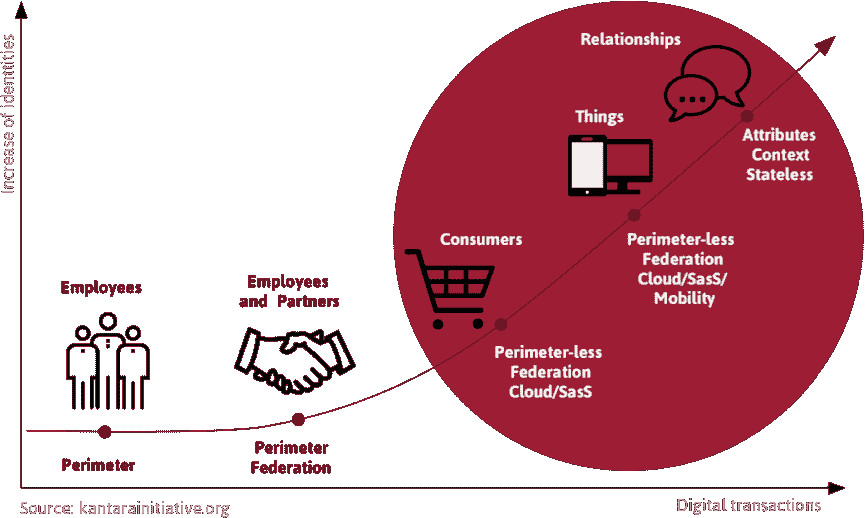

# 数据最小化——初创公司的新设计规则

> 原文：<https://web.archive.org/web/https://techcrunch.com/2016/12/09/data-minimization-the-new-design-rules-for-startups/>

[Nathan Kinch](https://web.archive.org/web/20221219211720/https://uk.linkedin.com/in/nathan-kinch-03359b40)

是 Meeco 体验和实验室的负责人，他整天都在思考第一人称技术带来的人类体验的价值、意义和参与度。在前世，他也是一名高尔夫球手。

等等，什么？

是的，你没看错。“数据”和“最小化”，这两个词很少在同一个句子中使用，现在代表了我们必须应用的关键产品设计规则之一，如果我们要建造的产品为我们服务的人类提供价值、意义和参与度。

有点迷茫？别担心。让我们“西蒙·西内克”这篇文章和[从为什么](https://web.archive.org/web/20221219211720/https://www.startwithwhy.com/)开始。

如果你在欧洲，并且你没有生活在岩石下，你无疑知道将于 2018 年生效的[通用数据保护条例](https://web.archive.org/web/20221219211720/https://ico.org.uk/for-organisations/data-protection-reform/overview-of-the-gdpr/) (GDPR)。设计的隐私、数据最小化和被遗忘的权利都是 GDPR 的要求。是的，组织必须遵守。

如果你在澳大利亚，你现在可能知道澳大利亚生产力委员会的[数据可用性和使用报告](https://web.archive.org/web/20221219211720/http://www.pc.gov.au/inquiries/current/data-access/draft)。简而言之，委员会希望消费者拥有的“全面权利”意味着消费者:

*   保留查看其持有的信息、要求编辑或更正以及被告知向第三方披露的权利；
*   提高了在某些情况下选择退出收集的权利；和
*   对提供给他们或指定的第三方(例如新的服务提供商)的数据的机器可读副本具有新的权利。

你可能在其他地方工作；亚洲、中东、非洲或美国。在这种情况下，让我们不要停留在支持这一点的不断发展的监管格局中，而只看几个关键的统计数据:

*   超过 4 亿人安装了广告拦截器
*   在全球范围内，约 80%的人表示，在使用公司数据方面，他们不信任公司
*   由于数据质量差，30%的企业收入面临风险(是的，人们在填写您设计的冗长表格时会谎报自己的身份……)
*   一个完整的个人信息管理服务(PIMS)生态系统正在形成
*   数万亿美元危在旦夕

这个相当于狂野西部的数据面临着生存威胁。人们，无论是通过他们的态度和行为，还是通过不断发展的监管，正在获得对其个人信息和日益微妙的数字身份的控制权。

个人数据不再仅仅是大型组织资产负债表上的一项资产。它正迅速成为数据主体的资产，即数据所涉及的人。

这意味着组织仅仅是人类(客户)数据的临时保管者。这种转变迫使我们改变索取、存储和利用个人数据的方式——这意味着我们的设计模式、启发式方法和最佳实践必须不断发展。

这样想一想；当你在现实世界中遇到某人时，你会告诉那个人你所有的秘密吗？你会给那个人看你的护照和驾照吗——允许他们为了安全起见拍照？你给他们你左腿内缝尺寸的细节了吗？

不太可能。

在现实世界中，我们倾向于逐步披露信息。我们是在持续对话的基础上这样做的，在对话中，通过相互交流发展了共同的理解并赢得了信任。

这是因为我们有机构来决定我们披露什么，向谁披露，在什么情况下披露。另一个人也有同样的权力，因此，我们在平等的条件下运作。

通过前面提到的 PIMS 生态系统，我们现在可以在数字世界中支持这些类型的交换。

此外，通过有意识的设计努力，尊重你的产品所服务的人的能动性，你可以更有效地利用“正确的”数据。

所以，这里是你一直在等待的设计规则。

## 逐步获取数据，并且仅在真正需要时获取

这意味着，你实现价值主张所需的数据必须与关系的背景和阶段相匹配。

如果有人想参加导游，想办法让他们匿名浏览。然后，在时机成熟时，为他们提供具体的、以行动为导向的、创造价值的入职培训。带领他们走上成功之路，让他们能够利用自己的数据来帮助实现这一成果。

要对这条规则进行商业分析，请关注重要的指标。LTV 不仅仅意味着今年 12 月的注册人数。

## 清楚地陈述你的目的

您是您打算使用的个人数据的临时保管人。为了实现您的业务目标，您必须通过平权行动，最大限度地提高人们明确同意您使用其信息的可能性。

要做到这一点，清楚地陈述数据将用于实现业务目的的确切目的的简单的人类语言(或视觉引用)是至关重要的。

没有人喜欢讨厌的惊喜。开始通过彻底的透明赢得信任。

## 恢复

个人数据很可能是您的组织的一项重大责任。在正确的时间获得正确的数据，而不需要承担责任，不是更好吗？

当然会。

所以考虑把归还数据作为一个设计规则和实践。让您的客户能够与您进行多方向的数据交换，从而创造共享价值。

请这样想:如果回馈数据已经嵌入到您的入职旅程中，并且客户有能力控制和利用这些信息，您可以在适当的时候要求使用这些信息。

更好的是，如果客户搬家(或改变任何其他重要的生活状态)，他们可以简单地更新他们的地址，并选择与您分享更新的地址。

我一直认为，“最小的数据，最大的利用率。”如果你记住这一点，并通过给予开始这段旅程，你很可能会得到更多的回报。

正如我上面提到的，这个市场正在迅速发展。细微差别和复杂性无处不在。虽然这是我们都必须面对的事情，但不要把这个负担，以及随之而来的不必要的认知负荷，推给你作为客户服务的人类。

保持事情简单。利用上面的设计规则，开始熟悉 PIMS 生态系统中的领先创新者。很有可能你会比你想象的更快地利用他们的能力。