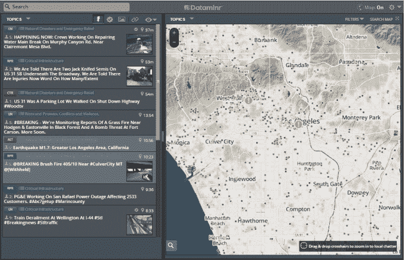
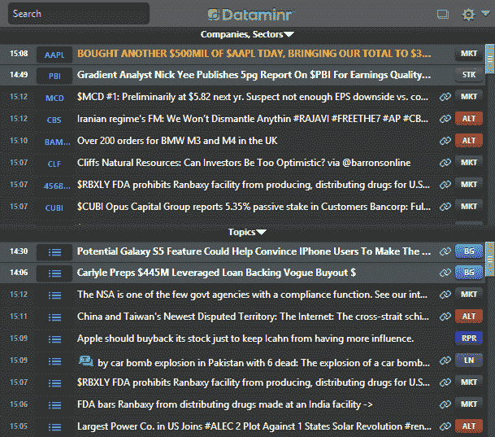

# Dataminr 确认融资 1.3 亿美元，将其社交媒体数据分析引入新的垂直领域 

> 原文：<https://web.archive.org/web/https://techcrunch.com/2015/03/17/dataminr-confirms-130m-raise-to-take-its-social-media-data-analysis-to-new-verticals/>

Dataminr 是一家初创公司，它解析和抓取 Twitter 等社交媒体网站上发布的大量实时信息，以提取公共安全、银行家和新闻机构的关键发展动态，该公司[证实](https://web.archive.org/web/20221225012038/https://www.dataminr.com/dataminr-raises/)它又筹集了 1.3 亿美元的资金。这笔由富达牵头的 D 轮融资将用于扩展到新的企业垂直领域，风险管理是一个关键的新领域。该公司还计划将这项基于美国的服务推广到更多地区。

“这笔资本将使我们公司能够满足全球对我们产品的巨大需求，扩展到许多新市场，并将有价值的新数据集集成到我们的算法引擎中，以增强我们基于 Twitter 的信号，扩大我们的产品，”Dataminr 的首席执行官兼联合创始人贝利在一份声明中说。

这笔资金最初是[透露给《华尔街日报》的](https://web.archive.org/web/20221225012038/http://www.wsj.com/articles/tweet-analysis-firm-dataminr-raises-funding-1426564862)，该报将估值定在 7 亿美元左右，我们现在已经证实这个数字是准确的。

除了富达之外，其他投资者还包括一长串金融机构和金融行业的知名人士，这表明该公司在哪些方面受到了很大的关注。

他们包括(深呼吸)威灵顿管理公司 LLP 和瑞士瑞信银行 NEXT 投资者，以及摩根士丹利前首席执行官约翰·麦克；花旗集团前首席执行官维克拉姆·潘迪特；路透社前首席执行官汤姆·格罗瑟(Tom Glocer)；诺姆·戈特斯曼(TOMS 资本有限责任公司)，对冲基金 GLG 的创始人；以及伯格鲁恩治理研究所的创始人尼古拉斯·伯格鲁恩。本轮的其他投资者是 Venrock 和机构风险投资伙伴。Dataminr 的其他投资者包括 WorldQuant Ventures、Glynn Capital 和高盛。

“在大多数地理区域和人类活动领域，Dataminr 已经成为实时信息发现的前沿，”Venrock 的 Dataminr 董事会成员 Nick Beim 说。“它有可能改变越来越多依赖实时信息的行业。”

这家总部位于纽约的公司迄今为止已经筹集了将近 1 . 8 亿美元。

如果你是使用社交网络服务的数十亿消费者之一，那么 Dataminr 自 2009 年成立以来一直在解决的问题就很容易理解了。像 Twitter、脸书和 Instagram 这样的平台对所有人开放，它们共同包含了大量来自大众的数据，人们用它们来记录一切，从他们的情绪、政治感受到他们今天早上吃了什么。

或者，正如贝利告诉我的那样，“Twitter 是一个为世界各地发生的事件表演的绊网。”

对于依赖外部数据来帮助决策或仅仅了解正在发生的事情的企业来说，这是一个潜在的金矿，但需要大量的提炼才能提取最有价值的金块并制造出最好的铝锭。

这就是 Dataminr 发挥作用的地方，它的算法用于过滤社交媒体服务以及其他数据源，如移动股票价格、新闻网站和许多其他公共和私人实时信息源。他们还计划随着时间的推移越来越多地扩展这一领域——为故事的发展收集信号。

有趣的是，这似乎不仅仅是根据特定的关键字收集和收集数据。有时，这是 Dataminr 揭示要寻找什么——去年夏天，在 ISIS 成为一个众所周知的组织之前，它就开始关注 ISIS，然后将其与油价联系起来(如上图所示)。

“基本上，如果在前线有信息，我们的目标是吸收这些数据，使之更加可靠和准确，”贝利说。

其他值得注意的应用是在新闻领域——data minr[去年](https://web.archive.org/web/20221225012038/https://techcrunch.com/2014/01/29/dataminr-for-news/)与 Twitter 和 CNN 合作创建了一项名为 Dataminr for News 的服务。这项服务目前已被美国 150 家新闻编辑室使用，并已参与 BBC 的测试，并将很快在国际上推出。

其他包括执法和其他政府组织，其中 Dataminr 读取、绘制和组织围绕特定主题的数据，然后将这些数据呈现在仪表板上，供客户监控。结果可能是这样的:

同样，这种金融产品提供了一种人们已经在彭博终端上使用的馈送。这里的不同之处在于将情绪分析纳入了新闻中。

Dataminr 下一个希望利用其数据优势的领域之一是风险管理领域。这与该公司已经开展业务的金融和政治垂直行业非常接近。该公司显然已经与企业观察中心合作，跟踪影响业务运营、工厂和员工的突发事件，其想法似乎是将此纳入更广泛的产品推广中。

该公司未披露其服务的收入甚至定价。

“我可以说的是，我们确实有分层的包装，这样我们就可以吸引我们提供数据的行业的不同部分，”贝利说。

换句话说，与摩根士丹利这样的全球金融巨擘相比，市政府会有不同的定价方案。“随着时间的推移，更大的机会是在众多机会中尽可能多地吸纳客户，”他说。他说，目前 Dataminr 没有使用自己的平台来帮助预测自己服务的最佳定价。

*更新了首席执行官的评论。*