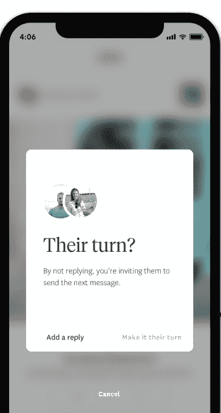
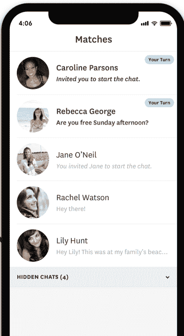

# 约会应用 Hinge 推出减少“鬼影”的新功能

> 原文：<https://web.archive.org/web/https://techcrunch.com/2017/12/20/dating-app-hinge-rolls-out-a-new-feature-to-reduce-ghosting/>

大多数约会应用程序匹配用户，然后让他们自己发起聊天。然而，当 Bumble [推出](https://web.archive.org/web/20230120232815/https://techcrunch.com/2014/12/02/bumble-is-exactly-like-tinder-except-girls-are-in-charge/)时，它通过让女性迈出第一步而开辟了新天地。今天， [Hinge](https://web.archive.org/web/20230120232815/https://hinge.co/) 推出了自己的观点，即约会应用程序上的对话应该如何处理，它称之为“轮到你了”“轮到你了”的想法是让用户决定——不管性别如何——谁先主动，然后提醒用户什么时候轮到他们回应。

在早期测试中，该公司声称该功能帮助其服务上的[重影](https://web.archive.org/web/20230120232815/https://en.wikipedia.org/wiki/Ghosting_(relationships))行为减少了 25%。

Hinge 首席执行官贾斯汀·麦克劳德解释了“轮到你了”背后的想法最初来自焦点小组，用户告诉公司他们并不总是故意放弃他们的对话。有时，他们只是忘记了收件箱里的人，或者，有 23%的时间，他们只是“忙得忘记了”

然后，Hinge 团队开发了一个功能，可以更好地标记你尚未回复的对话。这导致了《轮到你了》的诞生。

在第一次“轮到你”有助于开始对话之后，随着聊天的继续，该功能将提醒用户何时轮到他们回应对话。

这解决了约会应用的最大问题之一——对话往往开始时很好，但后来失败了，被放弃了。“轮到你了”是一个小小的暗示，有人想听到回应。

也就是说，如果对话进行得不顺利，Hinge 用户现在可以选择隐藏比赛，这样他们就可以专注于那些事情进行得更好的对话——也就是说，有更多来回发生的对话。这有助于清理收件箱，而不需要用户实际取消匹配——这是人们有时不愿意做的，因为……嗯，你知道……*以防万一。*

“轮到你了”的最终结果是双重的——它减少了收件箱的混乱，并清楚地表明下一个该轮到谁聊天了。

同样值得注意的是,“轮到你了”并没有根据用户的性别来决定谁应该开始对话。

(Hinge 用户说)他们厌倦了规则、游戏和被迫做他们不想做的事情——双方都是如此，”麦克劳德说。“这样做的好处是，你可以清楚地知道谁应该开始对话，而不会仅仅因为你的性别而强加给你一套规则。”

Hinge 表示，它上周在伦敦和华盛顿特区对数万名用户测试了这项功能，发现没有导致对话的匹配数量减少了 25%。

当然，不到四分之一的人说他们因为忙或者忘记而逃避对话，这意味着有更多的人因为其他原因而这样做——他们开始约会某人，也许，他们不感兴趣……或者他们只是有点粗鲁。

然而，这个更大的问题没有真正的解决方案。如今，这只是约会应用文化的一部分，它可以激发人们对整个过程的负面情绪，比如 T2、T3 和 T4。

但麦克劳德表示，Hinge 算法即将出现的其他变化可能会在这方面有所帮助。

“我们关注算法中的这些事情，”他在回答关于应用程序应该如何处理经常作弊的人的问题时表示。

“我们将在明年年初推出一些相当重要的算法变化，”麦克劳德指出。他说，新算法将更加关注用户的聊天行为，并将考虑诸如这个人是否只是匹配，而不是聊天，或者他们是否在重影等问题。

Hinge 没有透露它的用户数量，但表示它现在正以每月 15%的速度增长，大部分下载来自口头传播。它的大多数用户也受过大学教育，90%的用户年龄在 23 岁至 36 岁之间。在过去的 6 个月里，它的用户群翻了一番，现在每月有 10 万次约会(基于交换的电话号码)。)

众所周知，该公司过去一直在尝试新想法。它[为喜欢做媒的朋友推出了](https://web.archive.org/web/20230120232815/https://techcrunch.com/2017/09/19/hinges-new-app-lets-your-friends-play-matchmaker/)应用程序，[测试了](https://web.archive.org/web/20230120232815/https://techcrunch.com/2017/01/27/hinge-is-testing-a-personal-assistant-service-called-audrey-to-help-you-get-more-dates/)个人助理服务。它的一个功能——用户如何评论单个内容，如文本帖子和照片——似乎启发了 [Tinder 对新闻源](https://web.archive.org/web/20230120232815/https://techcrunch.com/2017/12/12/tinder-is-testing-a-feed-of-real-time-updates-from-your-matches-including-posts-from-instagram-and-spotify/)的测试，让你对大量新照片或其他项目做出反应。

Hinge 的“轮到我们”功能今天在所有市场上线，包括美国、英国、加拿大、澳大利亚和印度。