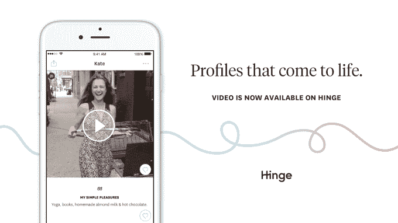
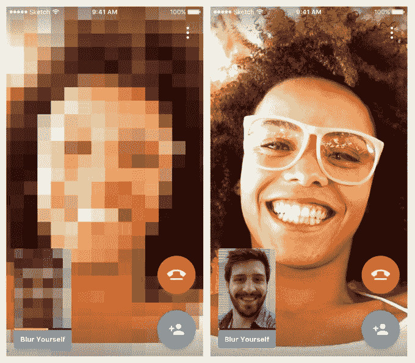
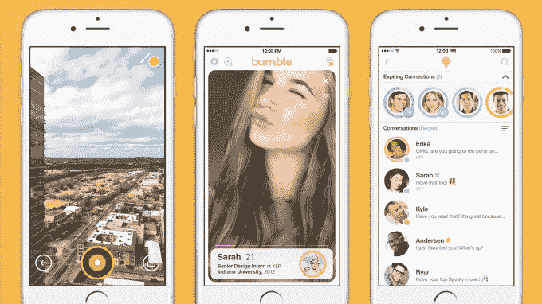
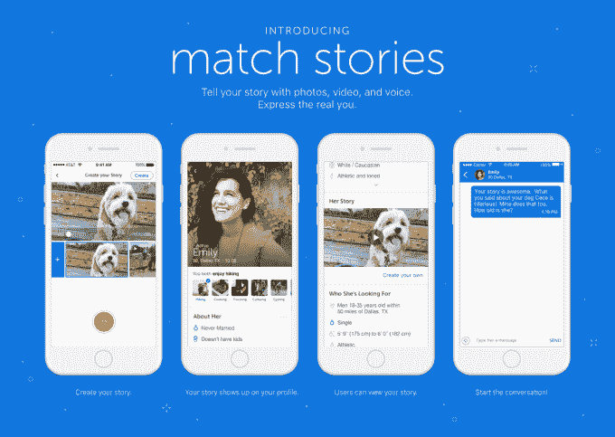

# 约会应用正在拥抱视频

> 原文：<https://web.archive.org/web/https://techcrunch.com/2017/06/27/dating-apps-are-embracing-video/>

约会应用本身就是一种社交网络——尤其是当它们扩展到交友或职业网络等新领域时。因此，考虑到视频在脸书、Instagram 和 Snapchat 等社交应用程序上越来越受欢迎，以及该行业越来越多地接受“故事”作为一种提供人们生活、活动和兴趣视角的手段，他们也会采用视频也是有道理的。

本周，Hinge 和 Zoosk 的 Lively 都以各自的方式推出了对视频的支持。

例如，Hinge 现在将允许用户通过视频来增加他们的用户档案。该公司表示，用户可以添加长达 30 秒的视频，从他们的手机上已经存在的视频中提取。然而，它避开了像 Instagram、Snapchat 或 Messenger“故事”中那样的简短、消失的视频。

事实上，Hinge 根本不会提示人们拍摄正面视频，只会提示那些预先录制或之前分享到脸书或 Instagram 的视频。(Hinge 指出，从社交网络导入的视频可能会超过 30 秒。)

相反，Hinge 认为，对视频的支持将让会员通过分享生活中有趣或难忘的时刻和活动，更好地展示自己。这延续了约会服务的更大使命，即帮助用户找到关系，而不是偶然相遇。

“在 Hinge 上，我们鼓励我们的成员彼此真诚相待，因为我们知道这可以带来最好的联系，”Hinge 创始人兼首席执行官贾斯汀·麦克劳德解释道。“我们的个人资料已经做得很好了，但视频为我们的会员创造了了解潜在匹配的机会，这是静态照片和文本无法捕捉到的。​"

该公司还将通过向五倍多的人展示带有视频的铰链轮廓来鼓励视频的采用。

与此同时，Zoosk 的新产品 [Lively](https://web.archive.org/web/20230316161448/https://www.golivelyapp.com/) 希望利用视频吸引更多人使用它的应用。

[去年夏天推出的](https://web.archive.org/web/20230316161448/https://techcrunch.com/2016/07/19/zoosk-takes-on-tinder-with-debut-of-lively-a-free-app-that-uses-video-to-tell-stories/)产品来自该公司的研发团队——Zoosk 实验室，Lively 从一开始就采用了视频。在 Lively 中，用户上传照片和视频，然后转化为故事拼贴画，其中还包括过渡和移动。

同样，这个想法是使用视频比静态的、只有照片的个人资料更能展示一个人的个性。

现在，Zoosk 在视频方面更进一步，推出了实时视频聊天。这项功能将于周三上午公开，旨在帮助用户与约会之外的人建立联系。

[gallery ids="1508859，1508860，1508861，1508862，1508863，1508864"]

在更新的应用程序中，用户将能够选择一个话题，并开始与其他人聊天。但与 Lively 的个人资料视频不同，聊天功能允许用户在模糊屏幕的情况下开始他们的会话。该公司解释说，这有助于用户立即感到更加舒适，而不必马上担心他们看起来是什么样子。

随着用户继续说话，模糊逐渐消失——但如果用户想保持隐藏，他们可以选择将其添加回来。Zoosk 说模糊会在 40 秒内消失，但你可以随时点击“添加模糊”来保持隐藏。

Zoosk 的产品 Behzad Behrouzi 的 SVP 说:“Lively 是创造有趣的方式来帮助人们联系，而不仅仅是匹配。”“我们希望创造一种整体体验，让人们可以更放松地做自己，更兴奋地认识和了解他人。”

这项功能将推动 Lively 超越约会，帮助用户结识新朋友。这种趋势不仅限于生动活泼。像 Tinder、Bumble 和其他顶级约会应用程序最近也采用了朋友查找功能，因为它们变得更像社交网络。随着 BumbleBizz 的首次亮相，Bumble 正准备在 9 月进入专业网络。

不久之后， [Bumble](https://web.archive.org/web/20230316161448/https://bumble.com/) 也将推出自己的视频支持。

[1 月](https://web.archive.org/web/20230316161448/https://techcrunch.com/2017/01/09/bumble-is-launching-video-stories-to-show-more-of-your-match/)宣布，BumbleVID 将允许用户在个人资料上分享视频“故事”。Bumble 表示，它决定保留该功能，因为从工程角度来看，在今年秋天推出的重建应用程序中推出该功能更有意义。这个版本的应用程序将支持 BumbleBizz，但也会引入一些功能，让你为约会、朋友和专业网络制作不同的档案。

与 Snapchat 和 Instagram 类似，Bumble 将支持现场或过去 24 小时内录制的短格式视频，这些视频可以发布到您的个人资料中供所有人查看，也可以只与火柴分享。

也像其他社交应用上的故事一样，这些视频会在一天内消失。然而，该应用程序的新版本将允许以半永久的方式保留它们。(今年秋天还会有更多。)

同样，Bumble 对视频的兴趣与该公司认为这种格式将帮助用户展示更多自己有很大关系，这是所有约会应用拥抱视频的共同点。

Bumble 联合创始人兼首席执行官惠特尼·沃尔夫(Whitney Wolfe)解释说:“这更像是一种讲述故事和表达自我的方式，但这种方式与我们观众已经使用社交媒体视频的方式是一样的。她说:“我们不想重新发明轮子——我们只想利用其他平台上已经运行良好的东西，给他们机会与他们还不认识的人而不是他们的朋友一起做这件事。

但像 Lively、Bumble 和 Hinge 这样的新约会应用并不是唯一一个将视频作为其更新用户体验的关键功能的应用。甚至长期约会的巨头[Match.com](https://web.archive.org/web/20230316161448/http://www.match.com/)也开始涉足电子游戏。

本周[公司宣布](https://web.archive.org/web/20230316161448/http://mashable.com/2017/06/21/match-stories-video-dating-profile/#B6YPC28ggSqy)也计划制作一个故事专题。在 Match 的例子中，故事可以延伸到 60 秒，相比之下，Bumble 的视频只有 10 秒。它们应该是照片和视频的组合，类似于 Lively 上的内容。另外，如果你愿意，你可以叙述内容，来描述你所展示的图像。

“这给了人们灵活性，”Match 首席执行官曼迪·金斯伯格在接受 Mashable 采访时解释道。“听到别人谈论他们的照片远比仅仅看到照片要好。我认为，看一段视频，听听他们的声音，是发现自己吸引力的圣杯。”

Match 表示，Stories 将在“未来几周”开始测试，并计划在今年晚些时候进行全国推广。

然而，视频聊天不在 Match.com 的公开路线图上，也不在 Bumble 和 Hinge 的路线图上。

这很可能是因为允许用户实时聊天带来的额外开销，不仅从产品和工程的角度来看，而且从社区安全的角度来看。这也可能没有必要——毕竟，如果两个人非常喜欢彼此聊天，接下来通常会提出类似“让我们离开这个应用程序吧”的请求。

Lively 的视频聊天将于明天上午 9 点左右启动。铰链的视频现在是现场直播。Match 和 Bumble 将在今年晚些时候推出视频。