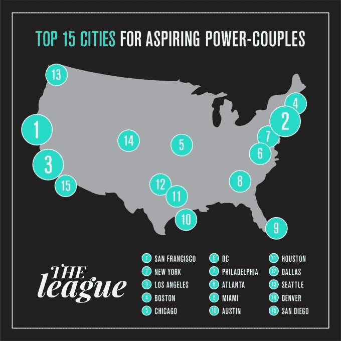

# 今年夏天，该联盟将在另外 10 个城市推出其独家约会应用 

> 原文：<https://web.archive.org/web/https://techcrunch.com/2017/05/26/dating-league-city-expansion/>

# 今年夏天，该联盟将在另外 10 个城市推出其独家约会应用

以选择性为傲并要求会员在加入前获得批准的约会应用 League ，传统上扩张相当缓慢。最初[于 2015 年初](https://web.archive.org/web/20230120212310/https://techcrunch.com/2015/01/22/investors-join-dating-app-the-league-with-2-1-million-seed-round/)推出，该应用程序仍然只在 7 个城市使用——纽约、旧金山、洛杉矶、芝加哥、波士顿、华盛顿特区和伦敦。

但这家初创公司刚刚宣布，他们将开始夏季旅行，在 8 月底之前增加 10 个城市。

它们是:费城、亚特兰大、迈阿密、奥斯汀、休斯顿、达拉斯、圣地亚哥、丹佛、西雅图和多伦多。

这些将分批推出，六月初首先推出的三个城市是费城、亚特兰大和迈阿密。

这家初创公司还将在每个城市举办一场发布会[，他们解释说，这是一个向新成员展示联盟不仅仅是你手机上的一个随机应用程序的好方法——实际上它背后有人类和社区元素。这一点尤其重要，因为联盟货币化战略的一个主要组成部分是让你与一个真人(他们称之为礼宾员)配对，以帮助你完善你的约会档案，以及宣传你所在城市的真实生活事件。](https://web.archive.org/web/20230120212310/http://bit.ly/theleaguesummerseries)

很多数据被用来决定联盟扩展到哪些城市。他们没有像其他约会应用那样在第一天就在全国推广，而是专注于慢慢增加城市，以确保它们是支持该应用的正确选择。例如，这家初创公司在推出之前会查看每个城市受过大学教育的单身人数，他们很恰当地将这些数据转化为对有抱负的权力夫妇来说最好的城市名单。

当然，由于联盟需要批准才能加入，初创公司需要确保在开门之前，他们在每个城市都有足够的用户。这就是为什么每个城市都有一个今天已经开放的等候名单。由于联盟通常喜欢推出一个有 2000 名“创始成员”的城市，他们的支持率在 20-30%之间，所以一个城市需要有大约 10，000 人在等待名单上，才能让应用程序在那里推出。

这 10 个新城市将使联盟在夏季结束时的城市总数达到 16 个，使其接近 2017 年底前 20 个城市(至少还有几个是国际城市)的新目标。