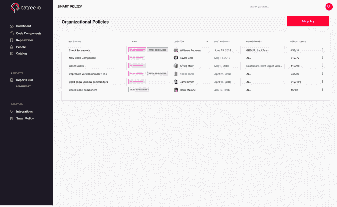

# Datree 获得 300 万美元种子资金，用于在 GitHub TechCrunch 中构建 DevOps 策略引擎

> 原文：<https://web.archive.org/web/https://techcrunch.com/2018/08/29/datree-gets-3m-seed-round-to-build-devops-policy-engine-in-github/>

# Datree 获得 300 万美元种子资金，用于在 GitHub 中构建 DevOps 策略引擎

以色列的早期初创公司 Datree 希望帮助公司为他们的应用程序创建一套策略，并在提交生效之前在 GitHub 中应用这些策略。今天，它宣布从 TLV 合伙人那里获得 300 万美元的种子资金。

据创始人说，这张支票实际上是去年 9 月写的，他们今天将投资公之于众。

像许多以色列初创公司一样，在他们编写一行代码之前，他们与 40 家公司进行了交谈，并找到了现代开发技术中的一个共同痛点。代码提交的速度越来越快，团队的分布也越来越广。您拥有容器化的微服务，而不是单一的应用程序，这些微服务通常由不同的团队构建。所有这些都汇集在 GitHub 中。

团队决定处理这种混乱的最好方法是通过创建一个开发团队及其工作的目录来试图使它变得有序。想法是将这些团队和他们的工作集中在一个中心位置，然后将一组内部最佳实践应用到他们的代码中，以便在他们提交代码之前发现任何违反策略的情况。需要注意的是，他们只提取元数据来构建这个目录。

Datree 智能策略编辑器。截图:Datree

如果您可以使用 Datree 来自动确认 GitHub 中的每个 pull 请求都符合一组内部策略，那么您就有可能为您的开发团队省去许多在提交后试图跟踪问题的麻烦。

这当然是 DevOps 模型背后的整个想法。开发人员尽可能快地进行开发，操作人员负责确保代码在发布前处于良好的状态、安全且符合公司政策。Datree 创建了一个报告引擎来扫描所有这些代码，并自动报告哪些符合策略，哪些不符合策略。他们还认识到，并非每项政策都是严格的，会有例外，他们也允许例外。

现在，它还处于早期阶段，公司由三个创始人和另外五个人组成，“在特拉维夫的一个车库里。”他们正在与六个设计合作伙伴合作，包括 HoneyBook、SimilarWeb 和 PlayBuzz，开发该解决方案的早期版本，但他们有一个愿景，他们有 300 万美元来构建它，看看它是否适合市场。他们计划在旧金山和特拉维夫之间分配时间，试图扩大他们的市场。