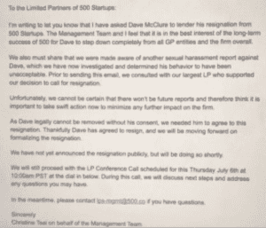

# 戴夫·麦克卢尔已经辞去 500 家创业公司的 GP 职务

> 原文：<https://web.archive.org/web/https://techcrunch.com/2017/07/03/dave-mcclure-has-resigned-as-gp-of-500-startups/>

# 戴夫·麦克卢尔已经辞去了 500 家创业公司的 GP 职务

TechCrunch 获悉，戴夫·麦克卢尔已辞去 500 Startups 普通合伙人一职。根据今天发给 limited partners 的一封信，我们已经证实联合创始人 Christine Tsai 要求辞职，他接受了。

我们联系了 500 家初创公司进行评论，他们也证实了辞职。麦克卢尔已经辞去了首席执行官的职务。

在给 LPs 的信中，Tsai 说她和管理团队认为 Dave 完全退出所有 GP 实体和整个公司最有利于 500 的长期成功。500 有几十种不同的投资工具，分布在全球各地。

Tsai 还表示，该公司已经了解到另一份针对 Dave 的性骚扰报告——该公司对此进行了调查，并认定这是不可接受的行为。

Tsai 说，公司不能确定将来不会有骚扰的报告，所以需要将 Dave 撤职。但是，由于没有他作为联合创始人和 GP 的同意，它不能这么做，所以它需要他的合作。他已经同意辞职。

在过去的一周里，麦克卢尔一直处于 500 英镑麻烦风暴的中心。《纽约时报》的一篇文章概述了不当性行为的发生率，包括创始人莎拉·孔斯特不受欢迎的挑逗。在那篇文章之后，麦克卢尔[发表了一份公开的认错书](https://web.archive.org/web/20230320151254/https://techcrunch.com/2017/07/01/500-startups-dave-mcclure-apologizes-for-multiple-advances-toward-women-and-being-a-creep/)，承认在他 500 岁的职位上多次发生对女性的不当行为。就在昨晚，500 家创业公司不得不向其澳大利亚合作伙伴 launch vic 道歉，因为他们没有披露对麦克卢尔性骚扰指控的内部调查。

关于内部调查的时间、麦克卢尔的免职以及他继续参与公司活动的问题仍然存在。稍后会详细介绍。

寄给 LPs 的信的全文如下:

