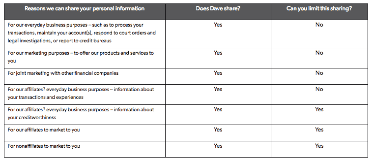

# 戴夫想帮你省下昂贵的透支费 

> 原文：<https://web.archive.org/web/https://techcrunch.com/2017/04/25/dave-wants-to-save-you-from-expensive-overdraft-fees/>

认识一下戴夫:一个穿上熊衣的人工智能，它刚刚发布来把你从昂贵的透支费用中解救出来。让戴夫访问你的支票账户，该应用的机器学习算法将忙于处理你的支出数据，这样熊就可以警告你即将发生的交易——比如网飞的每月订阅或典型的周六晚上优步账单——这可能会让你陷入赤字，并招致昂贵的银行罚款。

这个仅限美国的应用程序预测用户的“7 天低点”，也就是它认为你的银行余额在未来 7 天内将下降的最低水平，以鼓励和支持更好的资金管理。联合创始人杰森·维尔克说，最终目的是帮助人们避免不得不依靠透支作为“一种昂贵的信贷形式”，他将这描述为一种资金管理的“天气预报”。

Dave 还包括一个发薪日贷款工具——因此，面临不得不陷入负结余的不可避免性的用户可以选择在下一次发工资之前贷款最多 250 美元，以度过难关。但与发薪日贷款公司(如 [Wonga](https://web.archive.org/web/20221204211727/https://beta.techcrunch.com/2014/10/21/wonga-no-comment/) )不同，后者也向移动用户提供短期借贷便利，但通常收取非常高的利率，戴夫的发薪日贷款是 0%的利息。

维尔克告诉 TechCrunch，它也只是要求用户在有能力的时候还钱。“我们甚至没有把这件事和时间表联系起来。不像发薪日贷款。我们要说的是，只要你有预计收入，用户就要回报我们，”他表示。

如果这一切听起来好得不像是真的，那可能是有原因的:戴夫希望你会非常感谢它的机器学习算法为你的消费习惯提供的服务，以至于当熊要求小费时，你会捐款——尽管这也完全是自愿的。你选择付出多少(如果付出的话)也是你自己决定的。

为了进一步激励选择加入的费用，戴夫已经与[未来之树](https://web.archive.org/web/20221204211727/https://trees.org/)合作——并表示，对于每一个百分比的用户小费，它将通过其慈善合作伙伴种植等量的树木(因此小费 2%将等于种植两棵树)。

其网站上的一个常见问题解答这样描述其合作伙伴的事业:

> “未来之树”为撒哈拉以南非洲的家庭提供了可持续的食物来源、牲畜饲料、出售的产品、薪柴，并使他们的年收入增加了 500%。自 1989 年以来，树木组织在几十个国家种植了超过 1 . 15 亿棵树，并恢复了几十万英亩的土壤，同时永远改变了人们的生活。

因此，从本质上来说，戴夫是在重塑被彻底憎恨的银行透支费的形象，这显然除了让银行业巨头变得富有之外什么也没做，并试图用与有价值的事业相关的感觉良好的捐款来取代它们。其网站上的一行声称:“戴夫靠捐款生活”，尽管维尔克表示，它也对其应用收取少量订阅费——每月 0.99 美元。尽管如此，除了透支费的典型成本之外，这种订阅似乎非常合理。

戴夫背后的团队已经从一系列知名投资者那里筹集了种子资金。自去年 9 月“正式”成立以来，他们已经从包括马克·库班、SV Angel、Chernin Group、Jonathan Kraft、Skip Paul、Diplo 等投资者那里获得了 300 万美元。所以，可以肯定地说，这不是维尔克的第一次创业；事实上，他说这是他的“第四次尝试”。(他之前的一个创业公司——一个名为 AllScreen TV 的视频联合平台——以 8500 万美元的价格退出了 Zealot Networks，仅筹集了 33 万美元的种子资金，收入增长到 2000 万美元。)

戴夫的这个想法是因为维尔克说他和他的几个联合创始人在大学里是“慢性透支者”。“我会一直透支我的账户。我的账户上透支了数百美元。所以这是我一直存在的问题，我知道它需要被解决。我也是一名活跃的 Redditor，我每周都能看到有人发帖抱怨对银行收费的不满。”

他还指出，美国不断上升的透支费用是他希望在美国有所作为的另一个原因，指出仅去年一年透支费用就达到 360 亿美元，并将这个问题表述为“令人不安”。

为了找出他们如何能有所帮助，该团队开始进行市场研究，以找出人们透支的原因，并表示他们的调查发现了两个主要原因:人们不知道即将到来的开支，以及人们在下一次工资之前短缺。

他们发现的另一个因素是，人们经常会向朋友或家人寻求短期贷款来填补缺口，并度过难关——这是给这款应用程序起一个人类名字的灵感。至于熊，每个人都喜欢熊，对吗？

“我们希望戴夫成为你的朋友和家人的替代品，帮助你节省不必要的银行费用，并让你知道你所有即将发生的费用，”维尔克说。

在讨论该产品的贷款元素时，他表示，目前普通用户只需要借大约 130 美元，因此该团队尚未决定是否在未来提供收取利息的更大贷款。“250 美元似乎是一个安全的上限……但当我们考虑其他事情时，我们可能会提高这个数字，我们只是还不太确定，”他补充道。

维尔克将戴夫描述为“荣誉系统产品”，并认为其友好的方式将有助于抵御用户利用贷款设施的风险——即借钱不还(尽管他表示，如果用户继续违约，他们的账户将被暂停，因此戴夫的耐心不是无限的)。

贷款工具不对用户进行信用检查。尽管他们被要求有一个活跃的支票账户——本质上是有固定工资收入的工作。当然，戴夫知道你是否被雇用，因为你与应用程序共享对你银行账户的访问，所以它可以看到你账户进出的一切。

用户使用他们的支票账户登录该应用程序，维尔克指出该应用程序目前支持“大约 3000 家机构”。“与我们自己提供银行服务相反，我们认为更好的开始方式是帮助人们增强他们自己已经拥有的账户，”他补充道。

在预测方面，他承认戴夫显然无法预测意外和/或随机的支出——但他表示，这一想法是为了构建一系列通知(即将透支的警告，即将交易的警告等)，以便用户能够提前获得足够的通知，以便能够采取行动来更好地管理他们的资金——要么首先避免透支，要么申请短期贷款来填补缺口。

该应用程序最初会发送一个七天低余额的提前通知，让用户知道他们可能需要削减支出。它还会对任何可能导致账户出现负结余的未决交易发出警告——让用户有时间在钱被真正从他们的账户取走之前采取行动。最后一个警告给了借款以弥补不可避免的透支的机会。

“我们会给你发送最后通知，告诉你透支的风险非常高，”维尔克说。“如果您当前的余额为负，我们在今天结束前还有一些时间来帮助您。因此，我们不需要完美的预测来帮助你——我们希望尽可能地有用。但我们有三次机会可以干预，帮助你摆脱困境。”

为什么人们需要一种算法来帮助他们避免超支？为什么他们不能管理自己的支出？维尔克认为技术是问题的一个相当大的部分。“人们如此频繁地使用他们的借记卡或信用卡，现在很难跟踪，”他认为，并指出，未决交易可能特别难以跟踪，因为不清楚钱将在何时被取走。

他补充道:“怎么可能有人在那之上，并且知道他们有另一个账单要在本周的某个时候处理。”“此外，我们有所有这些数字服务，他们每隔 30 天就向你收费，所以谁知道会是哪一天。如果你的账户里只剩下 5 美元或 10 美元，那么不得不登录你的银行账户，回到你的账单，计算最后一笔账单是什么时候到达的，这有点令人沮丧……这很令人困惑。”

虽然该应用程序表面上是针对千禧一代的，但维尔克表示，测试人员的早期积极反馈并不局限于这个年龄组，并认为这里可能有一些对“所有年龄”都有用的东西。“如果 12 个月后我们能有 100 万次安装，我们会非常高兴，”他补充道。

他还证实，透支只是戴夫的第一个目标——他的想法是使用同样的方法，潜在地解决其他类型的银行费用，甚至解决其他行业不受欢迎的费用。“我们还不确定，我们只知道人们对许多不同的事情感到疯狂——所以这只是第一个，”他说。

**隐私**

当我查看戴夫的[隐私政策](https://web.archive.org/web/20221204211727/https://dave.com/privacy)时，我担心的一个因素是，它包括应用程序出于营销目的与第三方共享用户信息的明显能力。考虑到一个人的银行账户中包含了多少个人和敏感数据，例如消费模式、工资信息、订阅数据等，这似乎非常令人担忧。并使其低收费声明看起来更像是对用户数据的无情攫取。

下面是我第一次看它时，它的隐私政策页面上的一个表格所包含的“我们可以共享您的数据的原因”——请注意，它说 Dave 共享个人数据用于与其他金融公司的联合营销，以及用于向您营销的非附属机构:

当被问及戴夫是否真的会出于营销目的与第三方分享用户数据时，维尔克表示不会，而且他不知道 TechCrunch 提到的条款。“我们对出售任何人的数据都不感兴趣，”他告诉我们，并承诺会查看隐私政策并做出改变。

果然，新的隐私政策已经更改为声明 Dave 不会将个人数据用于与其他金融公司的联合营销，也不会用于向您营销的非附属公司:

“根据用户的数据向他们做广告不是我们感兴趣的业务，”维尔克补充道。“这不是我们想要做的事情——这项服务实际上是我们试图改善美国每个人的银行体验，因为我们认为这不是一个好服务。我们当然不想做任何让某人感到不舒服或以任何方式伤害他们的事情。”

因此，和以往一样，阅读小字是值得的——包括，也许特别是，如果你是一个创始人，而有问题的小字是你自己的隐私政策。