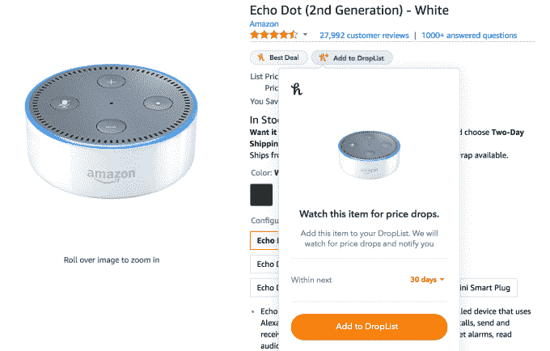

# 寻找交易的浏览器工具 Honey 现在跟踪亚马逊价格下降，提供酒店优惠 

> 原文：<https://web.archive.org/web/https://techcrunch.com/2017/06/30/deal-finding-browser-tool-honey-now-tracks-amazon-price-drops-offers-hotel-savings/>

自从几年前推出以来，[交易寻找浏览器插件](https://web.archive.org/web/20230124072535/https://www.joinhoney.com/) [Honey](https://web.archive.org/web/20230124072535/http://www.joinhoney.com/) 在 Chrome 上的用户数量已经增长到 440 万，此外它在 Firefox 和 Safari 上的用户数量也有所减少。最初，该公司被认为是通过跟踪销售和零售商的促销代码来寻找节省的更简单的方法，现在，该公司正在扩大其在线购物工具的选择，包括一个名为 [DropList](https://web.archive.org/web/20230124072535/https://www.joinhoney.com/drop-list) 的亚马逊价格下跌跟踪器，以及其他用于寻找旅游交易的新工具。

由于专注于寻找优惠券代码，Honey 在一定程度上错过了让那些主要从亚马逊购买的在线购物者不可或缺的机会。DropList 的推出是改变这种状况的一种努力。

该功能是 Honey 早期努力的扩展，旨在为亚马逊购物者提供有用的定价信息。它早些时候推出了一个名为价格历史的信息功能，显示亚马逊市场上任何产品的历史价格数据。这是为了帮助蜂蜜用户更好地了解现在是购买的好时机，还是应该等待价格下跌。

有了[下拉列表](https://web.archive.org/web/20230124072535/https://www.joinhoney.com/drop-list)，Honey 现在可以直接通知你什么时候该抓取你正在观看的项目。

要使用该功能，您只需在安装 Honey 扩展后访问亚马逊上的产品页面。该扩展为页面添加了蜂蜜徽章，包括一个标记该商品是否是“最划算的”(或者你在别处购物会节省多少钱)，以及新的“添加到下拉列表”选项。

如果你愿意，你也可以从亚马逊的购物车中添加物品到你的下拉列表中。

当你点击“添加到下拉列表”按钮时，你可以告诉 Honey 关注该商品 30 天、60 天或 90 天的价格。如果价格下跌超过 5 %, Honey 会发邮件提醒你。它还会在您的清单上的商品即将过期时向您发送电子邮件，这样，如果需要，您可以延长对有问题的商品的价格跟踪。

该工具可能在亚马逊即将到来的 Prime Day 销售中有用，该销售刚刚被[宣布将于 2017 年 7 月 11 日](https://web.archive.org/web/20230124072535/https://techcrunch.com/2017/06/28/amazons-2017-prime-day-sale-will-be-july-11th/)举行，交易将于美国东部时间 7 月 10 日星期一晚上 9 点开始。如果有你感兴趣的特定产品，你可以简单地将它们添加到你的下拉列表中，然后等着看它们是否成为黄金日销售节省的一部分。

DropList 目前仅适用于亚马逊，但 Honey 表示，计划在今年夏天将其引入更多商店。

迄今为止，Honey 主要专注于帮助客户在网上零售商购物时节省成本，但另一项新的业务将把 Honey 的重点扩展到旅游领域。

下周，Honey 将正式推出 [Honey Travel，](https://web.archive.org/web/20230124072535/https://www.joinhoney.com/features/honeytravel)，这是一款省钱工具，允许 Honey 用户在酒店购物时解锁会员专属折扣。Honey 表示，它将提供 Expedia、Priceline、Booking.com 等网站的价格比较，如果没有最低价格，它会让你知道。

“到目前为止，我们看到与第二便宜的在线价格相比，每晚平均节省约 30 美元——一周的假期超过 200 美元，”Honey 发言人指出。他们补充说:“就总的节省而言——通过我们而不是酒店网站预订——我们的用户可以享受高达 55%的优惠。”

Honey 的旅行储蓄通过一个独特的系统进行处理，该系统使用了一种叫做“HoneyKeys”的东西。当你第一次安装 Honey 时，你会得到一个 HoneyKey。随着您继续在线购物，您将获得更多钥匙。这些密钥随机出现在零售商的结账页面上，作为对蜂蜜用户的额外奖励。

蜜汁旅行网站(由 T2 酒店风暴提供支持)已经上线，尽管还没有正式宣布，一些用户已经发现了它。

Honey 拒绝透露有关其收入的细节，但当用户通过其扩展找到销售或优惠券时，它会收取佣金，就像该领域的其他服务一样。然而，该公司通过其现金奖励计划[【蜂蜜黄金】](https://web.archive.org/web/20230124072535/https://www.joinhoney.com/honeygold/about)来分割佣金，旨在激励其软件的使用。

DropList 现在可以从最新版本的 [Honey Chrome 扩展](https://web.archive.org/web/20230124072535/http://chrome.google.com/webstore/detail/honey/bmnlcjabgnpnenekpadlanbbkooimhnj?hl=en-US)中获得。Honey 的旅行网站可以在[这里](https://web.archive.org/web/20230124072535/https://www.joinhoney.com/features/honeytravel)找到。