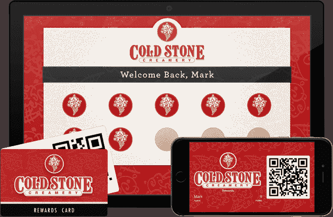
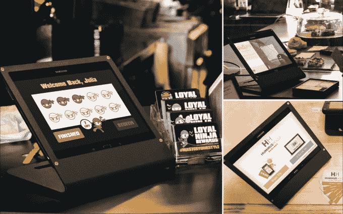
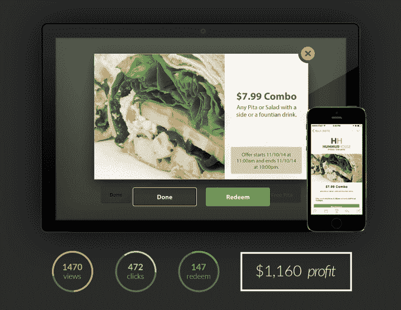

# Dealyze 为任何企业带来类似星巴克的忠诚度计划 

> 原文：<https://web.archive.org/web/https://techcrunch.com/2015/03/18/dealyze-brings-a-starbucks-like-loyalty-program-to-any-business/>

当谈到鼓励消费者忠诚度时，星巴克的计划包括其移动应用程序和附赠的奖励卡，为业内其他人树立了一个高标准。今天，一家名为 [Dealyze](https://web.archive.org/web/20230216193050/http://dealyze.com/) 的新公司推出了一项服务，旨在为任何企业提供类似的应用体验，但价格低于移动忠诚度领域的竞争对手。

虽然今天有许多初创公司为小企业运营移动忠诚度计划，例如包括 [Belly](https://web.archive.org/web/20230216193050/https://www.crunchbase.com/organization/belly) 和 [FiveStars](https://web.archive.org/web/20230216193050/https://www.crunchbase.com/organization/fivestars-loyalty) ，但 Dealyze 与众不同的地方在于，它允许一家公司用自己的标志和配色方案为其面向消费者的应用和平板电脑打上品牌，以便真正让它看起来像是他们自己的。这是通过 Dealyze 自己的主题引擎完成的，这使得该公司可以在几分钟内定制系统。

联合创始人兼首席执行官威廉·巴伦解释说，创业的想法真的只是落在他的腿上。从 UCF 大学毕业后，他花了很多时间在当地的皮塔饼餐馆附近闲逛，从事各种编程项目。随着时间的推移，他与那里的员工变得友好起来，有一天，店主问他是否可以为商店建立一个忠诚度计划。

“他不想让(他的忠诚计划)看起来像第三方，”巴伦说。当时的项目是这些“一奖多得”类型的系统。“它们功能齐全，但(店主)并不想在另一个市场上与其他商店竞争。他担心自己加入了另一个 Groupon……他所有的交易都与这个城市的每个人分享。他想要看起来更官方的东西——这正是他的项目，”巴伦补充道。

有了第一个客户之后，Baron 打电话给同样来自 UCF 的老朋友 Mark Salpeter，让他和他一起做这个项目。在接下来的六个月里，他们开发了一个系统，满足了皮塔饼店老板的需求，在系统启动运行、虫子被消灭后，他们最终也把它卖给了隔壁的 Cold Stone Creamery 特许经营店老板。

现在，该计划正在佛罗里达州和波多黎各的 10 个 Cold Stone Creamery 地点进行试点，总共有 30 家企业使用 Dealyze 创建的移动忠诚度系统，包括其他酒吧、餐馆、酒店、咖啡店、航空公司、营养商店、烟店、发廊和汽车修理店。目前，这些企业中有 14，000 名客户在 Dealyze 平台上注册，在试点测试期间，该公司报告称，其合作的那些企业的收入增加了 10-15%。

该系统本身被设计成易于使用。它包括一个锁定的 Android 平板电脑，安装在商店里，顾客可以通过提供他们的姓名、电子邮件和电话号码来注册他们的奖励账户。然后顾客会收到一个链接，允许他们在手机上安装商店的应用程序。然而，与星巴克的程序不同，这款应用不是通过主要应用商店分发的原生应用，而是一款基于网络的应用，就像手机主屏幕上的图标一样。

Baron 表示，他们决定使用 web 应用程序，因为它使客户的安装更容易、更快捷——商店喜欢他们可以将应用程序发送给客户。

计划成员还可以选择随身携带塑料忠诚卡，其中包括启动应用程序的二维码，如果他们喜欢有实体卡的提醒。

然后，交易通过短信或电子邮件发送给客户，当这些交易被点击和兑换时，Dealyze 收取 0.10 美元。顾客也可以通过数码卡应用程序进行登记，以便在商店获得积分，或者，如果商家选择，顾客可以根据他们的店内消费金额来收集积分。然而，巴伦指出，如今大多数人都在使用签到系统，通常在获得 10 分后才会有奖励。

除了赚取积分和接受交易，该公司还提供一个推荐计划，客户可以通过短信与朋友交易，这也可以在兑换时为他们赚取积分。这些东西的价格各不相同，但可能高达 25 美分。

这项服务的定价是每月 50 美元(或每年 500 美元)，有时间限制，包括访问一个在线仪表板，允许企业跟踪他们的交易、赎回和使用该系统获得的利润。Baron 说，未来的计划是提供像星巴克那样的可充值卡，但目前的重点是让更多的企业和消费者注册。

该公司目前正在参与 Y Combinator 加速器，但没有其他外部资金。