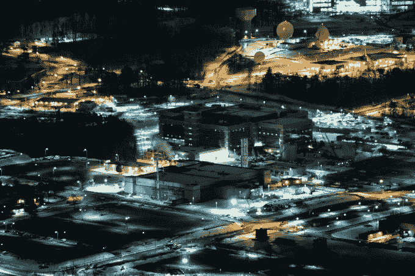

# 亲爱的第 45 任总统:通过保护全球网络来保护美国

> 原文：<https://web.archive.org/web/https://techcrunch.com/2017/01/05/dear-45th-president-protect-the-united-states-by-protecting-the-global-web/>

[Nico Sell](https://web.archive.org/web/20230321115123/https://www.crunchbase.com/person/nico-sell#/entity)

是的创始人

[Wickr Foundation](https://web.archive.org/web/20230321115123/https://www.wickr.org/)

，是的联合创始人和联合主席

[Wickr](https://web.archive.org/web/20230321115123/https://www.wickr.com/)

-自毁、安全、私密、匿名的消息服务。

More posts by this contributor

迪奥戈·莫尼卡是安克雷奇数字公司的联合创始人兼总裁，安克雷奇数字公司是面向机构的首要数字资产平台。他拥有里斯本技术大学的计算机科学博士学位，从事软件安全工作超过 15 年。作为 Square 的早期员工，他帮助构建了安全架构，现在每年的销售额为 1000 亿美元。在 Docker，他帮助保护全球银行、政府和三大云提供商使用的核心基础设施。

随着下一届美国政府上台，实现网络安全方法的现代化至关重要。

当前的方法在很大程度上仍然基于过时的信息安全防御与进攻框架。事实上，网络是一种全球资源，必须如此对待，以维持我们的经济增长和稳定，这意味着避免在线威胁的二元定义。

今天，所有国家和非国家行为者面临的激增的网络安全风险在本质上是全球性的，实际上不可能局限于某一特定目标。然而，大多数国家仍然依赖的政策是基于这样一种想法，即国家对其国家网络“领土”拥有控制权，可以可靠地保护它或阻止其他人遭受攻击。

虽然可以理解，对于许多政策制定者来说，这是一种熟悉的*操作方式*，但它植根于过时的假设，使我们无法有效地解决正在发展的信息安全危机。

**2016，信息安全年**

信息安全在 2016 年改变政府和企业的过程中发挥了重要(如果不是决定性)的作用。历史上最大的数据泄露事件被报道，现在正由联邦调查局调查；超过十万台被感染的联网设备被[用来](https://web.archive.org/web/20230321115123/https://krebsonsecurity.com/2016/10/hacked-cameras-dvrs-powered-todays-massive-internet-outage/)关闭主要的全球服务。

显然，这仅仅是个开始——未来的攻击不仅会对全球经济造成严重影响，还可能对我们的关键基础设施和国家安全造成严重破坏。

然而，最新一波与国家网络相关的提案继续呼吁[更弱的安全](https://web.archive.org/web/20230321115123/http://www.reuters.com/article/us-yahoo-nsa-fourth-amendment-analysis-idUSKBN14A25F):从[扩大政府访问](https://web.archive.org/web/20230321115123/http://www.nytimes.com/2016/05/09/technology/police-and-tech-giants-wrangle-over-encryption-on-capitol-hill.html?_r=0)到信息不加选择[数据保留](https://web.archive.org/web/20230321115123/http://www.wired.co.uk/article/ip-bill-law-details-passed)到[强制](https://web.archive.org/web/20230321115123/http://www.nytimes.com/2016/05/09/technology/police-and-tech-giants-wrangle-over-encryption-on-capitol-hill.html?_r=0)解除[加密](https://web.archive.org/web/20230321115123/http://www.theregister.co.uk/2016/11/30/investigatory_powers_act_backdoors/)和[要求](https://web.archive.org/web/20230321115123/https://www.wired.com/2016/03/apple-fbi-battle-crypto-wars-just-begun/)私人公司侵入他们的产品。所有这些想法都是为了帮助国家执法机关调查犯罪。

然而，如果在没有经过深思熟虑的公开辩论的情况下大规模实施，这些政策将危及执法部门致力于的许多其他任务:保护公民及其财产免受网络犯罪分子的侵害，确保关键基础设施的安全，以及保护企业免受经济间谍活动的侵害。

IBM 网络安全 X-Force 指挥中心，马萨诸塞州剑桥(John Mottern/IBM 专题图片服务)

**没有国家互联网**

当大部分服务、设备和软件在全球范围内销售和使用时，政府和执法部门的风险就变得比单纯解决特定犯罪或起诉罪犯要高得多。今天，相同的网络路由器和工业控制系统在世界各地运行，通过相同的光缆运行，部署相同的网络和加密协议。这在情报服务的能力和范围上提供了明显的优势。然而，随着世界变得越来越相互联系，这种控制是有代价的——任何国家在利用全球技术渗透目标国家或实体时，都可能给自己的公民、经济和国防带来非常明显的风险。

看到这些国家仍然试图将他们的网络“领土”与世界其他地区隔离开来，部署针对外国系统的攻击，同时假设国内使用的类似技术不会受到影响，这种情况并不罕见。以国家为中心的安全政策的支持者继续忽视近年来发生的一个关键变化——政府不再垄断和控制网络能力。他们也没有多少控制权

以国家为中心的安全政策的支持者继续忽视近年来发生的一个关键变化——政府不再垄断和控制网络能力。他们也无法控制自己关键基础设施、通信和金融网络系统的安全。

**私人演员的崛起**

几乎 [85%的美国关键基础设施和关键资产](https://web.archive.org/web/20230321115123/https://www.dhs.gov/xlibrary/assets/Physical_Strategy.pdf)，包括发电厂、石油和天然气生产设施以及供水系统都归私营企业所有。除了一小部分法规，我们的政府对公司如何保护他们的技术免受网络威胁的影响很小，这些威胁可能影响每个公民，从而影响国家安全。

事实上，大多数关键设施仍然是[非常脆弱的](https://web.archive.org/web/20230321115123/https://information.rapid7.com/national-exposure-index.html)，它们部署的是为互联网出现之前的运营而设计的遗留系统，因此缺乏加密和认证协议等基本保障。例如，要求较弱的安全性——加密后门，就是心甘情愿地向攻击开放我们自己的网络，包括关键设施。

随着网络的不断发展，越来越多的私营公司加入了数字经济——构建物联网和医疗设备、智能汽车和通信工具。随之而来的是更多的数据——被收集、共享和无限期存储，通常没有有意义的用户控制和公众监督。尽管加密技术在科技行业的应用显著增长，但我们仍然普遍低估了永久保存敏感和个人信息的内在风险，因为许多新产品仍然缺乏基本的应用程序安全性和隐私保护。

企业在全球数据流上积累了如此巨大的力量，现在已经成为犯罪分子和外国情报机构的高风险目标，让个人和政府暴露在未经授权的敏感数据收集和使用之下。对网络威胁的低估只会继续推高数据泄露的商业和声誉成本，同时[暴露](https://web.archive.org/web/20230321115123/https://www.bloomberg.com/news/articles/2016-12-15/stolen-yahoo-data-includes-government-employee-information)企业机密和政府数据的宝藏。它还为国家安全风险创造了温床，这些风险随时可能扰乱全球经济和关键基础设施。

2016 年 1 月 28 日，马里兰州米德堡，国家安全局的直升机视图。(图片来源:布伦丹·斯米洛夫斯基/法新社/盖蒂图片社)

**更强的安全性需要真正的激励&协作**

现在是时候认识到，政府决策者重新思考如何保护国家免受外国敌人的攻击，与激励私营公司和公众采取更强有力的安全措施同样重要。

作为一个由全国领先的网络安全专家组成的跨党派小组的一员，[我们刚刚发布了给下一届政府的关于改善国家安全漏洞政策的建议](https://web.archive.org/web/20230321115123/https://www.csis.org/analysis/awareness-action-cybersecurity-agenda-45th-president)。我们坚信，即将上任的总统继续致力于提高政府和企业部门的信息安全标准，对于我国的经济增长和国家安全至关重要。

明白没有安全是 100%有保证的，我们必须确保利用我们的技术和政策中的漏洞从来都不容易或便宜。让任何对抗努力变得更加困难和昂贵意味着要明白，我们现在生活在一个日益分散和相互联系的世界，决策的规模正在发生变化，使任何国内安全政策或公司决策都具有全球性。

非国家行为者——个人和私人公司——变得和过去只有国家一样强大。它们可以帮助保护网络，也可以造成大规模的破坏。两股相互冲突的力量——个人和公司日益增强的自主性和技术能力，以及中央政府日益减弱的控制——正在重新定义全球层面的安全格局和权力平衡。

利用私人行为者的潜力来帮助保护我们所有人将需要解决两个系统性问题:第一，公司没有动机在其产品中建立安全性；其次，商业和政策生态系统在法律上和经济上都不利于脆弱性研究。所有这一切造成了一种不可持续的、坦率地说是危险的局面，在这种局面下，公司应对数据泄露后果的成本更低，而研究人员在黑市上出售零日更有利可图。

如果我们真的想建立一个长期的网络安全愿景，那么主导大多数政策对话的*防御对*进攻的思维模式必须被遗忘。在这样一个复杂的环境中，国家和非国家行为者部署基本相同的工具和方法来保护或攻击系统，制定有效的网络政策需要理解网络是一个关键的全球空间，不可能隔离开来，只损害罪犯或外国对手。从现在开始，我们不应该依赖过时的网络安全框架，而是应该关注通过提高网络可靠性、产品质量、能力和信任来免疫网络，以确保我们的经济和所有以互联网为动力的系统的长期弹性。