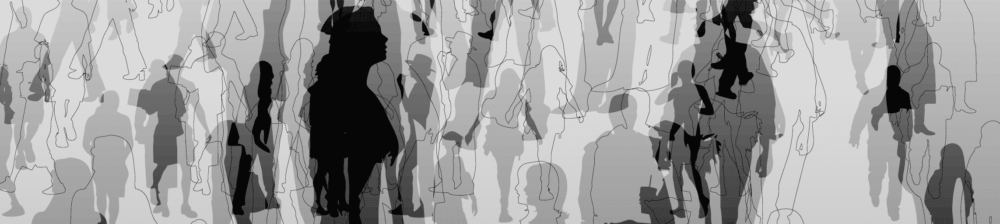

# 亲爱的白人，你们在多样性 上很差劲

> 原文：<https://web.archive.org/web/https://techcrunch.com/2015/12/13/dear-white-people-you-suck-at-diversity/>

当科技行业的白人开始谈论多样性时，我倾向于做好准备。通常情况下，他们似乎说了一些五音不全、完全无礼或缺乏交叉理解的话。

交叉性是指人们因其与种族、性别、阶级、性取向等相关的交叉身份而面临多层面的歧视。 对于女性和跨性别的有色人种来说，种族主义、性别歧视、同性恋恐惧症和跨性别恐惧症这些压迫性的制度都在起作用，不能分开来研究。

但是在科技行业，白人“领导者”倾向于谈论各自为政的多样性。 这里有三个最近的例子:

在 Re/Code Decode 最近的一集里，迪克·科斯特罗在回答卡拉·斯威舍关于多样性的宽泛问题时，只字未提少数民族、跨性别者和性别不合群者:

> 科斯特洛在接受 Re/code Decode 的采访时说:“很多男人口头上支持多元化，但实际上并没有做任何事情。“真正的工作是在这些公司内部培养女性领导者。”

在 Dreamforce，Salesforce 对旧金山的年度收购，首席执行官马克·贝尼奥夫也未能解决多样性的复杂性:

> “总的来说，多元化对我们来说极其重要。现在，这是主要问题[向房间/人群做手势]。我认为，当我们觉得我们已经得到了这一点，你知道，多一点点的控制，那么我认为这将是我们关注的主要问题。我们没有忽视它，这是我们支持的事情，这是我们正在努力的事情，但这是我们目前的主要焦点，是妇女问题。”

还有红杉资本(Sequoia Capital)投资者迈克尔·莫里茨，他似乎优先考虑聘用女性，而不是代表性不足的少数族裔，*和*胡说八道要降低门槛，以便聘用更多样化的候选人:

> “事实上，我们刚刚聘请了一位来自斯坦福的年轻女性，她和她的同龄人一样优秀，”红杉资本投资者迈克·莫里茨[在接受彭博采访时说道，题为《红杉的莫里茨:寻找女性合伙人](https://web.archive.org/web/20230330201613/http://www.bloomberg.com/news/videos/2015-12-02/sequoia-s-moritz-looking-for-women-to-be-partners)。“如果有更多像她这样的人，我们会雇用他们。我们不准备做的是降低我们的标准。”

我不明白为什么人们会说那样的话。因为他们是种族主义者吗？性别歧视？无知？三者的病态结合？大概吧。

交叉性并不在他们的关注范围内，因为他们谈论性别和种族时，似乎对很多人来说，它们并没有高度、高度的关联。法律学者金伯利·克伦肖(kimberéCrenshaw)在她 1993 年的论文《[映射边缘:交叉性、身份政治和对有色人种妇女的暴力》中写道，“在回应一个或另一个的话语中”，有色人种妇女和跨性别者具有交叉身份，或者作为有色人种的跨性别者 *和*](https://web.archive.org/web/20230330201613/http://socialdifference.columbia.edu/files/socialdiff/projects/Article__Mapping_the_Margins_by_Kimblere_Crenshaw.pdf)

> 女团默认为白人女性，黑人团默认为黑人男性；WoC[有色人种妇女]被从多样性的叙述中抹去。阿德里亚利查兹

这意味着社会会在性别和种族方面将他们边缘化。不幸的是，那些声称自己是多样性拥护者的女性似乎几乎没有注意到这种交叉现象。尽管有色人种妇女是妇女，但她们往往被排除在专门针对妇女的倡议之外。

正如 Slack 工程师 Erica Baker 最近在 Medium 上写的那样，科技公司似乎正在实践“无色多样性”，这是她最近创造的一个术语。无色多样性是这样一种观念，即多样性努力只关注并有利于白人(无色)女性(多样性中很小很小的一部分)。

这正是安妮塔·博格研究所格蕾丝·赫柏会议上发生的事情。没有一个黑人女性被列为主要发言人，但是他们为两位白人男性腾出了空间作为特邀发言人。 会议邀请了 SanDisk 首席数据科学家 Janet George 和脸书首席多元化官 Maxine Williams——两人都是有色人种——作为[小组成员](https://web.archive.org/web/20230330201613/http://anitaborg.org/news/press-release/janet-george-isis-anchalee-miral-kotb-discuss-diversity-in-tech-ghc15/)，[而非主要发言人](https://web.archive.org/web/20230330201613/http://schedule.gracehopper.org/session/fixing-the-leaky-pipeline-unleashing-the-power-of-community/)。

交叉性是为什么当科斯特洛说培养女性领导者是真正的工作时会有问题。或者当贝尼奥夫说 Salesforce 将专注于女性时。这也是为什么当公关人员向我推销解决多样性问题时，我会感到恼火，但随后又开始只谈论女性。

种族主义、性别歧视、变性恐惧症和其他压迫性制度的交叉影响着科技行业人们的看法和体验。对于那些想进入科技行业却无法进入的人来说，这也是一个潜在的障碍，因为这个行业并没有考虑到交叉性。事实上，科技行业似乎对此视而不见。

然而，解决交叉性可能是解决这一技术多样性危机的关键，因为这是关于通过多个镜头看待身份和经历。

[Adria Richards 今年早些时候非常雄辩地总结了科技领域的多元化状态](https://web.archive.org/web/20230330201613/https://twitter.com/adriarichards/status/566501145128861696)“女性群体默认为白人女性，黑人群体默认为黑人男性；WoC[有色人种妇女]被从多样性的叙述中抹去了。”

白人，如果你已经完成这篇文章，恭喜你。我现在对你的要求是阅读和聆听有色人种和性别不一致者的作品。拓宽你对多样性的理解。并认识到这远比简单的女人对男人，有色人种对白人要复杂得多。

*文章更新，指出 Janet George 和 Maxine Williams 出现在格蕾丝·赫柏会议的舞台上，但不是主要发言人。*