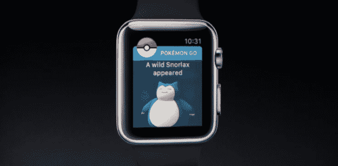

# Niantic 驳斥了取消传言，称 Apple Watch 上的 Pokemon GO 仍然“即将推出”

> 原文：<https://web.archive.org/web/https://techcrunch.com/2016/12/17/debunking-cancellation-rumors-niantic-says-pokemon-go-apple-watch-app-is-still-coming-soon/>

# Niantic 驳斥了取消传言，称 Apple Watch 的 Pokemon GO 仍然“即将推出”

当 Niantic 在 9 月份首次展示适用于 Apple Watch 的 Pokemon Go 应用程序时，该公司给出的唯一发布日期是年底

随着 12 月 31 日的迅速临近，PoGo 粉丝们开始怀疑 Niantic 到底会不会在 2016 年发货。随着疑惑和怀疑而来的是谣言失控的充分机会。

一封电子邮件今天早上开始在 reddit 上流传；据称是由 Niantic 的客户服务代理发出的，它声称“Apple Watch 的端口已经搁置”，开发已经停止。

虽然有几个网站接受了这个谣言并进行报道，但对我们来说，这一切似乎……有点离谱。苹果在自己的公告中特别提到了它；几个月后悄悄消灭它会烧掉一些非常重要的桥梁。

所以我们联系了 Niantic。当涉及传闻时，该公司通常很快不予置评——但在这种情况下，该公司的一名代表明确表示:

> 感谢您与我们联系！Reddit 帖子中的图片不是真实的。
> 
> Pokémon GO 的开发仍在继续，就像苹果宣布之前一样。我们很快会有更多关于该产品的消息。

与此同时，官方 PokemonGo 推特消息称: