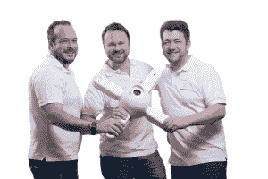

# Dedrone 筹集 1000 万美元探测空中入侵者 

> 原文：<https://web.archive.org/web/https://techcrunch.com/2016/05/17/dedrone-raises-10-million-to-detect-aerial-intruders/>

随着民用无人机在世界各地变得越来越便宜、复杂和常见，一家名为 [Dedrone Inc.](https://web.archive.org/web/20221206031533/http://dedrone.com/) 的公司已经筹集了 1000 万美元的风险投资，用于监控天空并告诉人们无人机何时进入他们的空域的系统。

[Menlo Ventures](https://web.archive.org/web/20221206031533/https://www.menlovc.com/) 领导了对 Dedrone 的首轮投资，使该公司迄今为止的总资本达到 1290 万美元。

据 Dedrone 联合创始人兼首席执行官 Joerg Lamprecht 称，该公司的旗舰 [DroneTracker 系统](https://web.archive.org/web/20221206031533/http://www.dedrone.com/en/dronetracker/drone-detection-hardware)安装在场地周围的地面上，并采用各种传感器来检测无人机，这些无人机要么是不受欢迎的入侵者，要么是受欢迎的高空作业者。

今天在德国制造的每架 DroneTracker 都包括摄像头、声学和无线电频率传感器，可以检测无人机的存在并确定它是什么类型的无人机。较小的场馆只需要一两台机器人，而体育馆和其他大型场馆可能需要十多台。

Dedrone 不会向任何第三方出售其收集的数据，但会向客户发送预警和无人机活动的每日报告。Dedrone 通过与博思艾伦汉密尔顿(Booz Allen Hamilton)或博世安全系统(Bosch Security Systems)等实体安全提供商合作销售其系统。

Lamprecht 指出，无人驾驶飞机已经在私营部门用于崇高的目的，如保护濒危物种，向偏远地区的诊所运送药物，或者帮助农民用更少的水种植更多的食物。

然而，民用无人机也越来越多地被用于邪恶的用途，如向监狱投放毒品、入侵企业系统或监视公民个人。随着无人机销量激增，民用无人机事故也可能发生。我们已经看到无人机意外撞上白宫草坪和加州的电线。

Lamprecht 说，“无人机有潜力用于更大的利益，但只有当我们超越今天在空中的无政府状态。”

该公司最终将为其 DroneTracker 系统增加一些功能，允许用户监控无人机的正常运行时间，以实现他们实际上想要在他们的财产上方工作的空中机器人。

Menlo Ventures 的董事总经理 Venky Ganesan 表示，他的公司支持 Dedrone，因为很明显，鉴于无人机在全球的销售速度，与无人机相关的问题将会增加。

*Dedrone 联合创始人(L-R) Ingo Seebach、Joerg Lamprecht 和 Rene Seber。*

“就安全性而言，无人机让物理围栏变得毫无意义。你不可能建造一个足够高的栅栏来阻挡无人机。因此，Dedrone 将网络安全与物理安全结合在一起，”Ganesan 说。

Dedrone 目前拥有约 40 名全职员工，最近将总部从德国卡塞尔迁至旧金山。

Lambrecth 表示，该公司将把新资金用于正在进行的研发、招聘，并增加其旗舰产品 DroneTracker 系统的销售和制造。

Lambrecth 说，DroneTracker 已经在体育场，机场，数据中心，高端酒店和私人住宅中使用，但出于安全考虑，他没有透露这些具体场所的名称。尽管该公司已经宣布其系统正在纽约大都会队的花旗球场使用。

Dedrone 是最新一家获得风投资金的初创公司，旨在使民用无人机的使用更加安全。其他筹集风险资金的公司包括: [PrecisionHawk](https://web.archive.org/web/20221206031533/https://beta.techcrunch.com/2016/04/20/precisionhawk-raises-18-million-to-bring-drones-safely-into-u-s-airspace/) 、 [AirMap](https://web.archive.org/web/20221206031533/https://beta.techcrunch.com/2016/04/07/airmap-raises-15m-series-a-round-to-develop-its-airspace-management-system-for-drones/) 和 [DroneDeploy](https://web.archive.org/web/20221206031533/https://beta.techcrunch.com/2015/03/31/dronedeploy-series-a/) 等等。

Dedrone 的早期种子投资者包括前互联网安全系统公司首席执行官汤姆·诺南和 Target Partners。