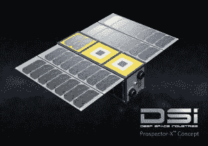
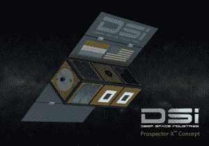
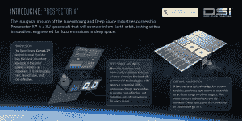

# 深空工业与卢森堡合作测试小行星采矿技术 

> 原文：<https://web.archive.org/web/https://techcrunch.com/2016/05/05/deep-space-industries-partners-with-luxembourg-to-test-asteroid-mining-technologies/>

小行星采矿公司 Deep Space Industries 与卢森堡政府签署了一份谅解备忘录，共同资助 DSI 首个航天器的开发和发射。被称为[探勘者-X](https://web.archive.org/web/20221225222321/https://deepspaceindustries.com/prospector-x/) 的小型航天器将在低地球轨道测试未来小行星勘探所需的关键技术。

Prospector-X /图片由 Bryan versteg/深空工业公司提供

该协议是朝着开发必要技术迈出的一小步，但却是重要的一步，这些技术将使潜在的[非常有利可图的](https://web.archive.org/web/20221225222321/https://techcrunch.com/2015/07/09/the-potential-100-trillion-market-for-space-mining/)小行星采矿业务成为可能。

> “我们与 DSI 在 spaceresources.lu 倡议范围内的合作前景看好，这清楚地表明了卢森堡政府支持探索和未来利用空间资源的坚定承诺。”卢森堡副首相兼经济大臣 tienne Schneider

早在二月份，卢森堡就成为第一个宣布打算为太空商业采矿活动建立必要的法律和监管框架的欧洲国家。

去年，奥巴马总统签署了《美国商业航天发射竞争法案》(CSLCA)，美国走得更远。CSLCA 声明，美国公司有权维护他们从外太空获得的资源的产权，让 DSI 和[行星资源](https://web.archive.org/web/20221225222321/http://www.planetaryresources.com/)这样的公司在监管上放心。

Prospector-X /图片由 Bryan versteg/深空工业公司提供

在卢森堡 2 月份的声明中，他们提到他们正在考虑投资已经成立的小行星采矿公司，如 DSI 和行星资源公司。

今天，卢森堡开始与 DSI 合作，他们已经计划与其他公司合作，并表示“正在进行单独的谈判，以正式确定我们与活跃在该领域的其他公司的关系。”

行星资源似乎是一个可能的竞争者，考虑到他们已经在 2015 年 7 月[发射了](https://web.archive.org/web/20221225222321/http://www.planetaryresources.com/2015/07/planetary-resources-first-spacecraft-deployed/)他们的第一艘宇宙飞船，以测试他们自己的小行星探测技术。

DSI 在美国宇航局艾姆斯研究园有一个办公室，并通过几个合同与美国宇航局合作，将在卢森堡开设第二个地点。

虽然航天器的部分目前正在开发中，但 DSI 将与卢森堡合作完成整个系统。探勘者-X 将在这两个地方建造和测试。

探勘者-X /图片由深空工业公司提供

DSI 董事会主席 Rick Tumlinson 告诉 TechCrunch，将在 Prospector-X 上测试的关键技术之一是一种名为 Comet-1 的电热推进器。

虽然图姆林森没有透露太多细节，但他指出，这是一种非常先进的推进器，使用水作为推进剂。他指出，推进这项技术将对航天工业大有裨益，特别是如果一家公司能够找到一种从小行星上获取水的方法。

DSI 当然希望成为那样的公司。

一般来说，小行星采矿涉及收获资源，这些资源要么保存在太空中——例如，小行星可以被制成旅行航天器的加油站——要么打算将这些资源带回地面在地球上出售。

> “我们要去死亡和致命的地方，我们收获生命的东西，这样人类就可以去那里生活和探索。”Rick Tumlinson，DSI 董事会主席

目前，DSI 正专注于从小行星收集水用于太空应用，如为其他航天器提供燃料。这项活动也很好地结合了他们的目标，即完善需要水作为推进剂的火箭推进器。

Tumlinson 将他们的计划比作石油工业，他说，“这几乎就像我们在钻探第一批石油*和*我们在开发内燃机。”

DSI 还计划从小行星上采集有价值的金属和气体。

然而，小行星采矿技术将需要数年时间来发展，因此从收获的小行星材料中获取收入不太可能在不久的将来发生。与此同时，DSI 计划通过出售他们在此过程中开发的技术和航天器能力来赚钱。

> “我们正在做的事情的美妙之处在于，我们正在展示的推进器和其他技术和能力现在适用于太空市场。”Rick Tumlinson，DSI 董事会主席

在探勘者-X 在低地球轨道飞行后，DSI 计划发射他们的下一个航天器，探勘者-1 号，执行前往小行星的任务。预计在四年后发射的“探勘者 1 号”将返回关于小行星组成的信息，以及图姆林森所说的“可挖掘性”(本质上是小行星开采的难易程度)。

Tumlinson 说，为了确定合适的采矿地点，可以向不同的小行星候选人发送多个探勘者 1 号航天器。

小行星采矿的生意当然很有希望。许多小行星都有水冰，可以采集来制造火箭燃料。其他的含有地球上稀有的有用金属。小行星的价值毋庸置疑。然而，以一种成本有效的方式提取这种价值，是人类还没有完全弄明白的部分。

像 DSI 和行星资源这样的公司正在打赌，他们的技术和商业计划将最终把他们带到小行星的金矿。我们只需要等一会儿，看看他们是对的。