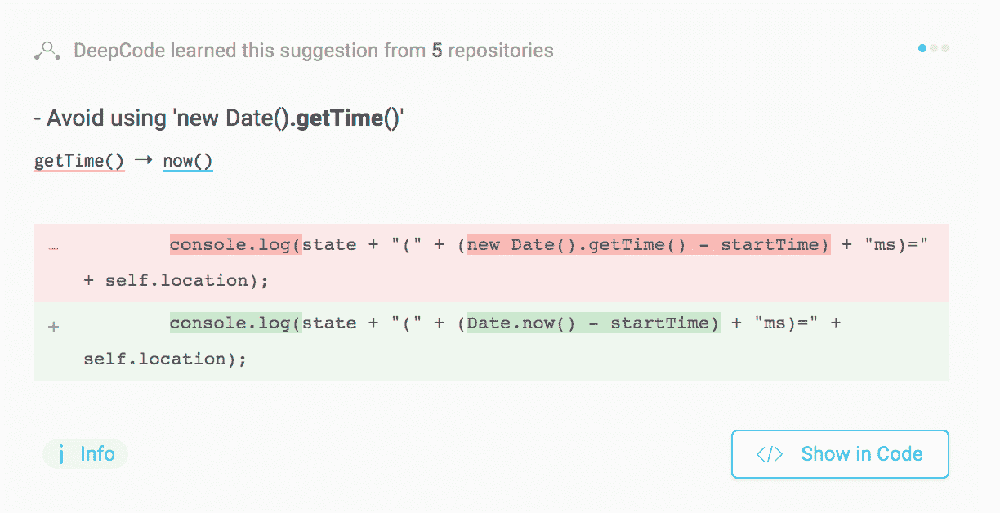
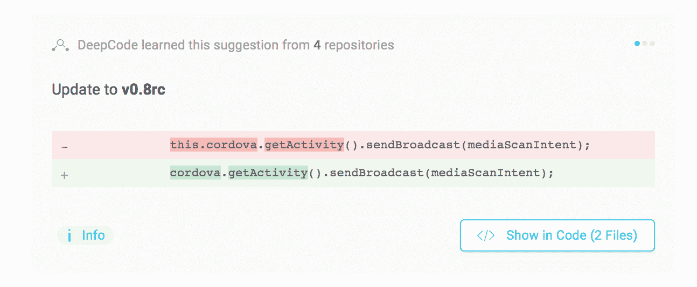

# DeepCode 借助人工智能 TechCrunch 的力量清理您的代码

> 原文：<https://web.archive.org/web/https://techcrunch.com/2018/04/26/deepcode-cleans-your-code-with-the-power-of-ai/>

# DeepCode 用人工智能的力量清理你的代码

总部位于苏黎士的 [DeepCode](https://web.archive.org/web/20221211103514/http://deepcode.ai/) 声称他们的系统——本质上是一个分析和改进代码的工具——在语法上类似于程序员。该系统使用 250，000 条规则的语料库，读取你的公共和私人 GitHub 储存库，并告诉你如何修复问题，保持兼容性，并总体上改善你的程序。

该团队由 Veselin Raychev、顾问 Martin Vechev 和 Boris Paskalev 创建，在机器学习和人工智能研究方面拥有丰富的经验。这个项目是瑞士联邦理工学院的副产品，是一个独立的研究项目，变成了编程工具。

它是如何工作的？相当好。我在系统中运行了我的一个公共存储库，收到了 449 个文件中的 49 条建议。修复的范围从字面上的代码变化——将`name: String,`改为`name: {type: String},`——到对函数调用中可能实际缺失的代码的建议。这是一个有趣的工具，尤其是当你需要帮助找到代码中隐藏的 bug 时。这个工具给出的建议也惊人的精确。因为它可以根据大量代码建立自己的建议，它会发现人类可能会忽略的东西。

“我们建立了一个理解代码意图的平台，”Paskalev 说。“我们自主理解数百万个存储库，并注意到开发人员正在做出的改变。然后，我们用这些变化训练我们的人工智能引擎，并可以为我们平台分析的每一行代码提供独特的建议。”

“今天，我们有超过 25 万条规则，并且每天都在增长，”Paskalev 说。“我们的竞争对手必须手动创建规则，最大的竞争对手有 3-4，000 条规则，他们已经工作了多年。

该公司自筹资金，最近从 btov 筹集了 110 万美元。创始人都是连续创业者。帕斯卡列夫在 VistaPrint 和 PPAG 工作，雷切夫在谷歌工作，是编程语言语义学中机器学习领域的研究员。

DeepCode 不仅仅是一个简单的调试器，它“读取”并尝试将代码与其他实现进行比较，从而为您提供每一行都是一流的性能。现在团队只需要让程序员使用它。

“我们有一个独特的平台，它理解软件代码就像语法理解书面语言一样，”Paskalev 说。“这一独特的主张使我们能够通过我们的第一项服务在软件开发社区内节省数十亿美元，然后成为将行业转变为完全自主的代码合成的前沿。”