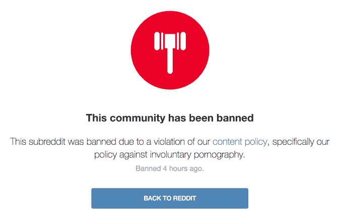

# Reddit 禁止交易人工智能生成的名人视频的“非自愿色情”社区 

> 原文：<https://web.archive.org/web/https://techcrunch.com/2018/02/07/deepfakes-fake-porn-reddit-twitter-ban/>

# Reddit 禁止交易人工智能生成的名人视频的“非自愿色情”社区

继最近对人工智能生成的人脸交换色情的争议做法的其他禁令之后，Reddit 也取消了禁令。周三，该社交平台关闭了 r/deepfakes 和 r/deepfakeNSFW 这两个受欢迎的虚假视频中心，它们使用算法软件来创建虚拟色情作品，描绘不情愿的参与者的肖像。Reddit 还针对 T2 的非自愿色情和未成年人的性化更新了政策。在此之前，T4 也对 porn hub T5、Discord 和 Twitter T7 进行了类似的打击。

正如 Reddit 的新语言所说:

> Reddit 禁止传播描述任何人裸体状态或从事任何明显未经其允许创建或发布的性行为的图像或视频，包括伪造的描述。
> 
> 一个人身体私密部位的图像或视频，即使该人穿着衣服或在公共场合，如果显然是在未经其允许的情况下创建或发布的，并且以淫秽的方式融入上下文，也是不允许的(例如，“creepshots”或“upskirt”图像)。此外，不要发布他人的图像或视频，以伪造明确的内容或寻求“相似”色情内容。

与此无关的是，Reddit 联合创始人亚历克西斯·奥哈尼安[今天](https://web.archive.org/web/20221206161559/https://twitter.com/alexisohanian/status/961229176853409792)宣布，他将离开 Reddit，专注于他联合创立的早期风险投资公司 Initialized Capital 的全职工作。

在禁令颁布之前，r/deepfakes 拥有超过 92，000 名用户。禁令发布前的一张截图显示了最近由人工智能生成的以泰勒·斯威夫特、赛琳娜·戈麦斯和奥利维亚·维尔德为主角的色情帖子。一篇帖子分享了一种名为 FakeApp 的软件的信息，任何人都可以使用该软件将色情与名人视频拼接在一起，从而产生一个被操纵的最终产品，可以描绘公众人物(或任何其他人)参与从未发生的性行为。TechCrunch 已经联系了 Reddit，了解他们计划如何在平台上的其他地方实施内容禁令的更多细节，当我们收到回复时，我们将更新这个故事。

当 Motherboard 报道 Reddit 用户“deepfakes”重新制作了一部以神奇女侠明星盖尔·加朵为主角的人工智能色情片时，围绕这种视频的争议爆发了。这个故事恰当地命名为“[人工智能辅助的假色情在这里，我们都被骗了](https://web.archive.org/web/20221206161559/https://motherboard.vice.com/en_us/article/gydydm/gal-gadot-fake-ai-porn)”，是整个事情的一个很好的入门。

这种趋势在某些层面上令人不安。显然，任何人在没有虚拟主体同意的情况下创作性内容——本质上是点播的复仇色情——都是令人不安和极其令人毛骨悚然的。但是，即使从色情的角度来看，让这些被操纵的视频发挥作用的机器学习技术只会随着时间的推移变得更加复杂，使互联网用户更难确定什么是真实的，什么是捏造的。

如果你认为我们现在有假新闻的问题，那么，在情况好转之前，它会变得更糟。