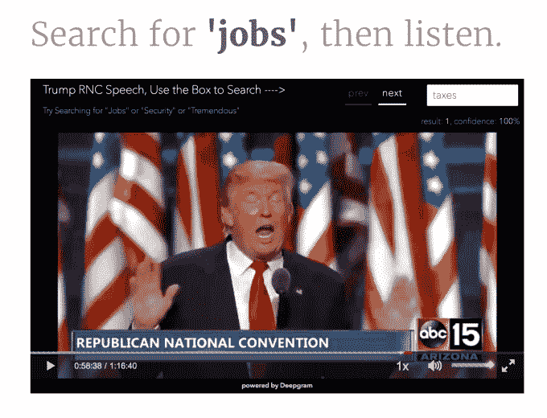

# Deepgram 的语音搜索引擎现在对记者免费开放，直到选举日 

> 原文：<https://web.archive.org/web/https://techcrunch.com/2016/10/10/deepgrams-speech-search-engine-is-now-free-for-journalists-until-election-day/>

在一场充满谎言和否认指控的有争议的选举中，更不用说超负荷工作的事实检查员了，一家可以帮助记者更容易地在录音中找到原声片段的公司 [Deepgram](https://web.archive.org/web/20230130225330/https://www.deepgram.com/) 向记者免费提供服务。音频搜索技术依赖于人工智能，被比作“声音的谷歌”——这意味着它可以像搜索引擎一样使用，但它能够显示音频文件中的短语，而不是网页上的文本。

由[前粒子物理研究员](https://web.archive.org/web/20230130225330/http://www.theoaklandpress.com/article/OP/20120904/NEWS/309049991) s、诺亚·舒提和斯科特·斯蒂芬森创立的这家初创公司的想法最初是因为舒提想要一种更好的方式来搜索自己的音频文件。这使他开发了基于神经网络的人工智能引擎，这开始了 Deepgram。

今年秋天，初创公司[宣布获得变形投资公司和 Y Combinator 投资的 180 万美元](https://web.archive.org/web/20230130225330/https://techcrunch.com/2016/09/27/launching-a-google-for-sound-deepgram-raises-1-8-million/)。

“在录像中搜索真的很难。就工作流程而言，通常原始音频被转录成文本，然后输入搜索工具。如果你用人工抄写的方式抄写，那太费时又费钱了，”Stephenson 在的一篇博客文章中解释道，他宣布将 Deepgram 向记者免费开放，直到选举日。

“如果你试图用自动语音转文本来做这件事，那么搜索的准确性就是问题。“Deepgram 解决了这个问题，”他说。

这是这项技术的工作原理。首先，终端用户上传一个音频文件到服务上，可以是任何东西——电话、播客、会议或视频——甚至可以使用 YouTube 的 URL。

然后，Deepgram 对语音进行处理，存储在所谓的“深度表征索引”中。Deepgram 不是试图将声音翻译成单词，而是通过语音将声音分组。因此，你可以根据单词的发音来搜索单词，即使拼写错误，Deepgram 也能找到它们。

该公司声称，它能够在不到人类转录员一半的时间内索引音频文件，每小时音频费用为 75 美分，而人类转录服务每分钟收费为 75 美分。

通过 API 使用服务的企业客户有不同的费率。如今，该公司拥有超过 1，200 家客户，包括小型黑客、呼叫中心、警用摄像头制造商等。

一旦被编入索引——这个过程只需要几秒钟——Deepgram 就可以在其索引中找到你的搜索词，并直接跳转到该关键词在音频中被提及的次数。

该公司指出，虽然这项服务不是 100%准确，但它能够在 5 次中找到 4 次结果——这不如人工转录，但比语音转文本要好，后者更容易出错，准确率为 20%。

此外，斯蒂芬森补充说，Deepgram 让“记者听语调和音调变化，这在转录过程中完全丢失了。”

就在选举周期期间向媒体提供这项技术而言，斯蒂芬森建议，对于那些希望搜索候选人演讲或电视露面上传的记者来说，这项技术将非常有用。

在公司的博客上有一个 Deepgram 的演示。

在特朗普 RNC 演讲的视频中，你可以在 Deepgram 的搜索框中输入各种术语，然后立即被带到视频中使用该术语的部分。例如，您可以搜索“工作”、“税收”、“女性”、“安全”等词语。界面的右上角还显示了找到了多少搜索结果，以及可信度。

当这个术语被提到不止一次时，录音会用红色标记表示出来，你可以点击跳到下一个听到这个术语的部分。

作为一项精明的营销举措(但这对记者来说是一项额外津贴)，Deepgram 现在在选举日之前对认证媒体免费。记者可以通过给 press@deepgram.com 发电子邮件请求采访。

更新:Deepgram 已经使用其技术使昨晚的辩论视频可搜索。这里有[这里有](https://web.archive.org/web/20230130225330/http://blog.deepgram.com/2nd-presidential-debate-2016/)。

*特色图片:[I newind](https://web.archive.org/web/20230130225330/http://www.shutterstock.com/pic-186744380/stock-vector-abstract-equalizer-night-music-club-life-vector-concept.html)/[SHUTTERSTOCK](https://web.archive.org/web/20230130225330/http://www.shutterstock.com/)*