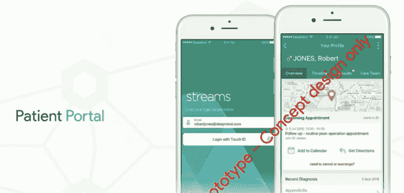

# DeepMind 希望其医疗保健人工智能按结果收费——但首先它需要你的数据 

> 原文：<https://web.archive.org/web/https://techcrunch.com/2016/09/20/deepmind-wants-its-healthcare-ai-to-charge-by-results-but-first-it-needs-your-data/>

在你的谷歌日历上做个标记因为从今天起，字母表广告巨头 DeepMind AI 部门将再次播放“不要作恶”，作为“不伤害”的希波克拉底保证。

具有不小讽刺意味的是，DeepMind 的联合创始人穆斯塔法·苏莱曼(Mustafa Suleyman)在今天的一次外联活动中为其[医疗保健推广](https://web.archive.org/web/20221006204805/https://deepmind.com/applied/deepmind-health/)提出的新口号，让患者听到这家谷歌旗下公司希望利用英国国民医疗服务系统(National Health Service)的数据建立什么，令人不安地与旧口号非常接近，即令人尴尬的失宠。

苏莱曼在讨论病人对公司计划的反馈时引用了希波克拉底誓言。

“[不伤害]必须成为我们重复的咒语，并成为我们过程中固有的一部分，”他在三个小时的讨论会议结束时说道，这次会议在 [YouTube](https://web.archive.org/web/20221006204805/https://www.youtube.com/watch?v=wBfBiD38x34) 上直播(通过 [#DMHpatients](https://web.archive.org/web/20221006204805/https://twitter.com/search?q=%23DMHpatients&src=tyah) Twitter 标签征求意见)。

“在任何部署之前，或者在我们试图证明任何效用和患者利益之前,[无害]应该是成功的第一衡量标准，”他补充说。

在回答问题并听取了由公司挑选的一小群患者、健康专家和公众成员的意见后，苏莱曼标记了其他要点。其中之一是需要扩大 DeepMind 现在已经开放的患者参与渠道。

他承认，活动在谷歌闪亮的伦敦市中心办公室举行令人遗憾。

“正如你所说，这是一座奇特而令人生畏的建筑，对此我很抱歉，从某些方面来说，这是一种遗憾。我真的同意你的观点，我们必须找到其他的空间，社区空间，让更多不同的人群更容易进入，”他说。

“当我们将(倾听患者心声的)过程正式化时，我们希望确保在座的其他人也能得到报酬，患者的贡献也应该得到报酬，我们将确保这一点。我们可能应该考虑如何在周末或晚上举行这样的会议，因为不同的利益相关者可能有更多的时间参与进来，”他补充说。

Alphabet 的人工智能部门今天也表示，它打算在 2017 年前“定义”它所谓的“患者参与战略”。

尽管 DeepMind 去年秋天开始与 NHS 进行数据共享合作——2015 年 9 月与伦敦皇家免费 NHS 信托签署了广泛的数据共享协议——今年 2 月才公开披露 DeepMind 健康计划，两个月前它开始对与皇家免费合作开发的一款应用程序进行医院用户测试……所以很难不把它对患者参与和介入的态度视为一种事后想法。

**争议和审查**

这看起来也像是对今年早些时候 DeepMind 首次公开宣布与 NHS 信托(皇家自由基金会)合作引发的[争议的回应——鉴于对该项目(Streams，一款用于识别急性肾损伤的应用程序)的批评集中在谷歌旗下公司在没有患者知情的情况下，更不用说咨询或同意的情况下，获得了多少患者可识别的数据。(DeepMind 和 Royal Free 坚称，在这种情况下，他们不需要患者同意就可以分享数据，因为他们说这款应用程序是为了直接护理患者——该公司现在在其网站上的一个名为“](https://web.archive.org/web/20221006204805/https://beta.techcrunch.com/2016/05/04/concerns-raised-over-broad-scope-of-deepmind-nhs-health-data-sharing-deal/)[信息治理](https://web.archive.org/web/20221006204805/https://deepmind.com/applied/deepmind-health/information-governance/)”的部分重申了这一点。)

英国数据保护监管机构 ICO 正在调查关于 Streams 应用的投诉。国家数据卫士的任务是确保公民的健康数据得到妥善保护和使用，它也在密切关注数据是如何被共享的。根据 MHRA 监管机构的说法，在医院测试之前，Streams 也没有注册为医疗设备，但[应该是](https://web.archive.org/web/20221006204805/https://beta.techcrunch.com/2016/08/23/deepmind-nhs-health-data-sharing-deal-faces-further-scrutiny/)。因此，DeepMind Health 的工作方式已经震动了不少船只——尽管苏莱曼在今天的公开评论中煞费苦心地强调 DeepMind Health 还处于“非常早期的阶段”。

很明显，这家谷歌旗下的公司现在在其健康网站上也有一个名为“ [For Patients](https://web.archive.org/web/20221006204805/https://deepmind.com/applied/deepmind-health/patients/) ”的部分，在那里它描述了创建“有意义的患者参与”的意图，并声称它正在“将患者和公众参与(PPI)纳入我们项目的每个阶段”。(虽然在这里，它再次指出了另一个未来的意图:创建一个病人咨询小组，“更广泛地为我们的项目做出贡献”——这表明它本可以做得更多，让病人参与第一波 NHS 项目和研究伙伴关系。)

“我们今天真正要做的是尝试公开邀请人们来帮助我们设计互动机制，”苏莱曼说，总结了 DeepMind 的外联活动的意图。“这个房间里的许多人比我们有更多的专业知识和经验，我们认识到我们在这里有很多东西要学，所以今天我认为是我们学习的机会。我们真的很感激人们的时间。我们认识到它的价值，我们真的认为这是一个以正确的方式做这件事的潜在机会。”

他没有直接提到 Streams 应用程序的数据共享争议，尽管整个会议的结构是为了说明(如 DeepMind 所认为的)共享健康数据对患者和健康结果的好处——从而创建一个强有力的叙事来含蓄地为其行动辩护——并大谈公共资助的 NHS 的经济紧缩以及尽早诊断病情以节省资源和生命的必要性。TL；dr: DeepMind 的销售卖点是，人工智能可以为长期资金短缺的 NHS 自动节省效率。因此:你不能不给我们你的数据！

虽然谷歌的讲台上有不直接为 Alphabet 工作的演讲者，但活动中的所有演讲者都是由该公司挑选出来发言的，因此毫不奇怪地与它的观点保持一致。例如，我们听到了健康数据共享倡导组织 [Empower: Data4Health](https://web.archive.org/web/20221006204805/http://www.data4health.co.uk/the-campaign/empower-data4health) 的 Graham Silk，而不是——比如说——健康数据隐私倡导组织 [MedConfidential](https://web.archive.org/web/20221006204805/https://medconfidential.org/) 的 Phil Booth，后者一直批评 DeepMind 对 NHS 数据的处理。

关键是，如果你在创建“公共”论坛，你就控制了(很大程度上)辩论的范围和基调。事实上[谷歌在](https://web.archive.org/web/20221006204805/https://beta.techcrunch.com/2014/07/30/rtbf-call-for-public/)之前就已经试图在其他与其商业利益相关的技术政策交叉点上这么做了——顺便提一下，也是在被迫对外部事件做出回应之后(比如当它调动资源去[游说反对欧洲法院关于被遗忘权的裁决](https://web.archive.org/web/20221006204805/https://beta.techcrunch.com/2014/07/04/digital-theatre/))。

**按结果付费**

也就是说，今天的观众不可避免地有点不切题，因为这场活动至少在理论上对任何公众成员开放，可以申请 120 个席位中的一个(尽管我们不知道 DeepMind 是如何选择参与者的)。观众们至少提出了健康数据共享的另一大潜在好处:即对 Alphabet 底线的财务好处——通过询问 DeepMind 打算如何利用它使用免费访问的公共数据开发的任何机器学习算法来赚钱。

https://twitter.com/LouisWihl/status/778239231881805824

在商业模式问题上，苏莱曼表示，一种按结果付费的模式是谷歌在这一初期阶段的想法，因为它寻求获得更多的公共健康数据集，以支持机器算法，希望这些算法能够及时产生利润。

“我们必须在此基础上建立一个可持续的商业模式。我们从一开始就清楚这一点。我们避免的是过早地确定这一点——幸运的是，我们有资源来探索围绕我们的干预最有效的商业模式，这样本质上我们在提供价值时就能获得回报。这才是我们真正想做的。现有的提供商通过他们的活动获得报酬——如果不是全部，也是绝大部分，他们的付款是在软件发货时交付的，”他说。

“我们想做的是得到报酬，至少是我们所得的一部分，与实际具体的临床结果联系起来。我认为这是患者可以真正发挥积极作用的另一个领域，帮助我们确定对患者以及医院来说，在效率和运营方式方面什么是重要的指标。我认为这将是该模式的一个真正具有挑战性的方面，但我们非常致力于在这方面进行创新，就像我们在技术上所做的一样。”

在他的演讲中，Suleyman 还花时间为患者和医生展示了几个看起来很光滑的概念健康应用程序，旨在让他们在手机上查看健康数据并与之互动——这是 DeepMind 称为患者门户的原型概念。

“这是罗伯特在家，在家里阅读他最近任命的数据，”他说，介绍其中一个应用程序，就像他在创业大赛上提出一个想法一样。“他所能做的是看到他有一个即将到来的后续预约，一个常规的术后预约，并确认他能够参加…他可能会得到指示，并将其添加到他的个人日历中。”

然而，概念应用程序在这一点上是纯粹的 vapourware。苏莱曼证实，DeepMind 尚未开始开发病人门户应用程序，并继续将这些概念描述为“我们可能希望在未来几年内实现的各种事情”。

也不清楚如何在短期内实现应用交付的 NHS 的任何愿景，因为它需要将所有现存的 NHS 系统与 DeepMind 集成，关键是，要实现以友好的智能手机格式将实时健康数据放在患者和医生的指尖下的承诺，需要舒适地共享数据。

因此，概念应用确实是 DeepMind 今天销售宣传中最明显的部分——利用智能手机应用的熟悉度和受欢迎程度，试图赢得英国公众对 NHS 医疗保健服务未来的替代愿景。这需要将他们的所有数据开放给第三方商业实体来管理和控制，并为此获得报酬。“如果那些讨厌的信息治理流程靠边站，我们就可以继续拯救生命，并以方便的应用程序形式美化你的血液测试结果，”这是这里不那么微妙的潜台词。

然而，并不是#DMHpatients 标签上的每个人都相信放松信息治理的呼吁…

可以肯定地说，DeepMind 试图招募用户/公众代表它施加政治压力，以实现——尽管苏莱曼谈到了“社会影响任务”——商业和利润驱动的目的，这是寻求解决监管造成的商业障碍的科技公司的一个非常标准的剧本。只是在这种情况下，这不是优步获得点播乘车服务，以抗议“过时的城市当局”阻碍他们回家，这是一个针对巨人的广告，旨在鼓励对分享个人健康数据采取更加自由的态度(这些数据也是由纳税人资助的，在英国的免费使用点 NHS 下)。

**安全顾虑**

在苏莱曼介绍病人门户网站概念后，观众提出的第一个问题凸显了 DeepMind 在说服英国公众信任一家商业巨头的健康数据方面面临的困难——提问者专注于安全和隐私问题，这是苏莱曼的介绍所掩盖的。

在提到 DeepMind 的概念应用程序时，一位名叫伯尼的患者指出:“你没有提到任何关于如何保护手机上信息的内容”，接着问数据会被保存在哪里——是医生的个人手机还是医院拥有的设备？——并补充道:“把手机或其他东西留在医院里，这样信息就不会流出医院，不是更安全吗？”

Suleyman 回应说，将数据传输到设备和在智能手机上使用安全元素是 DeepMind 认为它可以保护患者数据的一些方法，以实现应用支持的医疗保健的患者门户风格场景。

> 我们认为有办法确保这些数据只能由正确的人在正确的时间访问。

“计划是流式传输数据，这样数据就不会真正存储在本地移动设备上。目标是当特定临床医生或某一天患者需要并希望访问该数据时，尝试使该数据可用。目前，我们已经有了以非常安全的方式传输数据的技术，例如，当您的电子邮件被检查时，我们有最好的安全基础设施和控制措施来确保只有您才能访问这些数据。因此，无论是通过您手机上的密码还是指纹识别，我们都认为有办法确保这些数据只能由正确的人在正确的时间访问，”他说。

“一种方法(我们将数据流式传输到哪些设备)是将其流式传输到 Trust 拥有的设备。我们也会让这成为可能。所以，信托投资智能手机，就像投资传呼机一样，是绝对可能的。我们还认为，在技术上也可以对临床医生的个人移动设备执行此操作。这种方式的工作原理是，在移动电话中会有一个加密的操作外壳(或操作系统),不会接触到手机上的其他数据。这将由信托基金控制。因此，例如，数据、流媒体和应用程序将无法通过信任 wi-fi 访问。可以记录和记录该临床医生对数据的每次访问、编辑或更新。因此，这将产生一个审计跟踪，基本上是谁在哪个时间点查看了哪些数据。”

“在许多其他领域能够非常成功地做到这一点是有先例的，所以从技术上来说，这是一套非常成熟的工具和系统。它还没有普及到医疗领域，所以我们需要非常非常小心，让很多人参与到我们设计和部署这种方法的过程中来，但我们确实相信，在技术上，以非常非常安全的方式做到这一点是可能的，”他补充道。

**推销不是承诺**

在演示过程中，苏莱曼谈到了人工智能的潜力，将人工智能描述为 DeepMind 的“核心专业知识”，并补充道，“我们能够利用我们的核心专业知识来尝试和推进前沿研究是非常重要的”。然而，总是将公司通过人工智能取得成果的能力定性为唯一的可能。

他提到了 DeepMind 与 Moorfields 眼科医院的研究合作，该医院正在使用机器学习来尝试自动分析视网膜眼部扫描，并将另一项研究合作——与伦敦大学学院医院的合作——称为“早期研究”，该合作正在寻找使用人工智能自动进行放射治疗靶向的方法。“我们认为这可能是我们有可能做出贡献的事情，”他补充说，注入了另一个限定条件。

在活动期间，越来越明显的是，DeepMind 通过机器学习算法转变医疗保健成果的宣传只是一个宣传，而不是承诺。该公司已经获得了大量 NHS 数据，但还没有数据证明人工智能在预测和/或诊断疾病以及大规模改善医疗保健结果方面的有效性。在此之前，它需要将数据输入算法来构建模型。因此，如果它要建立任何有价值的东西，它真的需要访问 NHS 拥有的大型数据集。

因此，DeepMind 处于一个棘手的位置，它必须向英国公众兜售免费获取他们最敏感的个人数据，然后才能提供任何具体的回报。如果没有公众的支持，它将很难获得它所需要的作为生命线的数据管道。因此，你真的不得不奇怪，为什么该公司花了一年的大部分时间才意识到它需要让患者充分参与 DeepMind Health 正在做的事情是多么重要。

在结束其首次患者外联活动时，苏莱曼直接呼吁公众参与他所谓的“我们的过程”——他说，DeepMind 正在寻求帮助，以确定优先考虑什么，因为它与愿意与谷歌部门共享数据的 NHS 信托基金合作建立临床应用程序。

此外，公众个人购买特定的未来医疗保健应用程序和成果，可能会更支持商业实体要求其提供健康数据，而不是怀疑。(而且，正如许多硅谷科技巨头可以告诉你的那样，赢得公众支持是这些天来改变监管僵化的最佳策略。)所以不难看出 DeepMind 在这里做什么——归结起来就是擦亮自己的公关凭证。然而，在奢华的伦敦办公室举办一场本应是“以病人为中心”的活动，突显出他们的想法与他们希望为之服务的病人相去甚远。

> 我们不期望这是一个免费反馈我们产品的机会。这不是我们在这里要做的；我们是来邀请批评的。

“我们真的希望将患者、家属、护理人员和公众置于我们工作的中心。我认为，我们从一开始就试图把临床医生的声音和某种程度上病人的声音放在我们工作的中心。我们认为这只是非常早期的阶段。因此，我们邀请你直接参与我们的过程，”他说。

“重要的是，我们可以为我们的临床应用选择许多不同的优先级。我们可以有许多不同的方向，我们认识到让许多不同的利益相关者参与这些优先事项的设置非常重要。到目前为止，我们已经尽了最大努力让一批不同的利益相关方参与进来，但现在我们认为是时候将这一流程正式化，并将其作为我们未来工作的一部分。”

“我们也认为这是一个机会，人们可以作为重要的朋友来帮助我们做好这件事。因此，我们不希望这成为免费反馈我们产品的机会。这不是我们在这里要做的；他补充说:“我们在这里是为了招致批评，本质上是为了让人们成为严格流程的一部分而付钱，而不是在适当的时候付钱给人们。”。