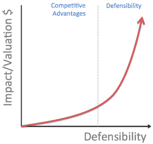

# 防御性为创始人创造最大价值 

> 原文：<https://web.archive.org/web/https://techcrunch.com/2016/09/15/defensibility-creates-the-most-value-for-founders/>

詹姆斯·库里耶撰稿人

詹姆斯·库里耶是

[NFX Guild](https://web.archive.org/web/20230201131419/http://www.nfx.com/)

，这是一个早期基金，为期三个月，面向市场和网络业务。

More posts by this contributor

最近[微软](https://web.archive.org/web/20230201131419/https://techcrunch.com/2016/06/13/microsoft-to-buy-linkedin-for-26b-in-cash-makes-big-move-into-enterprise-social-media/)以 260 亿美元收购 LinkedIn 是软件行业历史上最大的一笔交易，2014 年脸书以 190 亿美元收购 WhatsApp 紧随其后。这些例子说明了实现真正防御的公司创造了多少价值。

一些顾问告诉创始人，“不要担心防御性。专注于做一些让客户高兴的事情，并且做得更好。”没关系。

但是，如果我有选择的话，我宁愿创办一家公司，我知道如果它行得通，它将是可以辩护的……我真的可以  保护它免受竞争。很长时间了。

这里的妙处在于，在数字世界中获得真正的防御能力的最佳方式似乎是利用网络效应。我们会谈到这一点。

更广泛地理解这一点的关键是，几乎所有给你和你的投资者的巨大回报——100 倍或 500 倍的回报——都来自具有长期防御能力的企业。对于早期投资来说，推动回报的是大热门。因此，即使对于早期投资来说，拥有对防御能力的视线也很重要。

## 游戏已经改变了

在过去，商业文献列出了许多创造防御能力的方法:获得原材料的独特途径、有利的地理位置、关税、专利和许可证等政府法规。

> 网络效应已经成为数字世界的天然防御手段。

然而，在数字世界里，这些已经基本消失了。在软件领域，信息透明度更高，地理边界意味着更少，客户很容易点击竞争对手，等等。

我们剩下的是一些竞争优势和一些真正的防御能力。

## 创业公司如何获得竞争优势

“竞争优势”帮助你的公司走向成功。防御能力帮助你留在那里。两者都为你的生意增加了价值。以下是目前在数字世界中行之有效的八大竞争优势:

**速度。**在短期和中期内，加快速度是一个显著的优势。这是每个创业公司可以给自己的头号竞争优势。在 NFX 公会，这是我们筛选公会成员的关键因素之一。

**首都。**就像我们在优步、Square 或 NextDoor 看到的那样，团队筹集更多资金的能力让公司能够更快地招聘员工，购买市场份额，并着手建立真正的防御能力。此外，筹集大量资金有助于吓退其他投资者投资你的竞争对手。(也可能导致损害公司的判断失误，不过那是后话了。)

**独特的团队。**技术人才或对客户/市场的独特洞察力。

**内容。Zillow、Yelp 和脸书等公司是用户在发布时或发布后不久获取独特内容的地方。**

**嗡嗡声。**当 Slack 或 Meerkat 这样的公司抓住了科技和媒体领域有影响力的人难以捉摸的想象力时，它就更容易筹集资金、雇佣人才、获得媒体关注和引起客户注意。

**关系。**人确实重要。拥有客户的个人优势可能会在一段时间内成为竞争优势。

**硅谷。位于这里的公司拥有竞争优势，因为它们可以从从事类似问题研究的密集网络中获得资金、媒体、人才和创造性见解。数字证明了这一点。**

**专利。**这些可能适用，但随着时间的推移，我们发现它们在软件和数字世界中的应用越来越少。

## 真实价值创造

如果你建立了一个具有良好竞争优势的企业，你的价值会随着收入的增长而线性增长。那很好。但是如果你能够将过去的竞争优势转变为真正的防御能力——真正能够保护你的企业免受竞争——你的价值会成倍增长。

## 数字世界的四大防御

在数字世界里，几乎没有防御。今天，我们只有四个。

**规模经济**(例如:亚马逊)。当你变得更大时，你会有很多优势。更多的用户意味着更多的数量，意味着你可以从供应商那里获得更便宜的价格，意味着对客户更低的价格，意味着更高的转化率，使你的广告比你的竞争对手更有效，等等。数字都朝着对你有利的方向移动，数学很难与之竞争。

**品牌**(例如:Booking.com、谷歌)。有了品牌，当我们想到我们需要的东西时，某个公司可以站在第一位，就像当我需要一个酒店房间时，booking.com。Booking.com 的所有者 Priceline 每年花费 20 多亿美元做广告，以确保这是真的。此外，人们开始认同品牌。想和苹果产品[交往的人不会去比较商店](https://web.archive.org/web/20230201131419/https://www.youtube.com/watch?v=FL7yD-0pqZg)。这些心理障碍使得竞争者很难突破。

**嵌入**(例子:Workday，Oracle，SAP)。当你把你的软件集成到客户的操作中，这样客户就不能把你淘汰掉，用竞争对手代替你，嵌入就起作用了。当客户是组织而不是个人时，这显然更为普遍，并且通常伴随着推动嵌入的直接销售力量。

**网络效应** (例子:LinkedIn、阿里巴巴、Craigslist)。网络效应是指另一个用户使服务对其他用户更有价值。一旦你的公司领先，用户就不会在你的竞争对手的小型网络中发现同样多的价值。

网络效应有五种主要类型。直接(LinkedIn、WhatsApp、脸书)；双面(易贝、Craigslist、微软、iOS)；数据(谷歌地图、Waze)；技术性能(BitTorrent，Skype)；以及人际关系(Slack，苹果)。

这些都会让你的生意一旦开始就很难被抓住。他们让它变得可以防御。

网络效应已经成为数字世界的天然防御手段。幸运的是，创业公司从第一天起就可以创造网络效应。因此，我们认为网络效应是防御能力中最重要的类型，也是创造价值的最可靠途径。

如果你正在开始或投资一项业务，不要开始，直到你已经彻底思考如何设计它与一个或多个核心网络的影响。然后想想你开发的每一个新功能如何给你产品的其他用户增加价值。这种思考商业和产品设计的方式让你走上真正的防御和大规模影响和价值创造之路。