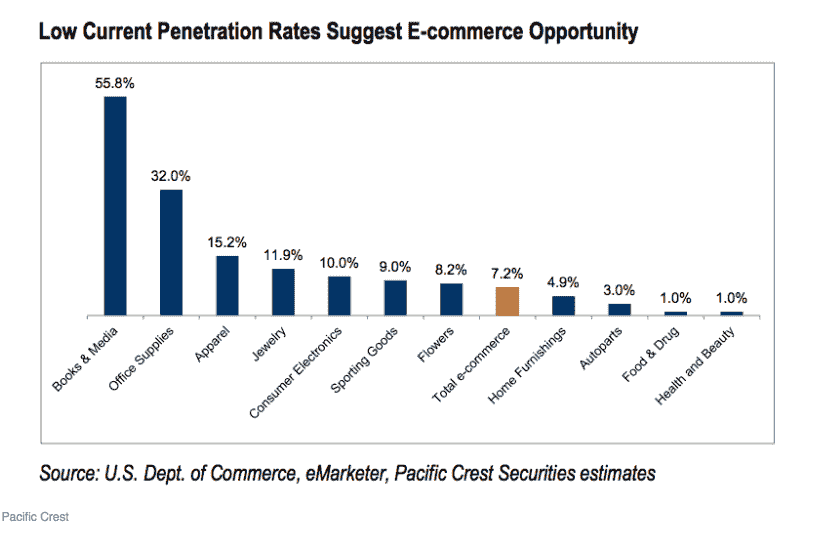

# 面对亚马逊巨头 TechCrunch，食品科技企业家的防御策略

> 原文：<https://web.archive.org/web/https://techcrunch.com/2017/10/22/defensible-strategies-for-food-tech-entrepreneurs-facing-the-amazon-juggernaut/>

帕特丽夏·纳卡什撰稿人

More posts by this contributor

自从亚马逊收购全食超市(Whole Foods)的交易在 8 月份正式宣布以来，食品科技企业家一直在屏住呼吸，期待接下来会发生什么。先是[房价下跌](https://web.archive.org/web/20221221193432/http://fortune.com/2017/08/24/whole-foods-amazon/)；现在，很明显，他们在上升。

不知道贝佐斯对亚马逊拥有的全食超市的最终愿景，食品科技公司必须决定是否以及如何竞争。我给忧心忡忡的企业家提供了一个谨慎乐观的信息:呼气，至少呼出一点。尽管有新的市场现实，但仍有巨大的发展机会。

作为星巴克、P.F. Chang's 和 Jamba Juice 的早期投资者，我们目睹了食品趋势的变化。我们时常会遇到比趋势更基本、更持久的东西:地震般的转变。星巴克富有远见的领导人霍华德·舒尔茨帮助创造了这样一个转变。

[受到意大利丰富的咖啡馆传统](https://web.archive.org/web/20221221193432/https://www.starbucks.com/about-us/company-information)的启发，他教导美国人期待更高质量的产品和更好的客户体验，引领我们走向今天的[美食狂潮](https://web.archive.org/web/20221221193432/https://www.forbes.com/sites/neilhowe/2017/07/20/how-generation-yum-is-stoking-the-foodie-frenzy)。

我们目前正在经历另一场翻天覆地的变化，人们越来越深刻地意识到，我们消费的东西会直接影响我们的健康和福祉，并反映出我们的核心价值观和愿望。

瓶装水的消费现在超过了苏打水，有机食品的销售额去年达到 470 亿美元，占美国食品总销售额的 5%以上。亚马逊收购全食超市反映了人们对食品态度的转变。好消息是，尽管亚马逊的存在迫在眉睫，但仍有大量机会有待发现。

美国人每年在食品上的花费高达 1.4 万亿美元。这其中包括餐馆的 8 亿美元(包括外卖)和杂货销售的 6 亿美元。尽管亚马逊在电子商务中占据主导地位，2016 年占所有在线销售额的 43%甚至在全食超市收购完成前[占在线食品销售额的 18%](https://web.archive.org/web/20221221193432/http://www.marketwatch.com/story/amazons-whole-foods-acquisition-makes-online-grocery-prime-for-acceleration-2017-06-19),但食品杂货的在线渗透率只有区区 1%。这为增长留下了巨大的机会。

杂货渠道的低在线渗透率可以归因于[令人生畏的物流](https://web.archive.org/web/20221221193432/http://fortune.com/2013/07/16/for-online-food-startups-a-challenging-recipe-for-success/)，从采购、准备、包装到易腐消费品的配送。尽管存在物流方面的挑战，食品的巨大市场规模和在线增长机会可以让公司抓住哪怕是一小块馅饼(双关语)就能取得巨大成功。

亚马逊比世界上任何一家公司都更成功地将新的零售类别带到了网上，并在这个过程中解决了高度复杂的物流挑战。他们将利用对全食超市的收购来推动更多的在线食品销售，将全食超市作为配送中心，以缓解上述诸多挑战。

运营和配送是亚马逊的核心优势；随着他们积极进军食品杂货销售，他们对 Whole Foods 的收购将巩固这些竞争优势。运营和配送也是众多资金雄厚的私人食品配送公司的核心竞争力，如 UberEATS、DoorDash、Instacart 和 Postmates。退一步说，这是一个令人生畏的竞争环境。

也就是说，运营和分销只是食品技术难题的两部分。虽然在优势领域与亚马逊和其他资金雄厚的公司竞争通常是不明智的，但公司可以通过专注于“最佳点”以外的一个或多个维度来蓬勃发展:

*   **有抱负的品牌—**伟大的 CPG 品牌之所以成为标志性品牌，不一定是因为它反映了我们是谁，而是我们渴望成为什么。今天，许多消费者渴望改善他们的健康和福祉。认识到这一转变，像百事可乐这样的大公司正在投资健康意识品牌，以产生[强劲的销售并超过竞争对手](https://web.archive.org/web/20221221193432/http://fortune.com/2017/02/15/pepsico-healthy-paying-off/)。这种转变也为新品牌创造了巨大的机会，其中一些将成为诱人的收购目标，如白抗氧化饮料，[被胡椒博士以 17 亿美元](https://web.archive.org/web/20221221193432/https://www.bloomberg.com/news/articles/2016-11-22/dr-pepper-snapple-agrees-to-acquire-bai-brands-for-1-7-billion)收购。

真正体现多种愿望的品牌可能定位特别好。Bevi(我们的投资之一)吸引了既关心健康又关心可持续发展的客户。他们的智能水冷却器可以分配加味的无气泡和气泡水饮料，同时减少塑料和铝的浪费，为客户省钱。

忙碌的父母经常寻求既能提供健康的食物，又能有效地准备食物。只要看看“速溶壶”的病毒式轰动就知道了，它已经在人群中获得了“T2”般的狂热地位。再举一个例子，餐包公司 [Gobble](https://web.archive.org/web/20221221193432/https://www.gobble.com/) ，可以让忙碌的父母在 15 分钟内准备好健康的晚餐，[刚刚完成了由科斯拉风险投资公司(Andreessen Horowitz，Initialized Capital 和 Trinity Ventures 也参与了)牵头的 1500 万美元的 B 轮投资](https://web.archive.org/web/20221221193432/https://techcrunch.com/2017/10/05/meal-kit-startup-gobble-has-raised-15-million-in-series-b-financing-from-khosla/)——尽管蓝色围裙的股票表现不稳定，亚马逊也进入了市场。

*   **专利食品**-消费者对健康和可持续食品选择的需求日益增长，这推动了营养和食品科学的研究。这项研究的进展导致了与食品相关的专利，根据定义，这些专利可以抵御竞争对手。从比尔·盖茨和开放慈善项目等机构筹集了近[3 亿美元的 Impossible Foods 发明了一种基于大豆的环保产品，这种产品看起来、闻起来、尝起来甚至“出血”都与碎牛肉非常相似，以至于它被纳入了](https://web.archive.org/web/20221221193432/https://techcrunch.com/2017/08/01/impossible-foods-just-raised-75-million-for-its-plant-based-burgers/)[众多著名餐馆的菜单](https://web.archive.org/web/20221221193432/https://www.fastcompany.com/3068690/why-the-plant-based-impossible-burger-is-taking-restaurant-menus-by-sto)。我们的投资组合公司防弹公司创造了专有的“生物黑客”产品，如[无真菌毒素咖啡](https://web.archive.org/web/20221221193432/https://blog.bulletproof.com/one-ugly-mug-the-science-behind-just-one-mold-toxin-in-your-coffee/)和[胶原蛋白棒](https://web.archive.org/web/20221221193432/https://www.bulletproof.com/food-drink/quality-snacks?gclid=EAIaIQobChMI2J6FvqLH1gIVDHd-Ch1a3wswEAAYASAAEgIHT_D_BwE)，以帮助消费者改善他们的精神和身体表现。虽然亚马逊出售许多防弹商品，并且有一天可能会出售不可能的食品，但它不太可能试图复制这些产品来直接竞争。
*   **专业细分市场**–亚马逊在吸引大众方面做得非常出色，但鉴于食品市场的巨大规模，疯狂专注于特定细分市场的公司仍然可以开拓出利润丰厚的大型业务。

一个可防御的部分涉及机构市场。(在本文中，“机构”是指向消费者提供或出售食品和饮料的公司、学校、医院、酒店或其他机构。

这种商业模式也被称为“B2B2C”。)[EAT Club](https://web.archive.org/web/20221221193432/https://www.eatclub.com/)(Trinity 的一项投资)为中小型场所提供自助餐厅替代解决方案，使员工能够每天订餐。通过雇主销售，B2B2C 公司接触到许多终端消费者，并享有可靠的、经常性的收入流(类似于订阅模式)。

同样，革命食品公司为数百万儿童提供健康的学校午餐，并计划在去年使 T2 的销售额达到 1 . 5 亿美元。通过服务于这些专业化的细分市场，这些公司建立了天然的竞争缓冲区，如定制的硬件和软件以及专有的物流、工作流程和配送系统。

乍一看，亚马逊对全食超市的收购似乎敲响了食品科技创业的丧钟。然而，当霍华德·舒尔茨向世界介绍星巴克时，咖啡看起来像一种商品，咖啡馆看起来像当地的利基产品。

今天的食品科技领域有地雷，但对于能够穿越这些地雷的企业家来说，前景是乐观的。我迫不及待地想看到他们开辟的(有营养和可持续的)道路。