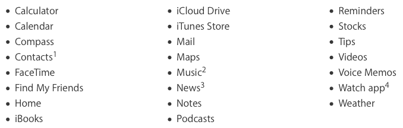

# 在 iOS 10 中删除苹果预装的应用程序实际上并没有‘删除’它们 

> 原文：<https://web.archive.org/web/https://techcrunch.com/2016/06/14/deleting-apples-pre-installed-apps-in-ios-10-doesnt-actually-delete-them/>

# 在 iOS 10 中删除苹果的预装应用，实际上并没有‘删除’它们

苹果即将推出的 iOS 10 中最受关注的功能之一是[删除 iPhone 或 iPad 上预装的许多应用程序的能力](https://web.archive.org/web/20221128032122/https://beta.techcrunch.com/2016/06/13/ios-10-beta-finally-lets-you-remove-all-those-built-in-apps/)。但事实证明，删除应用程序并没有真正删除它们*。*

 *这是根据苹果软件工程高级副总裁 Craig Federighi 的说法，他在[由](https://web.archive.org/web/20221128032122/http://daringfireball.net/live/)[主持的脱口秀直播](https://web.archive.org/web/20221128032122/https://twitter.com/gruber)上证实了这些事实，苹果博主 John Gruber 指出。

费德里吉和同事菲尔·席勒一起解释说，删除应用程序确实会将它们从主屏幕上删除，并丢弃相关的用户数据，但因为这些预装的服务被嵌入到 iOS 中，所以应用程序二进制文件仍然存在。由于安全签名的原因，应用程序是二进制的一部分，这种结构也解释了为什么内置应用程序只在 iOS 本身更新时才接收功能更新。

这是一个非常隐蔽的细节，几乎所有删除应用程序的用户都不会知道有什么不同。那些改变主意并想“重新安装”苹果应用程序的人可以在苹果公司本周早些时候悄悄解除捆绑并作为独立应用程序发布后的应用程序商店中找到它们。

提醒:这些是可以在 iOS 10 中删除的应用，不过你必须等到新软件公开发布后才能删除“苹果垃圾”应用文件夹。最初，iOS 10 仅适用于拥有苹果开发者账户的用户。

*