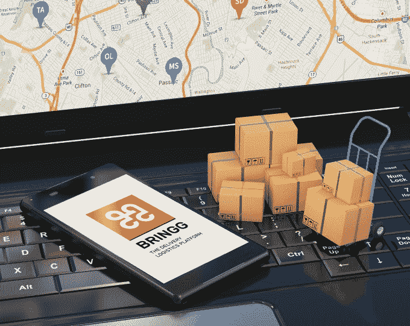

# 交付物流平台 Bringg 从战略投资者那里筹集了 1200 万美元，其中包括 sales force Ventures 

> 原文：<https://web.archive.org/web/https://techcrunch.com/2018/01/16/delivery-logistics-platform-bringg-raises-12m-from-strategic-investors-including-salesforce-ventures/>

送货物流平台 bring gg 今天宣布，它又筹集了 1200 万美元的 B 轮融资，使融资总额达到 2200 万美元。这一轮是继去年春天的第一轮 B 轮之后的一轮，包括来自汽车行业领导者 Shmuel Harlap 博士、航运和房地产巨头 Eyal Ofer 和 Salesforce Ventures 的新战略投资。

此前，Bringg 已经在 Aleph VC 领导的 B 轮融资中筹集了 1000 万美元，可口可乐和之前的投资者 Pereg Ventures 也参与了进来。

这家总部位于芝加哥和特拉维夫的初创公司成立于 2013 年，创始人是 Raanan Cohen，他是 MobileMax 的前创始人兼首席执行官；以及前 Gett 和 Clarizen.com 首席技术官 Lior Sion。其目标是通过提供一系列功能，如在地图上跟踪司机的进度、送货通知、司机与客户的沟通、星级评定等，为零售商和其他企业提供亚马逊或优步那样的送货业务可见性。

除了零售或食品配送之外，一些行业也需要这类工具。如今，Bringg 在 50 多个国家拥有零售、电子商务和食品领域的众多客户，以及服务和物流提供商。虽然该公司不能披露其所有客户，但一些知名品牌正在使用它，包括战略投资者可口可乐，以及金佰利克拉克、Panera Bread、Cdiscount 和 Hilti。

例如，可口可乐一直在使用 Bringg 处理各种需求，从缺货到欧洲、亚洲和拉丁美洲部分地区的设备维修业务。它还在 Bringg 上开发了一项尚未推出的直接面向消费者的服务。

与此同时，Panera Bread 在 JAB 以 75 亿美元收购之前，利用 Bringg 的平台在[推出了全国配送服务](https://web.archive.org/web/20230118180502/http://www.delish.com/food-news/a51220/panera-bread-delivery/)。

航运和物流概念

科恩说，自去年融资以来，随着企业试图赶上亚马逊和其他在交付和物流市场领先的企业，Bringg 取得了显著增长。该公司从去年仅有的几个大客户发展到现在有超过 30 个项目处于推出阶段。

它还将 30 岁以下的团队人数增加了一倍，达到 60 岁以上，并计划在特拉维夫、芝加哥和纽约再招聘 60 人。

“在宏观层面上，我们在世界上的地位是帮助现有的品牌和企业拥有像亚马逊一样的交付能力，”科恩说。“亚马逊推动市场的方式——无论是杂货、零售还是制药——所有这些行业现在都非常恐慌，试图拿出自己的送货能力，”他说，并补充说，随着时间的推移，这种趋势只会越来越强。

该公司尚未盈利，但它正在与客户签署大量交易——例如，其年度合同金额通常在 6 至 7 位数之间。

“我们已经创造了数百万的收入。科恩说:“它看起来非常结实。

随着新的战略投资，Bringg 也准备进入新的垂直市场。Mobileye 的大股东 Shmuel Harlap 博士([以 153 亿美元的价格被英特尔收购](https://web.archive.org/web/20230118180502/https://techcrunch.com/2017/03/13/reports-intel-buying-mobileye-for-up-to-16b-to-expand-in-self-driving-tech/))提供了进入汽车垂直行业的更多机会，汽车制造商正在推出自己的服务，如汽车共享、运输、道路救援等服务。

Eyal Ofer 的业务可以将 Bringg 与货运和装运服务以及其他尚未进入其关注范围的公司联系起来。

然而，由于 Bringg 需要为一些客户整合现有系统，Salesforce.com 已经与 Bringg 合作了一段时间。

Cohen 指出:“他们 25%到 30%的客户的业务中包含交付元素。“他们的客户和我们的客户之间有重叠，所以很明显，这对我们来说可能是一个很好的战略合作伙伴关系。”

“这三者都让我们获得了更大的曝光率，让我们更接近市场，并为我们带来了潜在的大客户，”他补充道。