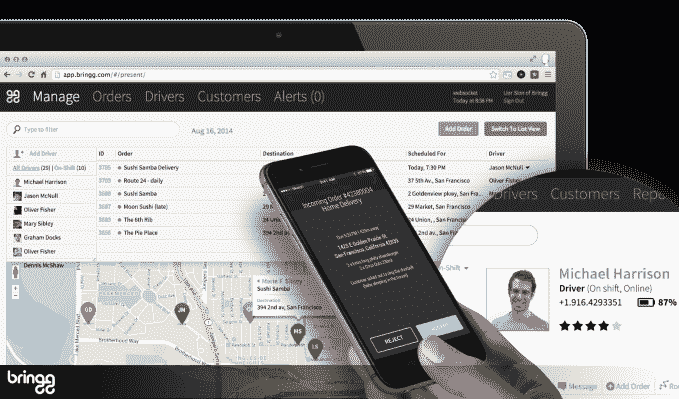
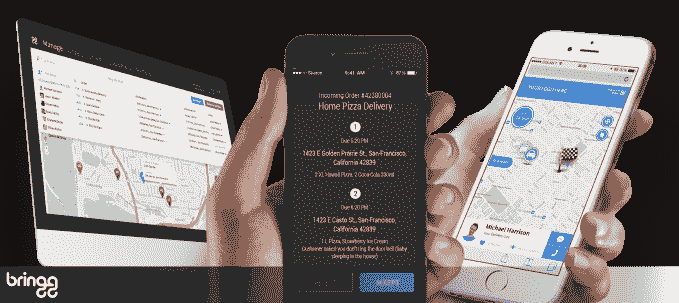

# 交付管理平台 Bringg 筹集 1000 万美元，帮助任何企业应对亚马逊 

> 原文：<https://web.archive.org/web/https://techcrunch.com/2017/03/14/delivery-management-platform-bringg-raises-10-million-to-help-any-business-take-on-amazon/>

bring gg 是一家初创公司，它利用向更快、更透明的按需交付的转变，在 B 轮融资中又筹集了 1000 万美元，该公司今天早上宣布。[基金](https://web.archive.org/web/20230129072509/https://www.crunchbase.com/organization/bringg#/entity)由 Aleph VC 牵头，包括可口可乐和之前的投资者 Pereg Ventures 的参与。

总部位于芝加哥的 Bringg 成立于 2013 年，由 MobileMax 的前创始人兼首席执行官 Raanan Cohen 创办；以及前 Gett 和 Clarizen.com 首席技术官 Lior Sion。这个想法是为企业提供一种更简单的方式，让他们能够像亚马逊或优步那样了解自己的送货业务，包括送货通知、在地图上跟踪司机的能力、司机与客户的沟通、星级评定等面向消费者的功能。

Sion 解释说，对于使用 Bringg 解决方案的企业来说，他们能够更有效地实时优化和优化他们的路线和交付，这使他们能够更好地与亚马逊等公司竞争。

“亚马逊和优步将客户期望提升到了前所未有的水平，”Sion 说。“对于消费者来说，现在非常奇怪的是，如果我们订购了一些东西，需要一周才能到货，而且我们不知道具体什么时候才能到货。体验很难受。”

像优步和亚马逊这样的运营变得越强大和高效，Bringg 的情况就越好，上个季度，它的送货数量增长了 300%以上。

“零售商店正在输给亚马逊，没有直接消费者关系的品牌开始害怕——他们正在寻找直接面向消费者销售和直接面向消费者交付的方式，”Sion 说。“我们正在民主化亚马逊试图控制的整个送货体验，”他补充道。

今天，Bringg 在 50 多个国家拥有数百家客户，包括完整的递送链、包裹递送服务、食品递送服务和其他服务，例如干洗服务或电缆维修公司。企业通过基于数量的定价为 Bringg 付费。

它的许多客户也是大型企业，如投资者可口可乐公司，该公司使用 Bringg 满足多种需求，从通过将企业与最近的批发商联系起来处理缺货情况，到设备维修业务，甚至是美国境外的一些企业对消费者业务。

Bringg 不能透露客户名称，但指出他们不是一般的初创公司。他们是需要优化交付运营成本的企业，而不仅仅是利用实时车队管理功能。Bringg 可以以最低的成本优化路线、司机和交付，此外，它还可以通过其一系列 API 和 SDK 集成到应用和网站中，用于实时地图、警报、服务评级、通信等。

它甚至可以帮助企业适应各种交付模式和提供商，如混合使用内部和第三方车队，或在繁忙时间(如假期)通过众包司机扩大车队。

“从顾客进入网站的那一刻起，亚马逊就对库存、配送的第一英里和最后一英里以及顾客体验有了全面的了解……这就是他们杀死所有人的原因，”Sion 说。“他们可以在整个过程中优化一切……我们的目标是为我们的客户提供同样的功能。我们认为，这是与亚马逊对抗的唯一方式，”他说。

该公司拥有 50 人的团队，目前在特拉维夫、纽约和芝加哥设有办事处，并计划利用额外的资金扩展到新的市场和新的细分市场。这包括发展其 R&D 和运营团队(即销售、营销、账户管理和支持)。

迄今为止，Bringg 已经筹集了 1900 万美元。